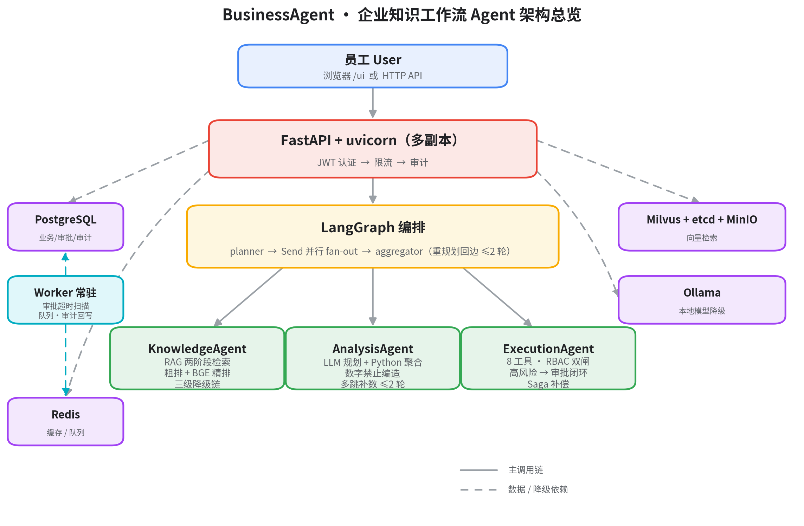
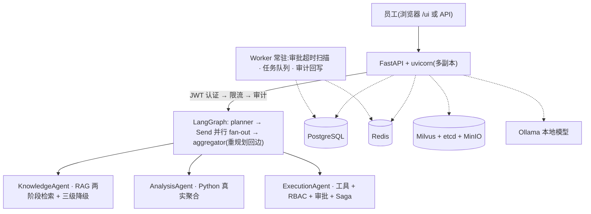

# Hello，小A——企业知识工作流 Agent

> 员工用自然语言一站式完成 **知识问答 · 数据分析 · 业务执行**，带权限隔离、审批闭环、全栈降级的企业级多 Agent 系统。

[](https://github.com/zhenkun26/BusinessAgent/releases)
[](https://github.com/zhenkun26/BusinessAgent/actions/workflows/ci.yml)
[](https://github.com/zhenkun26/BusinessAgent/actions/workflows/ci.yml)
[](https://www.python.org/)
[](https://github.com/langchain-ai/langgraph)
[](https://fastapi.tiangolo.com/)
[](https://milvus.io/)
[](https://www.postgresql.org/)
[](https://redis.io/)
[](https://hub.docker.com/)
[](enterprise-agent/deploy/k8s)
[](openspec/specs)
[](https://github.com/zhenkun26/BusinessAgent)

---

## ✨ 核心能力

| 能力 | 说明 | 关键设计 |
|---|---|---|
| 📚 知识问答 | 基于企业知识库的 RAG 问答 | 两阶段检索（Milvus 粗排 + BGE 精排）→ 场景化置信度决策 → 拒答优于编造；三级降级链（向量 → BM25 → PG tsvector） |
| 📊 数据分析 | 业务数据统计、对比、趋势 | LLM 解析计划 → **Python 真实聚合**（数字禁止编造）→ primary 生成报告；多跳补数 ≤2 轮 |
| ⚙️ 业务执行 | CRM/邮件/工单工具调用 | 工具选择 → RBAC 双闸 → Saga 补偿；高风险操作（外部邮件）自动建审批单，经理批准后执行 |
| 🛡️ 企业护栏 | 权限、审批、降级、可观测 | 5 角色 × 8 工具矩阵 + 部门命名空间隔离；审批不越权（按发起人角色终审）；三条降级链 + 审计/指标/Trace |
| 🔁 运营闭环 | 知识审核、审批超时、重规划、用户生命周期 | 知识候选审核后入库；审批超时自动流转并通知；覆盖不足自动重规划（≤2 轮）；密码校验 + 用户管理 API |

## 🏗️ 架构总览



<details>
<summary>查看 mermaid 源码版本</summary>



</details>

## 🚀 快速开始

### 方式一：一键启动（推荐）

- **macOS**：双击根目录 [启动小A.command](启动小A.command)（自检 Docker → 启动 PG/Redis/Milvus → 初始化数据库 → 启动 API + Worker → 打开页面）
- **Windows**：双击根目录 `启动小A.bat`

浏览器打开 **http://localhost:8000/ui**（种子用户密码任意；生产开启 `AUTH_REQUIRE_PASSWORD=true` 后为 `ChangeMe123!`）。

### 方式二：手动启动

```bash
cd enterprise-agent
cp .env.example .env            # 填写 API Key 与连接配置

# 1) 基础设施(Milvus + PostgreSQL + Redis + Ollama)
docker compose up -d etcd minio milvus-standalone postgres redis

# 2) API + Worker(另开窗口)
PYTHONIOENCODING=utf-8 python -m app.main
python -m app.worker

# 3) 验证
curl http://localhost:8000/health   # {"status":"healthy","version":"1.2.0"}
curl http://localhost:8000/ready    # db/milvus healthy, tools_count=8
```

### 方式三：容器化 / Kubernetes

```bash
# 生产镜像(多阶段,742MB,非 root,HEALTHCHECK)
docker build -f enterprise-agent/Dockerfile.prod -t enterprise-agent:prod .

# K8s 一键部署(8 个清单:Deployment/Service/ConfigMap/Secret/Ingress/HPA/PDB + 双探针)
cd enterprise-agent/deploy/k8s && kubectl apply -f .
```

## 📁 文档导航

| 层 | 内容 | 位置 |
|---|---|---|
| 产品方案层 | 现行方案 v3、选型研究 | [docs/10-product-plan/](docs/10-product-plan/README.md) |
| 产品文档层 | 产品权威现状文档 | [docs/20-product/产品文档.md](docs/20-product/产品文档.md) |
| 操作手册层 | 使用案例 / 前端版 / 运维手册 | [docs/30-guides/](docs/30-guides/README.md) |
| 过程记录层 | ROADMAP / DECISIONS / ISSUES / 阶段性总结 | [docs/40-process/](docs/40-process/README.md) |
| 工程文档层 | 后端 README、部署指南 | [docs/50-engineering/](docs/50-engineering/README.md) |
| 知识数据库层 | 知识库数据与入库规范 | [docs/60-knowledge/](docs/60-knowledge/README.md) |
| 面试与演示 | 面试备稿、产品介绍网页 | [interview/](interview/) |
| 需求演进 | openspec 主规格（10 项能力） | [openspec/specs](openspec/specs) |

完整目录树索引见 [contents.md](contents.md)。

## ✅ 项目状态（v1.2.0 · 2026-08-04 归档完结）

- **已完成**：W2-W9 全阶段 · 整体联调 17/17 · P1/P2 迭代 · 前端 v2/v3 与流式输出 · 生产对抗性审查（12 项漏洞修复）· 业务闭环补全（41/41 任务）· 两个 openspec change 归档、10 项主规格沉淀。
- **测试与 CI**：58 项单元测试全绿（Python 3.11/3.13）；GitHub Actions 每 push 自动跑测试 + 构建镜像并推送 GHCR。
- **挂起（P3，按决策不上线）**：压测、UAT/安全测试、pymilvus 3.1 迁移等，见 [ROADMAP](docs/40-process/ROADMAP.md)。

## 🛠️ 维护入口

- 版本变更：[CHANGELOG.md](CHANGELOG.md)（版本规则见文件头）
- 里程碑规划：[ROADMAP.md](docs/40-process/ROADMAP.md)
- 设计决策：[DECISIONS.md](docs/40-process/DECISIONS.md)
- 问题与坑：[ISSUES.md](docs/40-process/ISSUES.md)
- 工程约定：[AGENTS.md](AGENTS.md)
