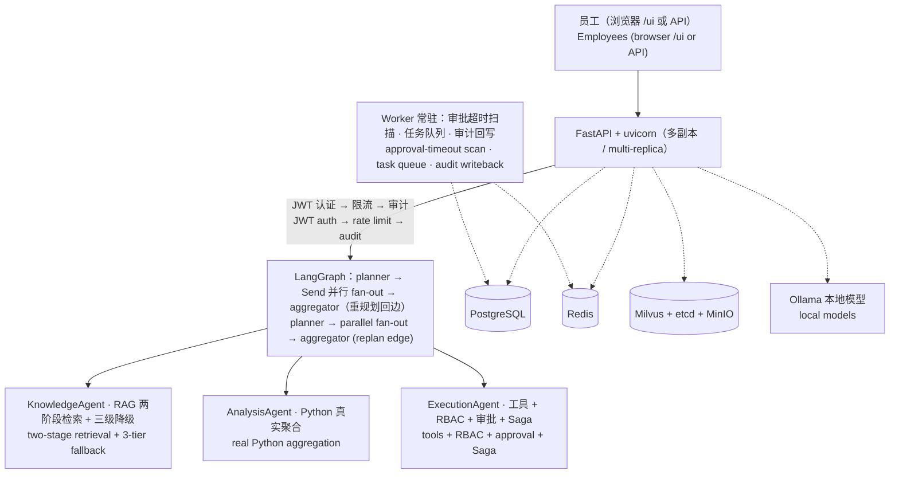

# 智多星 · 企业级多智能体平台 / ZhiDuoXing — Enterprise Multi-Agent Platform

> 员工用自然语言一站式完成 **知识问答 · 数据分析 · 业务执行**，以 RBAC 权限、审批闭环、全栈降级与全链路可观测为护栏的企业级多智能体平台。
>
> An enterprise-grade multi-agent platform where employees complete **knowledge Q&A, data analysis, and business execution** in natural language — guarded by RBAC, approval loops, full-stack degradation, and end-to-end observability.

[](https://github.com/zhenkun26/BusinessAgent/releases)
[](https://github.com/zhenkun26/BusinessAgent/actions/workflows/ci.yml)
[](https://github.com/zhenkun26/BusinessAgent/actions/workflows/ci.yml)
[](https://www.python.org/)
[](https://github.com/langchain-ai/langgraph)
[](https://fastapi.tiangolo.com/)
[](https://milvus.io/)
[](https://www.postgresql.org/)
[](https://redis.io/)
[](https://hub.docker.com/)
[](enterprise-agent/deploy/k8s)
[](openspec/specs)
[](LICENSE)

---

## 一、项目定位 / Positioning

### 为什么是「平台」，而不是「知识工作流 Agent」/ Why a platform, not just a "knowledge-workflow agent"

- **覆盖三类任务域，而非单一知识流程**：检索问答（RAG）、真实计算（数据分析）、工具执行（业务动作）同时在场，且互相编排 / Not a single knowledge pipeline: retrieval Q&A (RAG), real computation (data analysis), and tool execution (business actions) coexist and orchestrate together.
- **多智能体协作，而非单 Agent + 工具**：三个专职子 Agent（Knowledge / Analysis / Execution）+ 集中规划 + 并行 fan-out + 可重规划回边 / Not a single agent with tools: three specialized sub-agents plus centralized planning, parallel fan-out, and a replanning loop.
- **企业治理是一等公民，而非事后补丁**：权限、审批、降级、审计、可观测、运营闭环构成可上线基线 / Enterprise governance is a first-class citizen: permissions, approvals, degradation, audit, observability, and operations form a production baseline.

**一句话定位 / In one sentence**：让员工用自然语言完成知识问答、数据分析与业务执行，并让每一次回答、计算和操作都可审计、可控权、可降级、可恢复的企业级多智能体平台。

**目标用户 / Target users**：

| 角色 / Role | 使用方式 / How they use it |
| --- | --- |
| 员工 / Employees | 自然语言提问与下达任务：查制度、看数据、办业务 / Ask in natural language: policies, data, business operations |
| 管理者 / Managers | 审批高风险操作、查看执行进度与审计 / Approve high-risk operations, track progress and audit |
| 运营与管理员 / Ops & Admins | 知识审核入库、用户与权限管理、系统运维与告警 / Review knowledge, manage users & permissions, operate & alert |

---

## 二、核心能力 / Core Capabilities

| 能力 / Capability | 说明 / Description | 关键设计 / Key design |
| --- | --- | --- |
| 📚 知识问答 / Knowledge Q&A | 基于企业知识库的 RAG 问答，带来源标注与权限过滤 / RAG Q&A over the enterprise knowledge base, with source attribution and permission filtering | 两阶段检索（Milvus HNSW 粗排 + BGE Reranker 精排）→ 场景化置信度决策 → **拒答优于编造**；三级降级链（向量 → BM25 → PG tsvector） |
| 📊 数据分析 / Data Analysis | 业务数据统计、对比、趋势分析 / Statistics, comparison, and trend analysis over business data | LLM 解析计划 → **Python 真实聚合**（数字禁止编造）→ primary 生成报告；多跳补数 ≤2 轮 |
| ⚙️ 业务执行 / Business Execution | 调用 CRM、邮件、工单等工具完成业务动作 / Call tools such as CRM, mail, and ticket to complete actions | 工具选择 → RBAC 双闸 → 高风险操作自动建审批单 → Saga 补偿 |
| 🛡️ 企业护栏 / Enterprise Guardrails | 权限、审批、降级、可观测一体化 / Permissions, approvals, degradation, and observability | 5 角色 × 8 工具 RBAC 矩阵 + 部门命名空间隔离；审批不越权（按发起人角色终审）；三条降级链 + 审计 / 指标 / Trace |
| 🔁 运营闭环 / Operations Loop | 知识、审批、任务、用户的持续治理 / Ongoing governance of knowledge, approvals, tasks, and users | 知识候选审核后入库；审批超时自动流转并通知；覆盖不足自动重规划（≤2 轮）；密码校验 + 用户管理 API |

---

## 三、架构总览 / Architecture




**设计要点 / Highlights**：

- **显式状态机而非自由循环**：planner 集中做意图分类与任务分解，路由是代码而非 LLM 即兴决策，每一步可审计、可恢复 / Explicit state machine over free-form loops: routing is code, auditable and resumable at every step.
- **并行执行**：LangGraph `Send` API 按子任务并行 fan-out，单结果直通、多结果 LLM 汇总，成本只在必要处发生 / Parallel fan-out via `Send`; a single result short-circuits, multi-result summarization only when needed.
- **断点恢复**：Checkpointer 三级降级（Redis → PG → Memory），进程重启后同会话可续聊 / Three-tier checkpointer (Redis → PG → Memory); conversations survive process restarts.
- **前端**：单文件 SPA（`/ui`，零构建）+ SSE 流式输出 + 角色感知界面 / Single-file SPA (`/ui`, zero-build) with SSE streaming and role-aware UI.

---

## 四、关键设计决策 / Key Design Decisions

完整记录见 [DECISIONS.md](docs/40-process/DECISIONS.md)；核心取舍 / Full records in [DECISIONS.md](docs/40-process/DECISIONS.md); core trade-offs:

| 决策 / Decision | 选择与理由 / Choice & rationale |
| --- | --- |
| 编排框架 / Orchestration | LangGraph 显式状态机，而非 ReAct / AutoGen —— 路由可预测、权限点可审计 / Explicit StateGraph instead of ReAct/AutoGen: predictable routing, auditable permission points |
| Agent 拆分 / Agent split | 三个专职子 Agent + 统一 `AgentResult` 契约，可独立评测、独立换模型 / Three specialized sub-agents with a unified contract, independently evaluable and swappable |
| 工具策略 / Tool strategy | Mock-first，但 pydantic 契约与补偿语义对齐真实 API，`_call_external` 预留切换点 / Mock-first with real-API-aligned contracts; `_call_external` is the switch point |
| 降级原则 / Degradation | 三条降级链（LLM / 检索 / Checkpointer），且**每条降级必须可观测**，不掩盖配置错误 / Three fallback chains, each emitting an explicit "I'm degraded" signal |
| 审批边界 / Approval boundary | 批准后仍按发起人角色过 RBAC（批准不越权），审计分离记录 `decided_by` 与 `executed_as_*` / Approval never escalates privileges; audit separates decision from execution roles |
| 模型分层 / Model tiering | 高频简单任务走本地 qwen3.5:4b，推理任务走云端 DeepSeek，实测成本降低 40%+ / Local model for high-frequency simple tasks, cloud for reasoning; measured 40%+ cost reduction |
| 底线原则 / Bottom line | 拒答优于编造；分析数字一律来自 Python 真实聚合 / Refusing to answer beats fabricating; numbers always come from real Python aggregation |

---

## 五、安全与合规 / Security & Governance

- **RBAC**：5 角色 × 8 工具权限矩阵；无权工具不进 Prompt（既是安全防线也是 token 裁剪）/ 5 roles × 8 tools; unauthorized tools never enter the prompt.
- **隔离**：Milvus Partition 部门命名空间 + `access_roles` 双条件过滤，降级路径同口径（含回归脚本防「降级绕过防护」）/ Department namespace partitions plus role filtering, with the same filter applied on degraded paths.
- **认证**：JWT 登录 + 刷新、密码强度校验、用户生命周期管理 API / JWT auth & refresh, password policy, user-lifecycle admin API.
- **防护**：Prompt 注入防护、输入参数校验、接口限流（Redis）/ Prompt-injection defense, input validation, Redis-based rate limiting.
- **可观测**：6 类事件审计落库、OpenTelemetry 全链路追踪（Jaeger）、Prometheus 指标（/metrics）/ Six audit event types, OpenTelemetry tracing, Prometheus metrics.
- **CI 安全扫描**：gitleaks（密钥）、pip-audit（依赖漏洞）、Trivy（镜像，High/Critical 阻断）/ gitleaks, pip-audit, and Trivy gates in CI.
- **对抗性生产审查**：以金融级标准审查，修复 12 项漏洞（含 3 项 P0 认证/凭证类），详见 [审查报告](docs/40-process/生产对抗性审查与部署验收报告.md) / Adversarial review against financial-grade standards; 12 vulnerabilities fixed (3 P0), see the report.

---

## 六、技术栈 / Tech Stack

| 类别 / Category | 组件 / Components | 用途 / Purpose |
| --- | --- | --- |
| 运行时 / Runtime | Python 3.11 · FastAPI 0.141 · uvicorn | REST API + SSE 流式 / REST API + SSE streaming |
| Agent 编排 / Orchestration | LangGraph 1.2（StateGraph + Send + Checkpointer）· LangChain 1.x | 规划-执行-汇总状态机 / plan-execute-aggregate state machine |
| 检索 / Retrieval | Milvus 2.4（HNSW + Partition）· bge-m3 · bge-reranker-large | 两阶段检索 / two-stage retrieval |
| 存储 / Storage | PostgreSQL 16 · Redis Stack 7.4 · node 级持久化 | 业务 / 审批 / 审计 / Checkpointer / 限流 |
| 模型 / Models | Ollama（qwen3.5:4b 本地）· DeepSeek v4-pro / v4-flash | 高频本地 + 推理云端 / local for frequency, cloud for reasoning |
| 可观测 / Observability | OpenTelemetry · Jaeger · Prometheus · Grafana | 全链路追踪与指标 / tracing & metrics |
| 部署 / Deployment | Docker Compose（dev / prod / monitoring）· Kubernetes（8 清单）· Nginx | 一键开发与生产部署 / one-command dev & prod |

---

## 七、快速开始 / Quick Start

### 方式一：一键启动（推荐）/ One-click start (recommended)

- **macOS**：双击根目录 [启动智多星.command](启动智多星.command)（自检 Docker → 启动 PG/Redis/Milvus → 初始化数据库 → 启动 API + Worker → 打开页面）/ Double-click `启动智多星.command`.
- **Windows**：双击根目录 `启动智多星.bat` / Double-click `启动智多星.bat`.

浏览器打开 **http://localhost:8000/ui**（种子用户密码任意；生产开启 `AUTH_REQUIRE_PASSWORD=true` 后为 `ChangeMe123!`）。

### 方式二：手动启动 / Manual start

```bash
cd enterprise-agent
cp .env.example .env            # 填写 API Key 与连接配置 / fill in API keys & connection config

# 1) 基础设施（Milvus + PostgreSQL + Redis + Ollama）
docker compose up -d etcd minio milvus-standalone postgres redis

# 2) API + Worker（另开窗口 / separate terminals）
PYTHONIOENCODING=utf-8 python -m app.main
python -m app.worker

# 3) 验证 / verify
curl http://localhost:8000/health   # {"status":"healthy","version":"1.3.0"}
curl http://localhost:8000/ready    # db/milvus healthy, tools_count=8
```

### 方式三：容器化 / Kubernetes

```bash
# 生产镜像（多阶段，非 root，HEALTHCHECK）
docker build -f enterprise-agent/Dockerfile.prod -t enterprise-agent:prod .

# K8s 一键部署（8 个清单：Deployment/Service/ConfigMap/Secret/Ingress/HPA/PDB + 双探针）
cd enterprise-agent/deploy/k8s && kubectl apply -f .
```

### 体验示例 / Try it

```bash
# 登录（种子用户）/ login
curl -X POST http://localhost:8000/api/v1/auth/login \
  -H "Content-Type: application/json" \
  -d '{"username": "销售员张三"}'

# 知识问答 / knowledge Q&A
curl -X POST http://localhost:8000/api/v1/chat/message \
  -H "Authorization: Bearer <token>" -H "Content-Type: application/json" \
  -d '{"message": "请告诉我销售政策"}'

# 数据分析 / data analysis
curl -X POST http://localhost:8000/api/v1/chat/message \
  -H "Authorization: Bearer <token>" -H "Content-Type: application/json" \
  -d '{"message": "对比 C001 和 C002 两个客户的订单金额"}'

# 审批高风险操作（外部邮件等）/ approve a high-risk operation
curl -X POST http://localhost:8000/api/v1/approval/appr_xxx/decide \
  -H "Authorization: Bearer <manager-token>" -H "Content-Type: application/json" \
  -d '{"decision": "approved", "comment": "同意"}'
```

---

## 八、部署与运维 / Deployment & Operations

- **Docker Compose**：开发 / 生产（`--profile production`）/ 监控（`--profile monitoring`，Prometheus + Grafana + Jaeger）三套 profile / dev, prod, and monitoring profiles.
- **Kubernetes**：8 个清单就绪（Deployment / Service / ConfigMap / Secret / Ingress / HPA / PDB + 双探针）/ 8 manifests with dual probes.
- **备份与容灾**：PG / etcd 备份脚本 + 备份恢复演练（实测 RTO / RPO 已记录）/ Backup scripts plus a restore drill with measured RTO/RPO.
- **告警与值班**：Prometheus 告警规则 + 运维值班预案，见 [运维维护手册](docs/30-guides/运维维护手册.md) / Alerting rules and an on-call runbook.

---

## 九、质量与测试 / Quality & Testing

- **单元测试**：89 项全绿（Python 3.11 / 3.13），覆盖工具网关、RBAC、Saga、审批超时、降级、越权与安全加固 / 89 passing unit tests across ToolGateway, RBAC, Saga, approval timeout, degradation, privilege escalation, and hardening.
- **CI**：每 push 自动跑测试 + gitleaks / pip-audit / Trivy 三道扫描 + 构建镜像并推送 GHCR / Automated tests, three security scans, and image builds to GHCR on every push.
- **RAG 评测**：评测集 + 命中率 / 答案覆盖率指标（答案覆盖率目标 ≥0.85）/ Eval harness with hit-rate and answer-coverage metrics (coverage target ≥0.85).
- **压测与容灾**：k6 阶梯压测 + 备份恢复演练，SLA 基线初值：可用性 ≥99.5%、p95 ≤2s、p99 ≤5s、错误率 <0.5%、RTO ≤1h、RPO ≤24h（单机 Compose 现实初值，K8s 启用后复评）/ k6 load test + DR drill; SLA baseline (single-node Compose initial values, to be revisited on K8s).

---

## 十、项目状态与路线图 / Status & Roadmap

### 当前版本 v1.3.0（2026-08-06 生产就绪与全量更名）/ v1.3.0 — production-ready, renamed to 智多星

- ✅ W2-W9 全阶段 + 整体联调 17/17 + P1/P2 迭代 + 前端 v2/v3 与 SSE 流式 / all milestones, E2E integration 17/17
- ✅ 生产对抗性审查（12 项漏洞修复）+ 业务闭环补全（41/41）/ adversarial review + business-loop completion
- ✅ 生产就绪基线（边界 / SLA / 8 项风险操作清单）、RAG 答案质量、压测与容灾演练、安全加固落地 / production-readiness baseline, RAG quality, load/DR drill, security hardening
- ✅ 13 项 OpenSpec 主规格沉淀 / 13 main OpenSpec specs archived

### 进行中 / In progress

| Change | 优先级 / Priority | 状态 / Status |
| --- | --- | --- |
| ticket-system-integration（工单真实接入试点） | P2 | 已提案 / proposed |
| crm-mail-sso-integration（CRM / 邮件 / SSO 真实接入） | P2 | 已提案 / proposed |
| uat-and-ga-rollout（UAT、灰度、上线门槛） | P3 | 已提案 / proposed |

### 挂起 / Suspended

- UAT 与安全实测（含 Prompt 注入攻击面）/ UAT & security testing — carried by `uat-and-ga-rollout`
- pymilvus 3.1 迁移（已钉 `>=2.4,<3.1` 防误升级）/ pymilvus 3.1 migration (pinned to avoid accidental upgrade)
- Windows 开发体验：uvicorn reload 偶发卡死 / Windows dev experience (uvicorn reload)

完整规划见 [ROADMAP.md](docs/40-process/ROADMAP.md) / Full roadmap in ROADMAP.md.

---

## 十一、文档导航 / Documentation

仓库采用六层文档体系（单一事实源） / Six-layer documentation system:

| 层 / Layer | 内容 / Content | 位置 / Location |
| --- | --- | --- |
| 产品方案层 / Product plan | 现行方案 v3、选型研究 / current plan & research | [docs/10-product-plan/](docs/10-product-plan/README.md) |
| 产品文档层 / Product doc | 产品权威现状文档 / authoritative product doc | [docs/20-product/产品文档.md](docs/20-product/产品文档.md) |
| 操作手册层 / Guides | 使用案例 / 前端版 / 运维手册 / cases, frontend, ops | [docs/30-guides/](docs/30-guides/README.md) |
| 过程记录层 / Process | ROADMAP / DECISIONS / ISSUES / 总结 / roadmap, decisions, issues | [docs/40-process/](docs/40-process/README.md) |
| 工程文档层 / Engineering | 后端 README、部署指南 / backend README & deploy guide | [docs/50-engineering/](docs/50-engineering/README.md) |
| 知识数据库层 / Knowledge | 知识库数据与入库规范 / KB data & ingestion spec | [docs/60-knowledge/](docs/60-knowledge/README.md) |

完整目录树索引见 [contents.md](contents.md) / Full tree index in contents.md.

---

## 十二、合作者 / Contributors

感谢所有参与者的贡献 / Thanks to everyone who contributes:

- [zhenkun26](https://github.com/zhenkun26) — 合作者 / Collaborator · 负责 IMG_5043 / IMG_5044 两张图片所涉及的工作 / Owns the work behind IMG_5043 & IMG_5044
- [kingoftaro（Taro）](https://github.com/kingoftaro/) — 合作者 / Collaborator · AI Engineer（LLM Applications · AI Agents · RAG · LangChain · LangGraph · MCP）

---

## 十三、维护入口 / Maintenance

- 版本变更 / Releases：[CHANGELOG.md](CHANGELOG.md)
- 里程碑规划 / Milestones：[ROADMAP.md](docs/40-process/ROADMAP.md)
- 设计决策 / Decisions：[DECISIONS.md](docs/40-process/DECISIONS.md)
- 问题与坑 / Issues：[ISSUES.md](docs/40-process/ISSUES.md)
- 工程约定 / Engineering conventions：[AGENTS.md](AGENTS.md)

---

## License / 许可证

[MIT](LICENSE)
