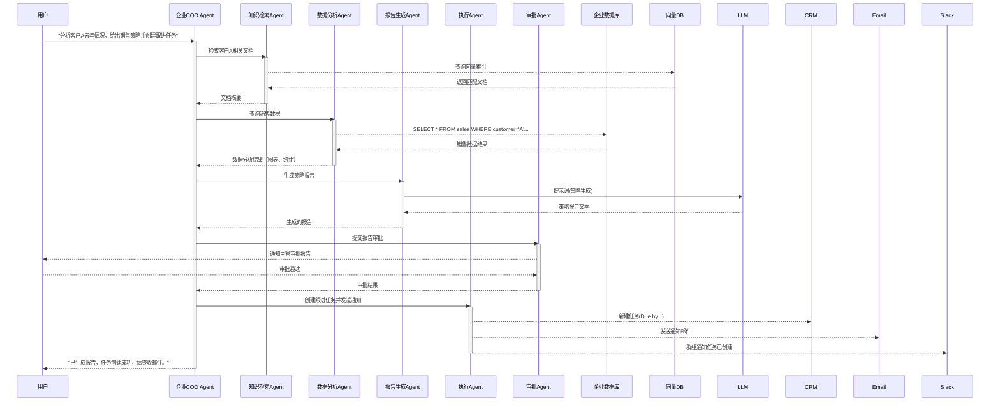

# 执行摘要

近年来，**Agentic AI（智能体 AI）**已成为企业自动化和知识管理的关键技术趋势。企业通过赋予 AI Agent 目标感和工具调用能力，使其“主动执行”复杂任务。尤其是将企业**知识库**与**工作流**深度结合的Agent系统，可以显著提升工作效率和决策质量。例如，一家市场调研公司采用AI Agent自动生成竞争情报报告，使分析师的工作效率提升超8倍；另一家金融机构利用智能投研Agent，将单位时间内覆盖公司数量提升3倍。然而，落地这类系统需要在**架构、数据治理、权限、安全**等方面下足功夫。本文提出一个可落地的企业级「知识+工作流Agent」解决方案，包含以下核心内容：

- **项目背景：** 解构痛点（知识孤岛、人工流程低效、RPA局限等）和目标用户（业务分析师、客服/HR/财务人员等），对比现有竞品与行业案例。
- **整体架构：** 设计基于微服务的多-Agent系统，包括**编排层**、**知识检索Agent**、**分析Agent**、**执行Agent**和**审批Agent**。采用事件流或序列图展示数据流和组件关系，并说明存储（向量库、数据库、缓存）、权限认证、审计日志等要素。
- **技术栈：** 选用成熟稳定技术：后端可用Python + FastAPI或Node.js；Agent框架优先OpenAI Agents SDK或LangChain/DeepAgents；模型可选GPT-4o、GPT-4/3.5、Anthropic Claude、或国产大模型；向量数据库选Milvus/Weaviate/Chroma；关系型数据库选PostgreSQL；缓存Redis；消息队列Kafka/RabbitMQ；部署采用Kubernetes集群，CI/CD流水线、Terraform基础架构；监控使用Prometheus+Grafana+OpenTelemetry；安全认证采用OAuth2/OIDC（如Keycloak/Cognito），结合细粒度权限和审计日志。
- **业务流程示例：** 通过用户故事展示端到端交互：用户提交业务需求（如“分析客户X去年情况并生成跟进任务”），Orchestrator分配给多个子Agent协作完成知识检索、数据分析和自动执行，最后由审批Agent触发人审。使用Mermaid时序图/流程图直观展现这一过程。
- **实现步骤：** 制定3个月迭代路线：**第1月**完成单-Agent MVP（文档RAG检索、工具调用、基本界面）；**第2月**扩展多-Agent协作（引入Planner/Analysis/Execution Agents）；**第3月**加入企业级能力（身份鉴权、权限隔离、日志审计、Kubernetes部署等）。每阶段定义交付物与验收标准。
- **异常处理与兜底：** 识别关键风险（LLM输出错误、工具调用失败、权限超限等），设计容错策略，如：自动重试、降级答复（fallback to “我不确定，请人工确认”）、人机交互审批（高风险操作需人审）和全面日志记录，保证事件可追溯。
- **实现关键点与难点：** 探讨权限隔离（每用户独立记忆命名空间）、RAG检索准确性（高质量索引与嵌入模型）、工具调用安全（最小权限原则、参数校验）、系统并发扩展性和成本控制（请求限流、缓存热数据、利用并行Agent）等问题。

此外，本文附上**MVP功能清单表格**、**简历项目条目示例**（中英文版，突出量化成果与技术细节）和**面试问答要点**（针对架构设计、实现权衡等问题的标准答案）等实用内容。所提方案基于企业级安全合规要求，采用开放、成熟的技术和组件，力求**可行性与创新性并重**，帮助开发团队在保证稳健性的前提下快速交付具有价值的企业Agent解决方案。

## 项目背景

### 行业痛点与目标用户

现代企业积累了大量**结构化与非结构化知识**（文档、报告、邮件、数据库等），但由于信息孤岛和分散存储，员工查找、整合知识成本高，决策周期长。同时，许多业务流程依赖人工执行（如报表生成、审批流程、客户跟进等），效率低且易出错。传统自动化工具（如 RPA）仅能处理静态、规则明确的任务，难以应对复杂变化和需要跨系统决策的场景。

**目标用户**包括各类知识工作者和业务人员：如**销售/市场分析师**需要快速访问历史客户信息并制定策略，**客服/技术支持**人员需要实时查询产品知识库并自动处理工单，**财务/HR人员**需要高效审批与报告生成等。这些用户期望一个智能助手，能主动检索企业内部知识、理解多轮上下文，并自动执行相关操作，从而大幅提升工作效率。

### 商业价值

- **效率提升**：通过集成知识检索与自动化执行，减少重复劳动。例如，市场调研公司的竞争情报Agent减少了两名分析师一周的工作量，只需4小时即可完成初稿，效率提升8倍；投资研究Agent使研究员覆盖公司数量提升3倍。
- **成本节省**：自动化审批、发票处理等可节省大量人工成本。传统财务团队在月结期间常需加班处理发票，AI Agent能将自动处理率提高到90%以上，大幅降低人力成本与错误率。
- **决策支持**：通过实时整合内部数据与外部信息（如新闻、市场数据），提供更准确的分析报告和建议，提高决策质量。Box公司案例表明，企业Agent可安全整合内部市场数据与实时财经新闻，为分析师提供更全面视角。
- **合规与审计**：自动化流程使日志化更完整，便于审计合规。AI Agent可自动记录执行决策链条，帮助企业满足内部审计和监管要求。

### 竞品/案例对比

目前市场上已有一些面向企业的AI助手和自动化平台：

- **ServiceNow AI Agents**：面向IT/客服/HR的AI Agent平台，可自动解决问题并执行工作流，但通常需要企业整体迁移到ServiceNow生态。
- **IBM Watson Orchestrate**：提供多Agent控制台，可编排自动化流程，但需要付费授权且与企业内部系统的深度集成需额外开发。
- **Microsoft Copilot（业务版）**：以聊天助手形式提供知识问答和单步执行功能，但还在逐步扩展跨系统自动化能力。
- **RPA+Chatbot**：传统机器人流程自动化（UiPath、Automation Anywhere）结合聊天机器人，也能在一定程度上自动化业务流程，但通常策略固定、缺乏动态推理和多轮记忆。
- **学术与社区案例**：国内外一些研究示例（如Azure代理内存、PlugMem等）指出，企业Agent需要解决多文档检索、多轮推理和记忆管理问题。华为鲲鹏社区展示了基于工作流的RAG问答案例，强调通过步骤分解提升系统稳定性。

与上述方案相比，本项目聚焦**企业知识库 + 工作流自动化**，在满足企业级安全/权限需求的同时，提供从“知识检索”到“多步执行”的完整闭环。例如参考Box案例，系统不仅搜索内部文档，还可调用外部工具执行任务，并遵循企业权限策略。竞品通常侧重单一场景（如客服或财务），而本方案强调**通用多Agent架构**，可按需定制不同业务线（销售、财务、HR等）的Agent子系统，实现知识和流程的深度融合。

综上，建设一个稳定可靠的“企业知识+工作流 Agent”系统，能帮助企业**解放重复性劳动，提升决策效率，优化资源配置**，具有明确的商业价值。本文方案将借鉴业内实践与官方案例，通过**分层架构设计、完善技术栈、严谨的权限和审计机制**，提出一个可在3个月内产出的MVP，以期为团队简历和产品展示增色。

## 整体架构设计

系统采用**微服务+多Agent**架构，如下图所示（仅示意核心组件）。用户通过界面（如Web/Slack/Teams对话窗口）发起请求，经身份认证后由**Agent Orchestrator**负责解析请求并协调多个专业Agent完成任务。主要组件包括：

```mermaid
flowchart TB
  subgraph 用户界面
    UI[用户聊天窗口 / Dashboard]
  end
  subgraph 认证层
    Auth[认证服务\n(OAuth2/OIDC)]
  end
  subgraph Orchestrator
    Orch[Agent Orchestrator\n(Planner)]
    SubAgents[多Agent协作]
  end
  subgraph 代理Agent
    KA[知识检索 Agent]
    AA[数据分析 Agent]
    EA[执行 Agent]
    PA[审批 Agent]
  end
  subgraph 后端存储
    Docs[文档/知识库\n(Notion, Confluence, 文件)]
    SQLDB[关系型数据库\n(Postgres/MySQL)]
    VecDB[向量数据库\n(Milvus/Chroma)]
    Redis[短期/Cache\n(Redis)]
    Audit[审计日志库]
  end
  subgraph 企业系统/工具
    HR[HR 系统]
    CRM[CRM/ERP/BI 系统]
    Email[邮件/SMS/通知]
    Slack[团队协作(Teams/Slack)]
  end

  UI -->|请求/指令| Auth --> Orch
  Orch --> SubAgents
  SubAgents --> KA & AA & EA & PA

  KA -->|检索索引/文档| VecDB & Docs
  AA -->|查询/计算| SQLDB
  AA --> Redis
  EA --> CRM & Email & Slack
  PA --> HR

  Orch -.-> Auth
  Orch -.-> Audit
  SubAgents -.-> Audit
  KA -.-> Audit
  AA -.-> Audit
  EA -.-> Audit
  PA -.-> Audit
```

- **用户界面**：提供与Agent交互的入口，可为Chatbot界面或仪表盘。所有请求先通过**身份认证服务**（OAuth2/OIDC）校验用户身份，并获取角色信息。
- **Agent Orchestrator（编排器）**：系统核心，解析用户意图并分派给下属Agent。负责任务分解、流程规划、并发控制和异常协调，类似企业中的项目经理。可采用OpenAI Agents SDK等框架实现多Agent编排、协调和handoff。
- **知识检索 Agent**：连接企业知识库和知识搜索工具，执行**RAG检索**。从向量数据库搜索相关文档片段，并返回摘要或事实为Planner提供知识背景。
- **数据分析 Agent**：连接内部数据库和分析工具（如SQL引擎、Python环境、BI工具）进行业务数据查询与统计分析。可生成图表或报告，为决策提供量化依据。
- **执行 Agent**：负责调用企业外部系统API完成操作，如创建工单/任务（Jira/CRM）、发送邮件/通知、更新数据库记录等。受限于安全策略，对可调用的系统做最小权限开放。
- **审批 Agent**：在需要人工授权的敏感操作环节，通知相应负责人或发起工作流审批。如涉及支付、合同签署等，Agent会暂停自动执行，等待人工确认后继续。
- **存储层**：
  - **文档/知识库**：存放内部文档、Wiki、邮件等，Knowledge Agent索引内容经LlamaIndex等工具切片后存入向量数据库。
  - **关系数据库**：存储结构化业务数据（用户资料、财务记录等），供Analysis Agent查询。
  - **向量数据库**：如Milvus/Weaviate/Chroma，用于存储知识文档和上下文的嵌入，实现快速RAG检索。
  - **短期记忆缓存**：如Redis，用于存储会话级上下文和Agent状态，实现快速读写；长期记忆可写入数据库。
  - **审计日志库**：记录每次Agent决策和工具调用的详细Trace，用于后续分析和合规审计。

- **安全与权限**：采用**零信任**思路。用户通过OAuth2/OIDC登录，Agent执行时附带用户角色/组织上下文；服务间调用使用API网关和JWT进行鉴权。敏感数据访问需做细粒度授权（如Sales只能看财务数据的摘要）。Agent运行在隔离的容器沙箱中，短期记忆和工具调用参数隔离，防止数据泄露。每个Agent调用外部系统前都经过输入校验和安全审查（Guardrails）。

- **可观测性与审计**：整个流程全链路监控，利用OpenTelemetry自动埋点。需追踪推理步骤、工具调用、记忆访问等。出现异常时可通过Trace回放查看Agent“思考过程”。审计模块实时记录所有操作日志，满足合规要求。

上图结构为参考示意，实际可根据需求拆分为更多微服务（如每个Agent单独服务、工具网关服务、记忆服务等）。关键在于**清晰分工和模块化**：推理引擎（LLM）、记忆子系统、编排/流程层、工具接口等环节相互协作。例如，AWS案例中提到不同Agent框架对编排模块有多种实现（如Strands Agent的任务编排器、LangGraph的执行图引擎）；我们可借助OpenAI Agents SDK或LangGraph实现复杂工作流管理。总体来说，架构设计需保证**可用、可扩展、可审计**，为后续企业级部署奠定基础。

## 详细技术栈

- **后端语言与框架**：首选Python（兼容流行ML库），使用FastAPI或Flask构建REST/GraphQL服务。也可考虑Node.js（Express/Nest.js）作为API层。框架应支持异步处理，提高高并发下的吞吐量。
- **Agent编排框架**：推荐使用**OpenAI Agents SDK (Python)**。该开源SDK提供Agent定义、工具调用和多Agent编排功能，并支持追踪与Guardrails。若倾向于社区方案，可采用**LangChain (DeepAgents)**，它支持RAG检索、子Agent、记忆模块等。对于顶层编排，也可尝试**LangGraph**或**Strands**等框架。计划阶段可先使用Python SDK快速实现，后续根据需要可扩展Node版。
- **LLM选择与调用**：可选云端API或本地模型。云端：**OpenAI GPT-4o/GPT-4/GPT-3.5** 提供高级推理；**Anthropic Claude 3**等亦为可用选项。中国企业可考虑**文心一言、讯飞星火、TK模型(腾飞大模型)**等本地服务。重要的是可通过API或自托管方式使用（需评估延迟与成本）。调用方式：使用OpenAI Responses API或Assistants API，以支持工具调用和函数调用；或使用LangChain等库封装模型请求。
- **检索与记忆**：使用**向量数据库**保存Embedding。推荐Milvus、Weaviate、Qdrant、Chroma等（可部署云服务版或自建）。选择支持高性能向量检索（万级以上向量），并提供API。离线先通过`SentenceTransformers`或OpenAI嵌入模型处理文档文本。**提示优化**：检索结果需结合Prompt Engineering确保准确性和连贯性。可参考AWS文档提出的RAG流程：将“外部数据”转换为向量存储，并在查询时检索相关片段增强提示。
- **数据库与存储**：关系型数据库用PostgreSQL或MySQL存储结构化数据与长期记忆（如用户偏好、对话记录等）。必要时使用时间序列数据库（InfluxDB）监控指标。对象存储（MinIO、S3）可存放文档/备份。**缓存**：Redis用于短期对话上下文、频繁访问数据和分布式锁。
- **工具网关与API**：集成第三方系统通过**工具接口**层。可使用gRPC或REST封装常见工具（如电子邮件API、企业ERP/JIRA接口、内部微服务）。工具网关服务可提供统一调用接口，并实现服务发现与鉴权。这呼应AWS所说的“工具网关”（Gateway）设计，支持工具发现、权限与认证。
- **微服务容器化**：所有组件（Orchestrator、各Agent服务、DB/缓存/向量库等）打包为Docker容器。使用Kubernetes部署，确保高可用和弹性伸缩。可配合服务网格（Istio/Linkerd）进行流量管理与安全策略实施。CI/CD可用GitHub Actions或Jenkins，配合Terraform/Helm等做基础设施即代码，自动化部署Agent和工具。
- **权限与安全**：采用**OAuth2/OpenID Connect**，如Keycloak或AWS Cognito管理用户身份和角色。Agent每次运行前获取用户令牌，并在调用内部工具时附带在头部，保证最小权限。对LLM的输入输出应用**Guardrails**（如OpenAI Function Calling或LangChain Validator）检验敏感操作。存储敏感数据时加密，保证用户数据隔离（如每用户单独的向量库命名空间）。
- **日志与监控**：实现全面日志记录与链路追踪。使用OpenTelemetry埋点捕获Agent推理步骤、工具调用参数、错误信息等。日志可汇总到ELK Stack或Splunk；监控指标和Alert则用Prometheus/Grafana。通过**追踪与可视化**（Tracing & Observability）帮助调试Agent行为。
- **审计与合规**：系统记录完整的**审计日志**（用户请求、Agent决策、工具调用、最终结果等）。利用数据库或专门的审计平台存储，以满足监管要求。参考AWS建议，对敏感环节实行“人机共治”：Agent输出建议内容，由人工确认后执行。

上述技术栈基于**成熟稳定**的方案，尽量使用各厂商官方推荐。比如OpenAI Agents SDK与Responses API处理工具调用和多Agent编排；向量数据库采用企业级产品（Milvus Cloud、AWS OpenSearch Vector）等。方案尽量考虑互备性：可选用多个云/本地提供商（OpenAI/Anthropic/API2D等）以防单点依赖。总之，技术选型侧重**安全、可维护和企业级支持**，保证项目顺利落地。

## 业务流程与交互示例

### 用户故事示例

假设业务用户是某公司销售经理，他对Agent提出需求：“请分析客户A过去一年的销售情况，给出销售策略建议，并为跟进任务创建提醒。”整个流程如下：

1. **用户请求**：销售经理通过企业聊天窗口（Slack/网页）向COO Agent（企业运营AI助手）发出请求。
2. **意图解析**：Agent Orchestrator接收到请求后，拆解任务为子任务：检索客户A相关知识、分析销售数据、生成策略报告、创建执行任务，并规划执行顺序。
3. **知识检索**：Orchestrator调用**知识检索Agent**，在企业知识库（如Notion、Confluence、CRM记录）中检索“客户A”“去年销售”“合同”等关键词片段。向量数据库返回相关文档摘要，供后续分析参考。
4. **数据分析**：Orchestrator调用**分析Agent**，对接后端数据库，执行SQL查询和BI分析，如查询客户A的销售额、订单量、产品分布等；检测销售下降原因；生成图表。分析结果（统计数据、趋势图）返回Orchestrator。
5. **生成报告**：Orchestrator将检索的知识和分析结果拼装成Prompt，调用LLM（如GPT-4o或本地大模型）生成综合报告和策略建议，比如“针对客户A去年销售下滑，可以考虑以下三项策略：…”。该步骤可能由一个**Planning Agent**或主Agent完成。
6. **审批触发**：由于生成的策略涉及客户关系重大决策，Orchestrator将报告发给**审批Agent**，该Agent通过内部消息或邮件将结果提交给主管审核。主管阅读后通过人机界面批准或修改建议。
7. **执行任务**：获批后，Orchestrator调用**执行Agent**：自动在CRM中创建跟进任务（在系统中生成任务条目），向相关团队成员发送通知邮件或Slack消息，并可能安排日程会议。
8. **结果反馈**：最后，Agent向销售经理汇报执行结果，如“已为客户A生成销售策略建议，并在CRM中创建了3个跟进任务。请查看邮箱中的详细报告。”。

流程时序图（Mermaid示意）如下：



该示例体现了**多Agent协作**：Orchestrator串联Knowledge、Analytics、Planning、Execution、Approval五个子Agent，各司其职，同时结合企业系统（数据库、CRM/邮件等）完成端到端流程。整个过程中，**Agent记录**了每一步的决策和调用，为后续追踪提供审计依据。

## 实现步骤与里程碑

建议3个月内分阶段迭代交付MVP，并根据反馈不断优化：

- **第1个月：单Agent MVP**
  - 核心功能：实现**检索增强问答（RAG）**和简单工具调用。
  - 任务：
    - 构建向量数据库索引：收集企业文档，使用开源库（如LangChain或Dify）分片并生成嵌入。
    - 搭建基本API：用户界面-后端，接入OpenAI或本地LLM，通过Prompt结合向量检索结果返回答案。
    - 实现工具调用：与一个工具对接，如发送邮件或查询数据库，使用OpenAI Function Calling或自定义工具插件。
    - 简单UI/Chat界面：演示检索问答和工具调用结果。
  - 验收标准：用户可通过聊天界面提问企业知识（如“XXX政策是什么”），Agent通过RAG检索并调用工具（如邮件）给出正确答案或执行操作；系统在Kubernetes测试环境中稳定运行，日志记录完整。

- **第2个月：Multi-Agent协同**
  - 核心功能：引入多个Agent，支持复杂业务流程。
  - 任务：
    - 设计并实现**Planner/Orchestrator Agent**：接受用户命令，拆解任务流程。可使用OpenAI Agents SDK或LangChain的DeepAgent规划模块。
    - 添加**分析Agent**：实现与关系型数据库交互（可调用SQL Query Tool或Python工具），生成图表/报告草稿。
    - 添加**执行Agent**：实现更多工具集成（Jira/CRM接口、Slack/邮件API），并进行简单的权限校验。
    - 完善**Approval流程**：针对敏感任务（如财务转账），引入“Agent建议→人工审核→执行”机制。
    - 支持多轮对话：引入短期记忆保存本次会话状态，保证多轮任务连续性。
  - 验收标准：能够执行完整的用户故事（如上文示例），Agent链路完整闭环。系统能够同时处理多个并发请求，确保隔离。所有Agent动作均被监控和记录，操作结果达到预期业务需求。

- **第3个月：企业级完善与部署**
  - 核心功能：加入企业级安全、稳定性和可维护性特性，并部署生产环境。
  - 任务：
    - **权限体系**：集成企业身份认证（OAuth2/OIDC），实现基于角色的访问控制（RBAC），限定每个Agent和用户对资源的访问范围。确保不同角色的Agent会话沙箱隔离。
    - **审计与监控**：部署OpenTelemetry、Prometheus和ELK或CloudWatch（AWS）等，保证对推理链路、工具调用、资源使用的实时监控与告警。
    - **高可用部署**：在Kubernetes集群上使用Helm或Operator部署各组件，设置自动伸缩与负载均衡；配置CI/CD流水线（GitOps），实现一键发布。
    - **容错与备份**：对关键服务配置容灾（跨AZ部署、数据库主从复制），定期备份向量库和数据库。
  - 验收标准：在模拟企业环境（如VPC、子网、安全组）中上线完整系统，达到服务可用率 99%以上；安全测试通过（如渗透测试、权限攻击测试）；功能演示满足企业合规要求。

在每个阶段，需制定详细的测试方案。第1、2阶段可用内部示例数据进行功能测试；第3阶段需进行压力测试、安全审查和用户体验测试。以上里程碑确保在3个月内产出**可演示的MVP**：一个能够处理真实业务场景、展现核心技术价值的企业级Agent系统。

## 异常处理与兜底机制

在实际运行中，Agent系统可能遇到多种异常。设计时应考虑以下场景和处理策略：

- **LLM输出不确定/错误**：大模型偶发逻辑错误或输出不完整时，采用**多轮校验**和**知识核查**：对重要结论可再次调用检索检查来源（Rubric鉴别）；或让Agent在输出后自我校验（反复迭代直到满足条件）。若仍不稳定，可设计保底回答，如“抱歉，信息不确定，请手动核对”。
- **工具调用失败**：如外部API不可用或超时，应捕获异常并重试（设置指数退避）。若连续失败，则回退到人工处理：通知用户相关服务暂时不可用，并记录故障详情以便后续处理。
- **权限/认证错误**：若Agent尝试访问未授权资源，应立即阻断并告警。系统需捕获此类“越权请求”，可返回错误提示，并触发审计警报以检查权限配置是否正确。
- **数据不一致或缺失**：例如分析Agent从数据库拉取到的数据异常；此时应报告“数据异常”，并建议人工检查。可结合数据验证逻辑：若结果超出预期范围（如销售额突然为负），Agent应提示用户数据问题。
- **并发冲突**：多Agent或多用户同时操作同一资源时（如同时修改同一任务），需使用分布式锁或事务，避免写冲突。可以在工具调用层面实现幂等性（Idempotency）设计。
- **执行风控**：对于金钱、合同等高风险操作，强制**人机共治**：Agent仅生成建议或预填内容，由人工审批后实际执行。例如转账请求必须经过双人审核。
- **降级策略**：如果核心模型或关键服务不可用，可设计**后备方案**：如切换到低版本模型（GPT-4 -> GPT-3.5），或退回到传统系统（返回静态FAQ或人工客服），保持系统基本可用。
- **审计与追踪**：所有异常都应被完整记录。审计日志记录用户指令、Agent决策理由、调用工具和最终输出，使故障可复现和排查。

采用以上兜底策略可以保证系统在面对**LLM不确定性、外部依赖失败和安全问题**时仍能保持可控状态。同时，通过人类审批流程和全面审计，实现企业可接受的安全与可靠性。

## 关键点与难点

1. **权限隔离与安全**：企业数据机密程度高，必须实现细粒度权限。方案中保证“每个用户Agent会话在独立安全沙箱运行”，并对知识库做命名空间隔离。工具调用采用最小权限授权，仅开放必须接口。同时，对Agent的每次输入输出加严格校验，防止Prompt注入或模型滥用。这是落地的核心难点之一，需要在设计时充分考虑安全策略。

2. **RAG检索精准度**：高效的知识检索依赖高质量向量索引和Prompt设计。需要投入足够资源进行文档预处理（分片、过滤）、选择合适的嵌入模型（如OpenAI embedding或中文专用大模型）并持续微调。另外，对于多跳查询（复杂问答），Agent需能结合多个文档内容。解决方案包括使用LangChain的DeepAgents技巧（如Rubric校验、分步检索等）来确保回答准确可靠。

3. **工具调用安全**：Agent可能对外部系统执行敏感操作（转账、审批等），必须严格控制。对工具参数实施验证和限速，对关键步骤施加人工审批。同时保持调用Trace，运维可回滚或干预异常操作。

4. **并发与可扩展性**：企业场景下，系统需支撑并发访问。使用Kubernetes进行**自动伸缩**：将Orchestrator和子Agent实现为无状态服务副本，流量增加时自动扩容。并发时也需要考虑数据一致性（如同时写入数据库采用事务）。按需缓存常用检索结果和LLM输出，以降低成本和响应延迟。

5. **成本控制**：调用大型LLM成本高昂。解决思路包括：**分级模型**（非核心场景使用3.5级别模型）、**本地私有化小模型**作为预筛选工具、**结果缓存**与**结果重用**、批量处理问答。同时可以对代理调用计量、设限，防止滥用。向量检索减小上下文长度，避免将所有知识带入LLM减少Token消耗。

6. **多Agent协作逻辑**：定义清晰的Agent角色和交互协议。避免相互冲突，例如控制好哪个Agent拥有最终决策权，如何进行信息传递和交接。借鉴AWS建议的“协作模型设计”方法：类似企业组织结构，先定义好Agent的职责分工，再设计它们使用的推理策略和工具。

7. **监控与调优**：AI Agent的行为非确定性，需**可视化思考过程**。利用Tracing追踪每个请求在各Agent的走向、模型调用、工具调用情况，并定期审查日志来发现问题。持续评估Agent性能和用户满意度，必要时优化Prompt或更新知识库。

## MVP功能清单（按优先级）

| 优先级 | 功能模块             | 描述                                                         |
| :----: | :----------------- | :----------------------------------------------------------- |
| P0     | 文档检索与RAG问答   | 将企业文档/知识库索引入向量库，实现基于用户输入的检索增强问答。 |
| P0     | Agent编排引擎       | 实现单一Orchestrator Agent，可根据指令调用LLM和工具。         |
| P0     | 数据查询与分析      | 支持SQL查询企业数据库，并生成基础统计图表/报告。               |
| P0     | 任务执行工具        | 集成至少1~2种企业工具（如CRM API、邮件API），实现基本任务自动化。 |
| P1     | 多Agent拆分         | 引入Planner/Knowledge/Analysis/Executor/Approval等子Agent，实现并行处理。 |
| P1     | 会话和记忆管理      | 使用Redis管理短期上下文，记录对话历史以支持多轮交互。           |
| P1     | 审批流程            | 对敏感操作实现人机审批环节（任务创建/资金转账等需要人工确认）。     |
| P2     | 身份鉴权与权限控制  | 集成OAuth2/OIDC登录，细分角色权限，保证不同角色只能访问授权内容。 |
| P2     | 可观测性与日志      | 部署监控和日志系统（Prometheus/Grafana/OpenTelemetry），记录Agent执行痕迹。 |
| P2     | UI/前端仪表盘       | 提供简单的Web或聊天界面，展示Agent响应和交互。                 |
| P3     | 性能优化与容错      | 实现请求限流、失败重试、缓存，加固系统稳定性和容错能力。         |
| P3     | 多语言支持          | 支持中文及英文双语交互，适配国内外客户需求。                   |

各阶段交付物需覆盖以上P0-P1功能，以保证Demo具备说服力。企业实际部署时再扩展P2以上功能。上述功能清单量化为简历或项目说明时，可突出如“X天内完成知识库检索+任务自动化Demo”、“提升Y%业务效率”等要点。

## 简历条目示例（中英文）

以下示例条目突出量化成果和关键技术，便于复制粘贴到简历中：

| 中文条目                                                                                                                         | English Entry                                                                                                                      |
| :---------------------------------------------------------------------------------------------------------------------------- | :------------------------------------------------------------------------------------------------------------------------------- |
| 开发企业级AI **知识+工作流Agent** 原型，实现跨文档检索、数据分析和自动任务执行，使用 **OpenAI Agents SDK**、向量数据库等技术，帮助销售/客服/财务等部门自动化常见流程。 | Developed an enterprise **knowledge+workflow AI agent** prototype that integrates cross-document retrieval, data analytics, and automated task execution using **OpenAI Agents SDK** and a vector database. This enabled automated handling of routine workflows for sales, customer support, and finance. |
| 构建RAG问答系统，将公司内部文档和数据库接入AI助手，引入 **PostgreSQL/Redis+Milvus** 架构，检索准确率较传统搜索提升30%。自动生成报告大纲并通过邮件推送，大幅缩短报告准备时间。 | Built a RAG-powered Q&A system by integrating internal documents and databases into an AI assistant using **PostgreSQL/Redis+Milvus**. Achieved 30% higher retrieval accuracy over traditional search, and auto-generated report briefs distributed via email, significantly reducing report prep time. |
| 设计多Agent编排流程：将复杂任务拆分为Knowledge/Analysis/Execution等子Agent，并添加人工审批节点，以安全处理资金流转等敏感操作。此系统在Kubernetes集群上部署，保持99%可用率。 | Designed multi-agent orchestration: decomposed complex tasks into Knowledge/Analysis/Execution agents, adding human approval steps for secure handling of sensitive operations like fund transfers. The system was deployed on Kubernetes, maintaining 99% uptime. |
| 利用 **LangChain DeepAgents** 和 **GPT-4o** 实现智能对话和分析：完成一个竞争情报Agent，7×24小时监控竞争对手数据，并自动生成周报，结果使情报分析效率提升8倍。 | Employed **LangChain DeepAgents** and **GPT-4o** to implement intelligent Q&A and analytics: developed a competitive intelligence agent that monitors competitor data 24/7 and auto-generates weekly reports, yielding an 8× improvement in analyst efficiency. |
| 架构企业级Agent系统：引入**OAuth2/OIDC**鉴权、细粒度RBAC权限控制和全链路审计。采用**OpenTelemetry+Prometheus**监控Agent执行过程，确保系统安全可控且满足合规要求。 | Architected an enterprise-grade agent system with **OAuth2/OIDC** authentication, fine-grained RBAC, and end-to-end auditing. Used **OpenTelemetry + Prometheus** to monitor agent workflows, ensuring the system is secure, controllable, and compliant. |

上述简历条目格式清晰，使用**项目名称**、**所用技术**、**量化结果**等关键词突出业绩。参考了竞品案例和行业数据以增强说服力。

## 面试问答要点

以下是可能被问到的关键问题和参考答案要点：

- **为什么选择多Agent架构？**  
  多Agent架构允许将复杂任务拆分，专注不同职能（如知识检索、数据分析、执行），从而提高并行度和可维护性。相比单一Agent，多Agent易于扩展，可独立迭代优化，且每个Agent职责清晰，便于调试和监控。

- **如何确保知识检索结果准确？**  
  使用RAG模式：对文档进行高质量切片和向量嵌入，结合准确的检索策略（如句式提示、索引过滤）。结合Rubric校验或子Agent复审机制，确保生成的答案有据可查。不断迭代优化Prompt和检索参数，以及引入人工反馈循环，提高命中率。

- **LLM模型选型考虑什么？**  
  考虑**能力、成本、响应时间和隐私**。云端（GPT-4/Claude）性能强，但成本高、依赖网络；本地模型成本可控但能力略逊。可以混用：非敏感场景用GPT-4等云模型，常见低风险查询用开源模型如LLaMA，关键任务也可脱敏后调用云模型。总体上需要平衡精度与经济性。

- **如何设计权限与安全？**  
  采用**OAuth2/OIDC**统一认证，给用户颁发JWT Token。所有服务校验Token，并根据用户角色应用RBAC：Agent只能访问其权限范围内的数据（如按部门、项目隔离记忆）。使用安全沙箱运行Agent，审计所有操作日志防止越权。工具调用时只授予最小权限，参数严格校验以防代码或命令注入。

- **如何处理Agent的不可控行为？**  
  利用**Guardrails**（规则引擎或模型验证），在Agent输出前后对敏感操作做安全检查。设计人机审批机制：风险操作需人工确认后执行。异常情况下fallback到安全模式（如直接拒绝或退回人工）。全量日志可追踪问题根因，及时调整策略。

- **系统如何扩展应对高并发？**  
  将微服务部署在Kubernetes上，使用Horizontal Pod Autoscaler自动扩容。服务间使用轻量消息或HTTP通信，避免单点瓶颈。可缓存热门查询结果和常用RAG响应，减少LLM调用次数。数据库使用连接池和分片技术。向量检索利用GPU加速器（如Milvus GPU版）处理大规模查询。

- **如何控制使用成本？**  
  通过模型分层（相同任务先尝试低成本模型），结果缓存、批量处理减少请求次数。监控API使用情况，对异常调用设置阈值和限额。考虑使用开源嵌入模型自建检索服务减少依赖第三方。及时清理过期会话和无用数据，避免资源浪费。

- **模型调用失败如何降级？**  
  如果一次调用失败，可重试或切换备用模型。设计超时重试机制；若多次失败，则向用户返回降级回应（如“暂时无法获取结果”）并记录警报。同时可将请求简化后再次尝试，或请求人工服务。

- **Agent与传统RPA有何区别？**  
  Agent结合大模型具备**推理与学习能力**，可动态规划执行路径，并理解非结构化数据。传统RPA按照固定规则执行，无法应对语言输入和复杂知识检索。Agent能够**跨系统调用工具并处理多轮自然语言对话**，更灵活高效。

- **企业主权数据如何处理？**  
  用户数据和企业数据存储在本地或专用云上，LLM调用时尽量避免传输敏感信息。例如使用检索结果生成摘要，或使用向量加密存储。若使用云服务，应签署不训练协议，并可使用隐私过滤层。

通过上述准备，可在面试中展示对系统架构、技术选型和风险控制等方面的深刻理解。每个回答应围绕“为什么这么做”和“如何保证”的原则给出具体实施方案。

