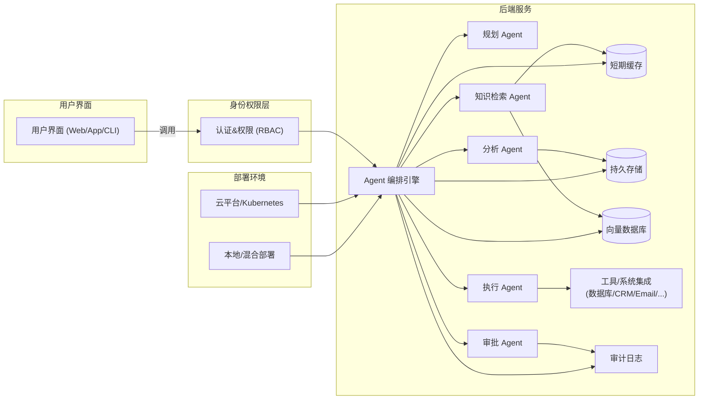

# 执行摘要

近年来，企业级 AI Agent 从“会聊天”向“会规划、会调用工具、会执行”演进。成功案例表明，高效的企业 Agent 通常具备**知识检索（RAG）**、**工具调用与流程自动化**、**多智能体协作**、**安全治理**等能力。实现中等复杂度的项目示例包括：智能数据分析助手、知识+工作流型助手、HR/财务流程自动化 Agent 等。这类项目不仅技术含量高（涉及多轮对话、工具链集成、记忆模块等），且商业价值明确（提升效率、降本增效），在简历中具有亮眼的加分效果。下文推荐三个典型用例，并给出关键功能、技术架构、开发里程碑等规划，以支持在三个月内开发可演示的企业级 Agent 原型。

## 推荐项目用例

| 用例 | 简历加分度 | 实现难度 | 商业价值 | 理由 |
|---|:---:|:---:|:---:|---|
| **企业数据分析 Agent**（AI 数据分析师） | ★★★★★ | ★★★★☆ | ★★★★★ | 自动化业务报表与洞察，直接提升决策效率。AWS 实践表明，仅用几百行代码就可构建从数据获取到报告输出的智能分析系统，效率提升几十倍。具备数据处理、代码执行等技术亮点，成果可量化（分析速度或准确率）。 |
| **企业知识工作 Agent**（知识+工作流型） | ★★★★☆ | ★★★★☆ | ★★★★★ | 整合企业知识库（文档、Wiki、邮件等）和业务系统，实现问答+任务执行。腾讯案例中，基于知识库的 Agent 已在售后故障诊断、HR 招聘等场景创造明显价值。技术涵盖 RAG、记忆、多轮规划、工具调用和流程编排，是典型的多 Agent 协作系统。 |
| **企业流程自动化 Agent**（HR/财务自动化） | ★★★☆☆ | ★★★☆☆ | ★★★★☆ | 自动化日常流程（如差旅申请、发票审核等），要求适中但收益明确。最新趋势表明，财务发票等场景从简单 OCR 转向「感知–决策–执行」闭环的智能 Agent。企业急需打通数据孤岛、提高自动化水平，本项目成果可直接体现在节省工时和错误率下降。 |

*注：星级评估为相对参考，数值基于示例项目技术深度和市场需求综合判断。*

## 用例1：企业数据分析 Agent 的关键功能

| 功能                           | 优先级 | 实现要点                                                                 | 外部系统/工具           |
|:-----------------------------|:----:|:-----------------------------------------------------------------------|:---------------------|
| 数据源接入与提取                   | 高   | 支持连接常用数据源（SQL 数据库、CSV/Excel、云存储等），动态加载数据              | MySQL/PostgreSQL/S3/Excel 等 |
| 用户需求交互与澄清                 | 高   | 多轮对话交互：Agent 首先询问分析目标、时间范围、维度等，避免分析跑偏       | 前端 Chat UI 或 CLI      |
| 自动化数据分析                    | 高   | 利用 LLM 生成 Python/SQL 代码执行数据清洗、统计分析、异常检测等（例如调用 Pandas、NumPy）  | Python 环境、Pandas、NumPy |
| 可视化与报告输出                  | 高   | 生成图表（折线图、柱状图等）和文本报告（Markdown/HTML），可选择邮件发送或下载             | Matplotlib、Charting 库    |
| 持续对话记忆（短期）               | 中   | 对当前会话状态和上下文（如已回答问题、生成的图表）进行缓存，支持多轮分析                  | Redis 等缓存             |
| 可追溯性和审计                    | 中   | 记录每次对话、工具调用和结果；生成日志（时间戳、请求/响应详情）供审计                        | 日志服务（如 ELK）        |

## 用例2：企业知识工作 Agent 的关键功能

| 功能                           | 优先级 | 实现要点                                                               | 外部系统/工具                 |
|:-----------------------------|:----:|:---------------------------------------------------------------------|:-------------------------|
| 企业知识库整合与检索                | 高   | RAG 检索：接入文档管理系统（Wiki、Confluence、文档库、邮件系统），构建向量检索引擎；查询时返回引用来源       | 文档服务（Notion/Confluence/SharePoint）、向量数据库（Pinecone/Milvus） |
| 用户对话与任务规划                 | 高   | 多轮对话，理解用户请求（如“分析客户情况并创建任务”），通过 Planner Agent 分解任务，协调子 Agent 执行       | OpenAI/GPT 模型调用         |
| 子 Agent 协作                     | 高   | **知识 Agent**：根据问题检索信息；**分析 Agent**：运行 SQL/Python 进行数据分析；**执行 Agent**：调用外部系统（CRM/邮件）创建任务   | 数据库、BI 工具、CRM、邮件 API |
| 工具调用和执行                     | 中   | 封装具体动作接口：如发邮件、创建 CRM 记录、更新数据库、发送 Slack/邮件通知等；执行 Agent 要实现与企业系统 API 对接      | CRM 系统（Salesforce）、电子邮件服务、Slack/钉钉 API    |
| 短期/长期记忆                     | 中   | 追踪用户偏好、历史对话；长期保留关键交互（如已完成任务、已决策内容）                  | Redis + SQL/Vector DB       |
| 权限控制与数据隔离                  | 高   | 基于用户角色的访问控制：不同角色只能调用特定工具、查询相应数据；细粒度权限管理确保敏感信息隔离             | 组织权限系统（LDAP/AD）、OneID 等  |
| 审计日志                         | 中   | 记录对话、决策流程与工具调用历史，支持事后审计与故障排查                           | 日志系统、审计平台           |

## 用例3：企业流程自动化 Agent 的关键功能

| 功能                           | 优先级 | 实现要点                                                             | 外部系统/工具                 |
|:-----------------------------|:----:|:-------------------------------------------------------------------|:-------------------------|
| 自然语言请求处理与指令识别           | 高   | 将用户请求解析成结构化任务（如「申请差旅」->填写表单、审批流触发），支持语义理解和任务映射            | LLM 模型、Intent 识别       |
| 业务政策与流程知识库（RAG）          | 高   | 企业政策、审批流程等文档存入知识库，Agent 可检索准确信息（如预算限额、出差规定）                | 内部政策文档、向量数据库       |
| 表单自动填写与提交                  | 高   | 根据用户信息和业务规则，自动填写HR/财务系统表单，并提交审批流；支持审批节点配置（如经理审批）        | HR系统（如 Workday）、OA/ERP API  |
| 审批流协同与通知                   | 中   | 自动发送待审批通知（邮件/IM）、生成审批待办；记录审批结果并推进流程                         | 邮件、钉钉/Slack 集成        |
| 人机协同（关键环节人工审批）          | 高   | 对于风险操作（如大额转账、合同签订），必须人工确认；设置 Agent 建议 -> 人员审批 -> 执行的工作流    | 审批系统（Flow engine）       |
| 短期/长期记忆                     | 中   | 记录用户偏好或前一次审批结果，如同一用户的常见申请内容；长期记忆可保存上次流程历史以便复用        | Redis + SQL                |
| 权限与安全                       | 高   | 严格基于角色定义：普通员工不能直接触发执行高敏感操作；敏感操作记录审计日志                         | RBAC 系统、数据加密、审计日志   |

## 技术架构

下图为推荐的企业级 Agent 系统简化架构示意：  



**说明：** 用户通过界面提交请求，经认证权限后由 Orchestrator 调度不同类型的 Agent（规划、知识、分析、执行、审批等）完成任务。系统使用**Redis**作短期会话缓存，**PostgreSQL**等关系型数据库作长期存储，**向量数据库**支持语义检索（RAG）。工具层集成各类外部系统（CRM、ERP、邮箱、IM 等），Agent 执行 API 调用或脚本与之交互。**身份与权限**模块进行用户鉴权和工具访问控制，**审计日志**记录整个过程以满足合规要求。部署上可采用容器化（Kubernetes）架构，支持云端或混合云环境。此架构兼顾灵活性与可扩展性，可作为简历中“企业级 Agent 平台”的核心组成。

## 最小可行产品（MVP）范围与3个月开发里程碑

| 时间节点    | 里程碑与产出                                                         | 验收标准                                                         |
|:---------|:------------------------------------------------------------------|:--------------------------------------------------------------|
| **第1个月** <br/>*单智能体阶段* | - 完成核心环境搭建（选型框架：例如 Python + OpenAI Agents SDK 或 LangChain）<br/>- 实现基础对话界面 (Web/CLI)<br/>- 集成 RAG：导入示例知识文档，向量数据库索引<br/>- 开发单一 Agent：能够针对知识库问答及简单工具（如数据库查询）进行回答<br/>- 简单日志记录 | - 系统能基于示例文档库正确回答问题（命中率可测）<br/>- 能调用至少一个外部数据源（如SQL）并返回结果<br/>- UI展示对话，基础日志记录可查询 |
| **第2个月** <br/>*多智能体与执行*  | - 引入多智能体编排：添加规划/分析/执行 Agent，支持任务链执行<br/>- 实现工具调用：例如调用邮件 API、创建 CRM 记录、调用 Python 环境执行代码<br/>- 丰富示例场景：实现一个完整流程（如“客户分析并创建跟进任务”）<br/>- 增加短期记忆：当前会话语境追踪<br/>- 内部评审 Demo  | - 多轮复杂示例任务能自动完成：即 Agent 按场景流程检索知识、分析数据、触发执行工具<br/>- 所有工具调用结果正确记录并反馈给用户<br/>- 无关键错误崩溃，核心功能演示通过产品评审 |
| **第3个月** <br/>*企业化与部署*    | - 实现权限控制：不同用户角色调用权限区分（如仅管理员执行敏感操作）<br/>- 审计与监控：全面日志记录（调用链、决策过程、错误日志），并可查询<br/>- Human-in-loop：对高风险操作增加人工确认环节<br/>- 系统优化：UI 美化、异常处理、性能调优<br/>- 完成生产部署：Docker/K8s 容器化部署，准备最终 Demo  | - 权限规则有效：测试不同角色限制效果<br/>- 可完整追溯一次任务的所有决策与工具调用过程<br/>- 风险操作触发等待人工确认流程<br/>- 项目文档齐备，Demo能顺利演示预定用例（性能稳定、无敏感数据泄露） |

每阶段结束时进行评审：确保功能满足验收标准后进入下阶段。三个月内应重点关注技术核心（智能体能力、工具集成、架构稳定），在最后留足时间进行调优和补充测试。

## 技术栈与组件清单

- **编程语言与框架：** 推荐使用 **Python**（生态丰富，简洁）；后端框架可选 **FastAPI**（高性能异步 Web 框架）或 Flask。若偏好 TypeScript/Node，也可使用 OpenAI 的 TypeScript Agents SDK。
- **智能体框架：** 可以选用 **OpenAI Agents SDK**（官方代理框架，支持多 Agent 编排、工具调用等功能），或开源 **LangChain**/**LangGraph**（支持多种模型/工具集成和持久化运行）。LangChain 具有大量现成模板；OpenAI SDK 提供托管选项和细粒度控制。
- **LLM 模型：** 主要调用商业API，如 OpenAI GPT-4/GPT-4o（需申请），或 Anthropic Claude 等。亦可考虑开源大模型（如Mixtral, LLaMA系列）部署到本地或私有云。中文支持可选百度文心一言/飞桨文心 ERNIE、华为盘古等，同时确保它们具备工具调用能力。
- **RAG 和向量检索：** 向量数据库推荐使用 **Milvus**、**Pinecone**、**Weaviate** 或 **Qdrant**。Milvus/Weaviate 开源成熟，Pinecone 商用稳定。向量数据库用于存储文本嵌入，实现语义搜索。也可考虑使用腾讯 PostgreSQL+向量扩展（已集成向量+图+关系三位一体记忆能力）。
- **短期/长期记忆：** 可用 **Redis** 做会话缓存，**PostgreSQL/MySQL** 存储长期结构化数据（用户信息、配置等）。在腾讯方案中，PostgreSQL 可扩展为 Agent 长期记忆库。也可选用图数据库（Neo4j）辅助关系推理。
- **工具/系统集成：** 根据用例可能需要访问 **CRM**（如 Salesforce）、**ERP/财务系统**、**HR/OA 系统** 等。可通过 REST API 或数据库直连实现。邮件/IM 通知可用 SendGrid、钉钉/Slack API 等。报表可集成 BI 平台（如 Metabase、Tableau）导出或邮件发送。
- **前端/UI：** 简易聊天界面可使用 **React** 或 **Vue**，也可快速用 **Streamlit**/Gradio 构建交互原型。重要的是展示多轮对话和结果（表格/图表）。
- **部署与运维：** 使用 **Docker** 容器化，各服务可部署在 Kubernetes 上；可选 AWS ECS、Azure AKS 等。监控推荐使用 Prometheus + Grafana；日志可集中到 ELK Stack 或 Tencent Cloud Log Service。
- **替代方案：** 若不使用 OpenAI SDK，可用 **Anthropic Agents API**（参考 Microsoft 文档）；如果不使用 LangChain，可用 **LLMFlow**、**AutoGen** 等框架。替代向量库：**ChromaDB**（本地免费）亦可。每种选择请参考官方文档评估功能。

以上组件均有官方文档（英文为主，可参考对应的中文博客教程）。建议优先使用社区活跃、文档完善的方案。

## 简历与面试展示要点

- **项目描述：** 开发了一个企业级多智能体自动化平台，实现了对内部知识库和数据的语义检索、自动分析及业务流程执行。项目能够接收自然语言请求，自动完成数据查询、报告生成和任务创建等操作。
- **个人贡献：** 主导架构设计与功能实现，包括选择技术栈（Python + OpenAI Agents SDK）、搭建向量数据库用于知识检索、开发 Agent 编排逻辑，并与后端系统（数据库、CRM、邮件）集成。
- **技术亮点：** 实现了 RAG (Retrieval-Augmented Generation) 多轮对话、LLM 自动代码生成与执行（如 Pandas 数据处理）、工具调用机制。应用了缓存（Redis）和长期记忆（PostgreSQL 向量扩展）优化会话连续性。加入权限控制和审批流，实现人机协同安全部署。
- **可量化成果：** 示例场景中，系统将原本 3 小时的数据分析流程压缩至数分钟；HR 招聘 Agent 自动筛选简历，成功将人员筛选效率提升数倍。日志审计确保流程透明可溯，引入人工审批后风险操作零误判。
- **Demo 脚本：** 演示通过 UI 输入一个业务请求（如“分析上季度销售并生成后续任务”），系统自动检索相关销售记录、生成分析报告，自动创建 CRM 跟进任务，并通过 IM 通知负责人；展示多轮对话、后台日志和审批流程。

## 风险与治理要点

- **权限控制：** 按角色分级授权。使用统一身份认证（如企业 LDAP/AD，或 OneID）绑定企业数据权限。例如，仅经理级用户可批准大额报销请求；敏感工具调用需额外验证。通过“Allow/Ask/Deny”机制控制 Agent 可执行操作。
- **审计日志：** 系统需记录每次用户请求、Agent 决策、工具调用和输出结果，确保全流程可追踪。如腾讯方案所示，审计日志可记录在 Portal 中。任何异常操作都能追溯到具体时间、用户和逻辑链，便于事后分析和合规检查。
- **Human-in-the-loop：** 对高风险操作（如资金转账、关键配置变更）强制人工审批。在 Agent 生成操作建议后，引入审批 Agent 或触发人工确认。只有通过人工审核后，Agent 才执行最终动作，防止误操作。
- **数据隐私与安全：** 严格控制敏感数据访问。输入输出时使用内容安全检查，自动过滤密钥或个人隐私。对外部系统调用进行网络隔离（如使用容器沙箱）。存储时加密重要字段，确保不同企业/部门数据隔离。
- **稳健性与监控：** 设置超时和重试机制，防止 Agent 无限循环或滥用资源。监控系统性能和成本（如模型调用次数、API 调用量），及时警报。频繁出现低置信度结果时应记录并人工优化模型提示。
- **合规：** 确保训练与使用的模型和数据符合所在地区的隐私法规（GDPR、PIPL 等）。敏感场景下预先进行风险评估，必要时使用本地化模型或提供数据屏蔽/脱敏。

## 估算工作量与人员配置

- **人员配置：** 预计需要 **2-3 名工程师**协同开发：1-2 位后端/AI工程师（负责智能体开发、模型集成、后端逻辑），1 位前端/DevOps工程师（负责 UI、部署与运维）。可根据项目规模微调。
- **人月估算：** 三个月全职约 **6-9 人月**。具体可分为：环境搭建和基础功能（~2-3 人月）、多 Agent 功能与集成（~3-4 人月）、安全治理与部署（~1-2 人月）。
- **简化方案：** 若资源有限，可简化功能：只实现单一领域（如仅数据分析或仅知识问答），不考虑多 Agent 协作与复杂工作流；暂时可省略完整的权限管理和长记忆。这样可将项目难度降低到 4-6 人月，依然实现Demo和基本验证。

``` 

**参考资料：** 以上规划借鉴了近年企业级 Agent 应用实践和厂商案例。例如，亚马逊 AWS 构建的数据分析 Agent 将 3 小时流程缩至几分钟，腾讯云 WorkBuddy 平台在售后和 HR 场景取得成果，LangChain 与 OpenAI 官方文档提供了 Agent 开发框架和工具调用模式。这些经验表明，合理聚焦核心场景、组合 RAG+工具调用、并关注企业级治理，能使项目在三个月内可交付一个技术含量高、能在简历中展示的成果。
```