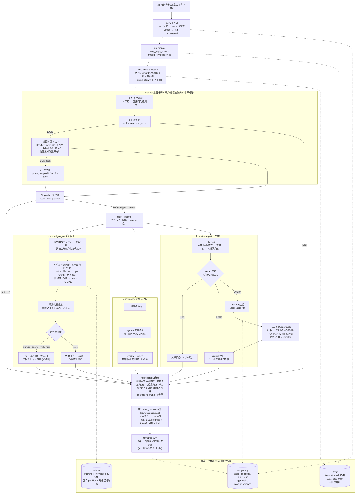

# 智多星——企业级多智能体平台 — 产品文档

> 版本:v1.5
> 日期:2026-07-27(内容基线)/ 2026-08-06(v1.3.0 同步)
> 对应项目版本:v1.3.0(2026-08-06 生产就绪与全量更名,见根目录 CHANGELOG.md 与 Git tag v1.3.0)
> 阶段:W2-W9 全部完成 + 整体联调(17/17 通过)+ P1/P2 迭代完成 + 生产对抗性审查修复完成 + 业务闭环补全与项目归档(v1.2.0)+ 生产就绪基线/压测容灾/安全加固/更名「智多星」(v1.3.0)+ 内部落地与业务验证(v1.3.0)
> 关联:[产品方案 v3](../10-product-plan/企业知识工作流Agent产品方案_v3_整合版.md) · [阶段性总结 W2-W6](../40-process/阶段性总结_W2-W6.md) · [阶段性总结 W7-W9+联调](../40-process/阶段性总结_W7-W9_联调.md)

---

## 一、项目背景

### 1.1 要解决的问题

企业内部的制度、流程、业务知识分散在各类文档中,员工查询靠问人、翻文档,效率低;同时大量业务动作(查客户、发邮件、建工单)需要在多个系统间手工切换。本项目构建一个**企业级多 Agent 系统**,让员工用自然语言一站式完成:

- **知识问答**:基于企业知识库的 RAG 问答(带权限隔离、来源标注、置信度决策)
- **数据分析**:业务数据的统计、对比、趋势分析(真实计算,禁止编造数字)
- **业务执行**:调用 CRM/邮件/工单等工具完成动作(带 RBAC、审批流、Saga 补偿)

### 1.2 企业级诉求

区别于 Demo 级 Agent,本项目从第一天就按生产标准建设:

- **权限安全**:5 角色 × 8 工具 RBAC 矩阵、文档命名空间隔离、Prompt 注入防护、高风险操作审批流
- **可用性**:LLM/检索/Checkpointer 三条降级链,任一依赖故障不宕机
- **可观测**:Prometheus 指标 + OpenTelemetry 全链路追踪 + 6 类事件审计落库
- **状态可靠**:Redis Checkpointer 断点恢复,进程重启对话不丢

### 1.3 当前状态

| 里程碑 | 状态 |
|--------|------|
| W2-W4 基础设施 + RAG + 评测 | ✅ 完成 |
| W5-W8 多 Agent 图 + Checkpointer + 工具 + API | ✅ 完成 |
| W9 生产化(Milvus 真实接入 + 可观测 + 部署) | ✅ 完成 |
| 整体联调(真实基础设施端到端) | ✅ 17/17 通过 |
| P1 迭代(AnalysisAgent/审批打通/审计/反馈) | ✅ 完成 |
| P2 迭代(命名空间隔离/取消机制/sessions 梳理/Prompt 版本管理) | ✅ 完成(实测:隔离 4/4、取消 E2E、A/B 回滚、回归 W5+W7 全绿) |
| P2 后续增强(前端 SPA /ui、SSE 流式、/metrics) | ✅ 完成(实测:token 流 126 事件、进度去重、中途取消即时生效) |
| 前端 v2 业务场景化增强(2026-07-27) | ✅ 完成:10 种子用户(5 角色 × 4 部门)/ 业务场景 chips(按角色)/ 业务数据参考页签(8 客户 + 8 订单 + 6 工单 + 7 文档)/ 批量审批 batch_2026_001 预置 3 条 / init.sql 8 客户 + 8 订单 + 6 工单 Mock 数据同源 |
| 审批进度跟踪(2026-07-27) | ✅ 完成:GET /approvals/mine(发起人视角)+ 前端「我的审批」区块(审批页签全员开放,approved_pending_reauth 一键恢复执行);实测:赵六 3 单返回、报价单邮件 approved_pending_reauth → executed |
| 多人协作闭环(2026-07-27) | ✅ 完成:salesperson 开放 send_email_external(高风险→审批)/ 新工具 query_my_approvals(8 工具)/ planner 子任务去重(修双写)/ 待审清零;实测:张三发起→赵六批→张三跟踪全链 E2E、双写复测单任务、回归 W7 7/7 + W5 通过 |
| 前端 v3 + 答案话术(2026-07-27) | ✅ 完成:个性化欢迎态(时段问候+角色简介+建议卡片)/ 场景 chips 弹窗化(✨ 场景按钮)/ 工具结果模板化格式化(_fmt_tool_output,不再透传原始 dict);实测:赵六/张三双视角截图、查客户+多工具话术正常 |
| 内部落地(2026-08-06) | ✅ v1.3.0:核心能力在内部业务环境中完成验证,覆盖知识问答/数据分析/业务执行/企业治理四条主链路;k6 压测与容灾演练、三道安全扫描闸、工单真实接入试点落地 |

---

## 二、技术栈

| 类别 | 组件 | 版本(实测) | 用途 |
|------|------|------------|------|
| 运行时 | Python | 3.11.15 | conda 环境 `enterprise_agent` |
| Agent 编排 | LangGraph | 1.2.9 | StateGraph + Send fan-out + Checkpointer |
| 原子能力 | LangChain | 1.3.14 | Retriever/Tool/Model 抽象 |
| Checkpoint | langgraph-checkpoint-redis | 0.5.1 | AsyncRedisSaver(主) |
| Checkpoint 降级 | langgraph-checkpoint-postgres | 3.1.0 | PostgresSaver(备) |
| Web 框架 | FastAPI + uvicorn | 0.140 / 0.51 | REST API |
| ORM | SQLAlchemy(async) | 2.0.51 | PG 访问(原生 SQL 一律 `text()`) |
| 向量库 | Milvus(pymilvus) | 2.4(客户端 3.0) | HNSW 索引 + Partition 命名空间 |
| 关系库 | PostgreSQL | 16-alpine | 业务/审批/审计/反馈存储 |
| 缓存/状态 | Redis Stack | 7.4.0-v3 | Checkpointer / 限流(含 RediSearch) |
| 本地 LLM | Ollama | latest | qwen3.5:4b 托管 |
| Embedding | bge-m3(本地) | 1024 维 | 向量化(CUDA) |
| Reranker | bge-reranker-large(本地) | - | 两阶段检索精排 |
| 追踪 | OpenTelemetry + Jaeger | 1.x / 1.60 | 全链路 span |
| 指标 | Prometheus + Grafana | latest | 指标采集与看板 |

部署形态:Docker Compose 编排 Milvus(etcd/minio/standalone)+ PG + Redis;API 宿主机直跑(开发)或容器化(生产 profile + Nginx 反代)。

---

## 三、项目结构

```
enterprise-agent/
├── app/
│   ├── main.py               # FastAPI 入口(lifespan 初始化:tracing/DB/审计/Milvus/工具/Prompt 同步)
│   ├── config.py             # Settings 单例(.env 驱动,默认值与开发环境对齐)
│   ├── api/                  # REST 层
│   │   ├── auth.py           #   登录 / 刷新 / me(JWT)
│   │   ├── chat.py           #   对话 / 流式(SSE)/ 取消 / 历史 / 反馈
│   │   ├── approval.py       #   审批决策 / 待审列表 / 我的审批(发起人进度)/ 批量审批 / 恢复执行
│   │   └── prompts.py        #   Prompt 版本管理 API(列表/建 draft/激活/流量,仅 admin/manager)
│   ├── prompts/              # Prompt 版本管理(P2-1)
│   │   ├── defaults.py       #   代码内置默认模板(11 个,与 prompt_versions v1 同源)
│   │   └── registry.py       #   进程内缓存 + A/B 确定性分流(md5(user:name)%100) + DB 故障降级
│   ├── static/               # 前端 SPA(index.html,FastAPI 挂载 /ui)
│   │   │                      #   v2(2026-07-27):10 种子用户(5 角色 × 4 部门)/ 业务场景 chips(按角色:
│   │   │                      #   销售·查 C001/建跟进任务、客服·查工单/建工单、财务·差旅报销/转账限额、
│   │   │                      #   管理·发外部邮件/Saga 多步骤)/ 业务数据参考页签(8 客户 + 8 订单 + 6 工单 + 7 文档,
│   │   │                      #   与 init.sql 及 CRM/工单 Mock 同源,每行带「查询」按钮一键发问)/
│   │   │                      #   流式对话/取消/反馈/审批/Prompt 管理/系统状态,角色感知页签
│   │   │                      #   v2.1(2026-07-27):审批页签全员开放,新增「我的审批」区块(发起人进度
│   │   │                      #   跟踪 + approved_pending_reauth 一键恢复执行),「待我审批」仍仅 manager/admin
│   ├── graph/                # Harness(LangGraph 编排骨架,见第四节)
│   │   ├── state.py          #   AgentState + 可重置 reducer
│   │   ├── planner.py        #   意图分类 + 任务分解
│   │   ├── dispatcher.py     #   条件路由(返回 Send 列表)
│   │   ├── executor.py       #   子任务执行器(async 节点 + Agent 缓存)
│   │   ├── aggregator.py     #   结果汇总(单结果直通/多结果 LLM 汇总,async 节点支持流式)
│   │   ├── checkpointer.py   #   Redis→PG→Memory 三级降级
│   │   └── graph.py          #   主图组装 + run_graph 入口
│   ├── agents/               # 子 Agent(统一 AgentResult 契约)
│   │   ├── knowledge.py      #   知识问答(RAG + 自评)
│   │   ├── analysis.py       #   数据分析(计划→计算→报告,多跳≤2 轮)
│   │   └── execution.py      #   工具执行(选择→RBAC→执行/审批建单)
│   ├── rag/                  # RAG 模块
│   │   ├── retriever.py      #   两阶段检索(粗排+精排,政策场景 shared 平局优先)
│   │   ├── vector_store.py   #   Milvus / InMemory 双后端工厂
│   │   ├── degradation.py    #   检索三级降级(向量→BM25→PG LIKE,P2-3 同口径部门过滤)
│   │   ├── confidence.py     #   场景化置信度决策
│   │   ├── embeddings.py     #   本地 bge-m3
│   │   ├── reranker.py       #   本地 BGE Reranker(LLM 降级)
│   │   ├── document_loader.py#   文档加载与切分(Markdown/文本)
│   │   ├── ingest.py         #   文档入库 CLI
│   │   └── llm.py            #   LLM 路由(primary/lite/local + 降级)
│   ├── tools/                # 工具生态(8 工具)
│   │   ├── base.py           #   ToolGateway(RBAC/参数/注入/审计/tracing)
│   │   ├── crm.py            #   客户/订单/任务(Mock,契约对齐真实 API)
│   │   ├── mail.py           #   内部/外部邮件(外部=高风险,需审批)
│   │   ├── ticket.py         #   工单创建/更新
│   │   ├── approval.py       #   query_my_approvals(发起人审批进度查询,2026-07-27)
│   │   └── saga.py           #   Saga 协调器(失败反向补偿)
│   ├── security/
│   │   ├── rbac.py           #   角色/工具矩阵 + 命名空间 + JWT 解析
│   │   └── jwt_manager.py    #   JWT 签发/刷新/过期检查
│   ├── middleware/
│   │   └── rate_limit.py     #   Redis ZSET 滑动窗口(内存降级)
│   ├── observability/
│   │   ├── audit.py          #   审计日志(PG 存储,本地文件兜底,连续失败 5 次告警)
│   │   ├── metrics.py        #   Prometheus 指标中间件
│   │   └── tracing.py        #   OpenTelemetry(OTEL_ENABLED 开关)
│   └── core/
│       ├── database.py       #   SQLAlchemy async 引擎/会话工厂 + sessions 状态机
│       ├── cancellation.py   #   进程内 session_id → asyncio.Task 注册表(P2-2 取消机制)
│       └── milvus_client.py  #   Milvus 连接/Collection 管理
├── eval/                     # 验证脚本(8 核心 + 3 辅助诊断)
│   ├── run_eval.py           #   W4 RAG 评测(命中率/覆盖率/延迟)
│   ├── run_w5_e2e.py         #   W5 多 Agent 图端到端
│   ├── run_w6_checkpoint.py  #   W6 Checkpointer 断点恢复
│   ├── run_w7_execution.py   #   W7 工具 + Saga + 注入防护
│   ├── run_w9_milvus.py      #   W9 Milvus 真实接入
│   ├── run_w9_tracing.py     #   W9 OTel tracing 全链路
│   ├── run_p2_namespace.py   #   P2 命名空间隔离回归(含降级链泄露)
│   ├── verify_recall_fix.py  #   P3 召回质量修复验证(shared 平局优先)
│   ├── diag_recall.py        #   召回诊断工具
│   ├── bench_local_llm.py    #   本地 LLM 基准测试
│   └── _tmp_test_analysis.py #   临时调试脚本
├── deploy/                   # init.sql / nginx.conf / prometheus.yml / DEPLOY.md
├── docker-compose.yml        # 开发编排(Milvus+PG+Redis+API)
├── docker-compose.prod.yml   # 生产编排(Nginx+资源限制+日志驱动)
└── Dockerfile
```

---

## 四、Harness 构造(LangGraph 编排骨架)

Harness 是系统的编排骨架:它决定「谁来理解用户、任务怎么拆、子 Agent 怎么跑、结果怎么合、状态存哪里、出错怎么办」。按 Harness 六组件框架对照本项目实现:

| 组件 | 核心职责 | 本项目实现 | 现状 |
|------|----------|------------|------|
| **编排引擎** | 控制 Agent Loop,管理多 Agent 调度与路由 | LangGraph StateGraph:planner → Send 并行 fan-out → executor → aggregator(4.1) | ✅ 完整 |
| **上下文工程** | prompt 组装、上下文压缩、分层注入、token 预算 | 按节点最小化注入(工具列表按角色裁剪/检索片段 top-5/计算结果 JSON);模型分层控成本;**压缩与 token 预算未做**(4.2) | 🔶 部分 |
| **记忆系统** | 短期(对话内)+ 长期(跨会话)+ 工作记忆(当前任务) | 工作记忆 = AgentState;短期 = Checkpointer 快照;会话元数据 = sessions 表;长期 = user_memories(表已建未接)(4.3) | 🔶 部分 |
| **工具接入层** | 注册、发现、权限校验、调用执行、结果格式化 | ToolGateway 统一网关 + 注册表 + 8 工具 + Saga 补偿(4.4) | ✅ 完整 |
| **安全护栏** | 权限检查、敏感操作审批、输出过滤、循环/token 上限 | RBAC 三防线 + 高风险审批流 + 注入检测 + 限流;循环上限 = 分析多跳 ≤2 轮(4.5) | ✅ 完整 |
| **可观测性 & 恢复** | 日志、追踪、指标、失败重试、降级、回滚 | OTel tracing + Prometheus + 审计落库;三条降级链;checkpoint 断点恢复;Saga 回滚(4.6) | ✅ 完整 |

---

### 4.1 编排引擎:任务编排与多 Agent 调度

#### 4.1.1 图结构与执行流

```
START
  ↓
planner(意图分类 + 任务分解,sync 节点)
  ↓ (route_after_planner 条件边)
  ├─ "aggregator"(闲聊/无子任务)────────┐
  └─ list[Send("agent_executor", …)]     │
       (多子任务并行 fan-out)            │
       ↓                                 │
     agent_executor(并行 N 个,async)     │
       ↓                                 │
     aggregator ←────────────────────────┘
       ↓
     END
```

三个节点 + 一个条件边函数,全部经由 `run_graph(user_input, thread_id)` 入口触发(`app/graph/graph.py`)。编译产物按 checkpointer 后端缓存(`_compiled_graphs`),同一后端只编译一次。

关键工程决策:

- **Send 在条件边返回**,不在节点返回(LangGraph 约束,踩过坑:节点返回 list[Send] 会报 Expected dict)
- **executor 必须是 async 节点**:Agent 内部要访问 SQLAlchemy async 引擎(审计/审批建单),同步节点开新线程跑 `asyncio.run` 会触发 "Future attached to a different loop"
- **aggregator 同为 async 节点**(流式改造时从 sync 迁来):多结果汇总要 ainvoke + `final_answer` 标签,让 token 流能进入 `astream_events`;planner 保持 sync(无面向用户的生成)
- **Agent 单例缓存**:按 `(task_type, dept, role, user_id)` 缓存(`app/graph/executor.py`),避免重复初始化 Retriever,且不会串用户身份
- **executor 异常不炸图**:任何子任务异常都被捕获并包装成 `success=False` 的 AgentResult 继续走汇总,单个 Agent 失败不影响其他并行分支

#### 4.1.2 Planner:意图理解三段式(`app/graph/planner.py`)

planner 是 sync 节点(跑在线程池),内部按「最便宜优先」顺序级联,任一环节命中即短路:

| 步骤 | 模型 | 作用 | 失败降级 |
|------|------|------|----------|
| 0. 超短消息预判 | 无(纯规则) | ≤4 字符且无业务关键词 → 直接判闲聊,零 LLM 调用 | — |
| 1. 闲聊判断 | qwen3.5:4b(本地) | 是/否二分类,命中闲聊则跳过全部云端调用 | 本地不可用 → 当作非闲聊继续 |
| 2. 意图分类 | qwen3.5:4b(本地,lite 主路径;v4-flash 降级) | 6 类选 1:knowledge_qa / multi_task / approval_flow / data_operation(含查客户/订单/工单等业务记录查询) / data_analysis / chitchat | 本地失败/输出不可用 → 云端 v4-flash 运行时重试 → 规则关键词匹配(优先级:multi_task > approval > operation > analysis > knowledge,兜底 chitchat) |
| 3. 任务分解 | deepseek-v4-pro(primary) | 仅 multi_task 时触发,拆 2-4 个独立子任务 | 降级为单一 knowledge 子任务 |

配套容错:

- **多轮历史注入**:`state["history"]` 非空时,意图分类把历史块(最近 5 轮问答)前置拼进 `{message}` 槽,让「那它的折扣呢」这类指代型追问能正确分类(见 4.2.4;闲聊预判/任务分解不带历史)
- **JSON 解析容错**(`_parse_llm_json`):先剥离 markdown 代码块,再整体 `json.loads`,最后正则提取首个 `{...}` 块,三级尝试
- **意图/任务类型安全转换**:字符串不匹配枚举时返回 None 走降级,不抛异常
- **单任务直接构造**:非 multi_task 的意图按映射表(`knowledge_qa→knowledge`、`data_operation→execution`、`data_analysis→analysis`、`approval_flow→approval`)生成单个子任务 `t1`,description 即原始消息
- **子任务去重**(`_dedup_subtasks`,2026-07-27 引入,2026-07-28 修正):分解结果中 task_type 相同且(描述互相包含,或业务实体 C\d{3}/ORD/邮箱 有交集 **且动作动词也有交集**)的子任务合并为一条(保留更长描述),重排 task_id/priority——修复「建任务+发邮件」被拆成两个重叠 execution 分支导致重复建单的双写问题;2026-07-28 修正:旧规则只看实体交集,会把「查 C005 / 为 C005 建工单 / 为 C005 发邮件」这类同实体不同动作的子任务误并成一条,新增动作动词提取(`_extract_actions`)要求动作也重叠才合并;prompt 模板同步加了"不拆语义重叠子任务"约束

子任务契约 `SubTask`:`task_id / task_type / description / priority(按 LLM 输出顺序 10-i+1 递减)/ depends_on`。注意:`depends_on` 字段已定义但**当前调度器不消费它**——所有子任务一律并行,无依赖编排(见遗留事项)。

#### 4.1.3 Dispatcher:并行 fan-out(`app/graph/dispatcher.py`)

条件边函数 `route_after_planner` 的两种返回:

- `"aggregator"`(字符串):闲聊或无子任务,直达汇总
- `list[Send]`:每个子任务构造一个**独立子状态**(只含 `user_input / request_id / current_subtask / intent`),LangGraph 自动并行调度到 `agent_executor`

设计要点:并行分支之间**不共享可变状态**,各分支只读自己的 `current_subtask`,产出通过 `agent_results` 的 reducer 合并——这是 LangGraph map-reduce 模式的标准用法,从结构上消除了并行写冲突。

#### 4.1.4 Aggregator:结果汇总四分支(`app/graph/aggregator.py`)

| 分支 | 条件 | 行为 | LLM |
|------|------|------|-----|
| 闲聊 | intent=chitchat | 智多星 人格话术九分支(问候含用户称呼/自我介绍/心情状态/能力询问/日常寒暄/情绪共情/感谢/再见 + 未命中时 **lite LLM 即兴生成**,LLM 失败回默认模板),confidence=0.9 | 仅未命中分支时(lite 本地) |
| 无结果 | agent_results 为空 | 友好兜底文案,error="no_agent_results" | 否 |
| 单结果 | 1 个 AgentResult | 直通;失败时**优先保留 Agent 自带回答**(避免掩盖 RBAC 拒绝等友好提示),仅无回答时才报「处理失败」 | 否 |
| 多结果 | ≥2 个 | primary LLM 理解+整合;失败降级为直接拼接 | 是 |

多结果分支的合并规则:

- **sources 去重**:按 `chunk_id` 跨 Agent 合并
- **综合置信度**:成功结果按 confidence 降序,权重 `1/(i+1)` 加权平均(越可靠的结果话语权越大)
- **needs_replan 传播**:任一 Agent 标记则整体标记,reason 取第一个
- **全失败**:不调用 LLM,直接返回第一个错误原因
- **反序列化防御**:入口统一 `AgentResult.model_validate`(checkpoint 恢复后 pydantic 模型会变 dict,见 4.2.3)

#### 4.1.5 端到端实例:一条多任务消息穿越 harness

以经理赵六(dept_sales)发送「对比一下 C001 和 C002 的订单金额,然后把结果发内部邮件给张总」为例,走完整个图(延迟为实测量级示例):

```
t=0.0s   POST /chat/message(JWT 校验通过,role=manager)
         → 限流中间件放行 → 审计 chat_request → run_graph
t=0.1s   planner:超短预判不命中(>4 字符)
         → 本地 qwen3.5:4b 闲聊判断:"否"(≈2s)
         → lite 意图分类:{"intent":"multi_task",…}(≈3s)
         → primary 任务分解(≈6s):
             t1 analysis  "对比 C001 和 C002 的订单金额"
             t2 execution "把对比结果发内部邮件给张总"
         → 写 checkpoint(step=1)
t=11s    条件边返回 2 个 Send → 2 个 agent_executor 并行启动
         ├─ 分支A AnalysisAgent:lite 解析计划 {"metrics":["order_amount"],
         │   "entities":["C001","C002"],"compare":true}
         │   → Python 真实聚合(C001=130,000;C002=90,000)
         │   → primary 生成报告(≈35s)
         └─ 分支B ExecutionAgent:lite 工具选择 → send_email_internal
             → ROLE_TOOLS 过滤(manager ✓)→ pydantic 校验
             → 注入扫描通过 → Mock 发送成功(message_id=msg_…)(≈8s)
         → 两个分支各写 checkpoint
t=46s    aggregator:2 个成功结果 → primary LLM 汇总(≈8s)
         → 综合置信度加权(0.82×1 + 0.75×0.5)/(1+0.5)≈0.80
         → 写 checkpoint(step 末)→ 返回
t=54s    审计 chat_response(latency/confidence)
         → 响应 {session_id, answer(汇总报告+邮件已发回执), confidence: 0.80, …}
```

三个值得注意的行为:① 两个子任务**并行**执行,总耗时 ≈ 较慢分支 + 汇总,而非两者相加;② 分支 B 的工具调用全程过了 RBAC/参数/注入三道关卡,和分支 A 的分析互不感知;③ 若分支 B 失败(如邮件工具异常),不影响分支 A 的报告——aggregator 汇总时标注"邮件发送失败"并保留分析结果。

---

### 4.2 上下文工程:prompt 组装与分层注入

#### 4.2.1 按节点最小化注入

每个 LLM 调用点只拿到自己需要的最小上下文,不共享「大而全」的系统 prompt:

| 调用点 | 注入的动态上下文 | 裁剪手段 |
|--------|------------------|----------|
| planner 闲聊判断 | `{message}` | 本地小模型,输入即原文 |
| planner 意图分类 / 任务分解 | `{message}`(有历史时前置多轮历史块,见 4.2.4) | 仅当前消息 + 最近 5 轮问答(助手答案截断 200 字) |
| knowledge 答案生成 | `{context}`(检索片段 top-5)+ `{query}`(有历史时前置历史块) | 两阶段检索截断,片段入库时限长 8192 字符 |
| knowledge 答案自评 | `{query}` + `{answer}` | 本地小模型 |
| analysis 计划解析 | `{entities}`(可用客户 ID 全集)+ `{query}` | lite 模型 |
| analysis 报告生成 | `{query}` + `{computed}`(Python 计算结果 JSON) | 禁止编造数字的硬约束写死在模板里 |
| execution 工具选择 | `{tools}`(**按角色过滤后**的工具列表,含参数 schema:字段名+必填标记+字段描述)+ `{message}` | 无权工具不注入,既安全又省 token;schema 显式注入防本地小模型猜错参数名 |
| aggregator 多结果汇总 | `{question}` + `{agent_answers}` | 失败 Agent 只带错误摘要 |

实例:销售员张三说「给客户 C001 发条回访提醒」时,execution 工具选择实际发给 lite 模型的 prompt(注意 tools 列表只有 4 个——send_email_external 等无权工具在注入前就被裁掉了):

```
你是智多星,需要从用户消息中提取要执行的工具调用。

可用工具列表(仅以下工具,不要编造):
- query_customer(query): 查询客户信息
- query_order(query): 查询订单信息
- create_crm_task(action): 创建 CRM 任务
- send_email_internal(action): 发送内部邮件给同事(仅内部域名)

任务:分析用户消息,输出要执行的工具调用 JSON 数组。
…(输出格式与规则)…

【用户消息】
给客户 C001 发条回访提醒

【你的输出】
```

模板统一为 Python `str.format` 语法(JSON 示例花括号 `{{}}` 转义),P2-1 起由 `prompt_versions` 表统一版本管理(见第九节)。

#### 4.2.2 模型分层调度(上下文成本的另一道闸门)

| 节点 | 模型 | 理由 |
|------|------|------|
| planner 超短消息预判 | 无(规则) | ≤4 字符直接判闲聊,零成本 |
| planner 闲聊判断 | qwen3.5:4b(本地,reasoning=False) | 实测 ~0.3s/条,零云端成本 |
| planner 意图分类 | qwen3.5:4b(本地)→ v4-flash 降级 | 6 类选 1,本地小模型足够 |
| planner 任务分解 | deepseek-v4-pro(primary) | 需要推理能力 |
| knowledge 答案生成 | qwen3.5:4b(本地)→ v4-flash 降级 | grounded 答案是提取任务,不需要推理模型 |
| knowledge 答案自评 | qwen3.5:4b(本地,reasoning=False) | 实测 ~0.2s/次;灰区外跳过 |
| analysis 计划解析 | qwen3.5:4b(本地)→ v4-flash 降级 | 结构化抽取,本地实测 ~0.2s |
| execution 工具选择 | **deepseek-v4-flash(云端)优先** → 本地 qwen3.5:4b 兜底 → 关键词兜底 | 2026-07-28 反转:本地 4B 会"选错工具"(合法 JSON 漏选动作工具),空回退不触发;云端 flash 实测 1.2~1.5s,正确率优先于延迟 |
| analysis 报告 / aggregator 多结果汇总 | deepseek-v4-pro | 真正需要推理/整合的环节 |
| aggregator 单结果 | 不调 LLM(直通) | 省成本 |
| aggregator 闲聊 | 命中分支:不调 LLM(智多星 人格话术模板);未命中:本地 qwen3.5:4b 即兴生成 | 模板零成本;生成走本地仍零云端成本(2026-07-28 起) |

> 2026-07-26 模型路由修正:曾将 lite 主路径迁到云端 flash(误判本地慢是 GPU 争用),
> 后实测发现真正根因是 ChatOpenAI 走 Ollama /v1 端点时 `extra_body={"think": False}`
> 被忽略,模型照生成 thinking token(自评单次 44-94s);迁移 ChatOllama +
> `reasoning=False` 后本地 0.2-0.3s/次,快于云端 flash(8.7-18.1s),
> lite 层反转为**本地优先、云端 flash 降级**;primary(v4-pro)仍在云端,
> 承担任务分解/分析报告/多结果汇总。
>
> 2026-07-28 例外:execution 工具选择反转为**云端 flash 优先**——本地 4B 会返回
> 合法 JSON 但选错工具(如发外部邮件只选 query_customer 漏 send_email_external),
> 「返回空才上云」的回退抓不到这种错误;改候选链(云端 flash → 本地 → 关键词)
> 后实测建单恢复,云端 flash 仅 1.2~1.5s/次,成本≈0。其余 lite 环节仍本地优先。

#### 4.2.3 AgentState:结构化上下文载体

`AgentState` 是 TypedDict(`total=False`),按职责分区逐步填充,是图内各节点交换上下文的唯一通道:

| 分区 | 字段 | 写入者 |
|------|------|--------|
| 输入区 | `user_input`(含消息/角色/部门/JWT/request_id)、`request_id`、`history`(多轮历史,入口从 checkpointer 加载,见 4.2.4) | 入口 `make_initial_state` + `run_graph` 注入 |
| Planner 区 | `intent`、`subtasks`、`plan_reasoning` | planner |
| 执行区 | `agent_results`(带 reducer)、`current_subtask` | executor(并行写) |
| 审批区 | `approval_required / approval_status / approval_action` | 审批场景预留 |
| 汇总区 | `final_answer / sources / confidence / needs_replan / replan_reason` | aggregator |
| 异常区 | `error / fallback_triggered` | 各节点 |
| 元数据 | `started_at / finished_at / total_latency_ms / tokens_used` | 入口 + aggregator |

两个关键机制:

- **可重置 reducer**(`_resettable_add`):`agent_results` 在并行 fan-out 时需要累加,但断点恢复后上一轮的残留结果不能混入新一轮。规则:右值为空列表(每轮初始状态显式传 `[]`)→ 重置;右值非空(executor 写入)→ `left + right` 累加。一个 reducer 同时满足两种语义
- **checkpoint 反序列化防御**:LangGraph checkpoint 以 JSON 存储,pydantic 模型(UserInput/SubTask/AgentResult)恢复后变成 dict,消费方(Aggregator、executor)入口统一 `model_validate` 或按 dict 兼容访问;Redis saver 的 JSON 反序列化不复活自定义 pydantic 类,部分字段会以 LangChain 序列化信封 `{"lc","type":"constructor","kwargs":{...}}` 形态存在,取字段前需先解 `kwargs` 层(`history.py`、API 层 `_unwrap_source` 均按此防御)

#### 4.2.4 上下文工程的边界(诚实说明)

- **历史注入(已实现,轻量版)**:每轮对话,`run_graph`/`run_graph_stream` 入口从 checkpointer 快照链提取最近 5 轮 (用户消息, final_answer) 对(`app/graph/history.py`),写入 AgentState 的 `history` 字段;planner 意图分类把历史块拼进 `{message}` 槽、knowledge 答案生成拼进 `{query}` 槽(**不改 prompt 模板**,兼容 prompt_versions 已激活版本)。knowledge 检索前做轻量指代消解:query 含「它/这/那/上面/刚才」等指代词时,检索 query 拼接上一轮用户消息。**未做**对话压缩(历史固定取最近 5 轮,助手答案截断 200 字,超长会话的摘要机制仍是 4.3.4 的预留设计)
- **无压缩 / 无 token 预算**:对话压缩未实现(历史固定取最近 5 轮,助手答案截断 200 字,超长会话的摘要机制仍是 4.3.4 的预留设计);无上下文窗口压缩逻辑(当前 prompt 输入规模天然较小,压力未出现)。token 采集现状:knowledge Agent 从 `usage_metadata` 提取 `tokens_used`(`knowledge.py` 的 `_generate_answer`),aggregator 求和后写入 `AgentState.tokens_used`,但**仅 knowledge 采集**(analysis/execution/aggregator 自身的 LLM 调用未采集),且**未持久化到 sessions.token_count**(chat 主链路 UPDATE 只更新 status/completed_at/error)
- **输入上限**:API 层 message ≤2000 字符;分析多跳 ≤2 轮(见 4.5)是唯一的「循环上限」

---

### 4.3 记忆系统:工作 / 短期 / 长期

四层对照(后三节为具体机制):

| 层 | 载体 | 内容 | 生命周期 | 状态 |
|----|------|------|----------|------|
| 工作记忆(当前任务) | AgentState(图内传递) | 本轮意图/子任务/各 Agent 结果/最终答案 | 单轮图执行 | ✅ 已落地(4.3.1) |
| 短期记忆(对话状态) | LangGraph Checkpointer(Redis 主路径) | 每个 super-step 的完整 AgentState 快照 + step metadata | 随 thread_id(=session_id),Redis 持久 | ✅ 已落地(4.3.2) |
| 多轮历史(prompt 注入) | 从 checkpoint 快照链派生(`app/graph/history.py`) | 最近 5 轮 (用户消息, final_answer) 对,注入 planner/knowledge prompt | 会话内,每轮入口重新提取 | ✅ 已落地(4.2.4) |
| 会话元数据 | PG `sessions` 表 | 每会话一行:user_id/original_query/status/completed_at/error | 永久(供列表/统计/外键) | ✅ 已落地(4.3.3) |
| 对话压缩(超长会话) | AgentState 内 `history_summary`(设计) | 早轮次压缩摘要 + 最近 N 轮原文 | 会话内 | ⏳ 预留设计,未实现(4.3.4) |
| 长期记忆(用户画像) | PG `user_memories` 表(memory JSONB + memory_type) | 偏好/事实/上下文 | 跨会话 | ⏳ 表已建,代码未读写(4.3.5) |

#### 4.3.1 工作记忆:AgentState 实例(已落地)

工作记忆就是「这一轮图执行期间,各节点能看到的全部信息」。以一轮真实的知识问答(张三问"销售提成比例是多少")为例,aggregator 完成后的状态快照内容:

```json
{
  "user_input": {"message": "销售提成比例是多少", "user_id": "user_sales_001",
                 "role": "salesperson", "department": "dept_sales",
                 "conversation_id": "sess_user_sales_001_a1b2c3d4"},
  "request_id": "req_9f8e…",
  "intent": "knowledge_qa",
  "subtasks": [{"task_id": "t1", "task_type": "knowledge",
                "description": "销售提成比例是多少", "priority": 10}],
  "plan_reasoning": "用户询问销售政策细节",
  "agent_results": [{"agent_name": "knowledge", "success": true,
                     "confidence": 0.78,
                     "output": {"answer": "根据销售政策,提成比例为…[来源1]"},
                     "sources": [{"chunk_id": "chk_…", "title": "销售政策"}],
                     "latency_ms": 41200}],
  "final_answer": "根据销售政策,提成比例为…[来源1]",
  "confidence": 0.78, "needs_replan": false,
  "started_at": "…", "finished_at": "…", "total_latency_ms": 42350
}
```

要点:工作记忆**不跨轮累积业务内容**——每轮 `make_initial_state` 重新构造,`agent_results` 显式传 `[]` 触发 reducer 重置;它只在单轮内充当节点间的黑板。

#### 4.3.2 短期记忆:Checkpointer 快照(已落地)

**写什么**:LangGraph 在每个 super-step(每个节点执行完)自动落一次 checkpoint,内容 = `channel_values`(上面那份 AgentState 全量)+ `metadata`(step 序号、source=哪个节点、checkpoint_id、parent checkpoint_id)。一个 thread(= session)下是一条 checkpoint 历史链,step 递增,`/history` 用 `aget_tuple` 取最新一条。

**一轮对话写几次**:planner 后 1 次 → 每个并行 executor 后各 1 次 → aggregator 后 1 次。单任务一轮约 3 个 checkpoint。

**存哪里**:Redis 主路径,键结构由 langgraph-checkpoint-redis 库管理(RediSearch 索引 + checkpoint 键,可用 `redis-cli FT._LIST` 验证索引存在);降级 PG 时落到该库自建的 `checkpoints` / `checkpoint_writes` 表(与业务 sessions 表无关)。

**恢复流程(第 N+1 轮请求进来时)**:

```
1. chat.py 收到 message + session_id
2. run_graph 构造 config = {"configurable": {"thread_id": session_id}}
3. graph.ainvoke(initial_state, config) 时,LangGraph 先按 thread_id
   读最新 checkpoint,把 channel_values 合并进初始状态
4. agent_results 的 reducer 收到初始 [] → 触发重置(上轮结果不残留)
5. 本轮从 planner 重新执行,上轮快照提供的是"会话存在性"与历史链,
   不会把上轮的 intent/subtasks 错当成本轮的
```

**实测证据**:杀掉 API 进程重启后,旧 session_id 续聊,checkpoint 完整恢复,且本轮检索真实走 Milvus(余弦分 0.57/0.50),耗时 115s(联调测试 12)。

**三级降级链**(`app/graph/checkpointer.py`,单例,进程内只初始化一次):

```
Level 1: AsyncRedisSaver(主,生产)   ← 需 redis-stack-server(含 RediSearch,asetup 建索引)
Level 2: PostgresSaver(PG 持久化;sync 实现,langgraph 1.x 自动 to_thread 包装)
Level 3: MemorySaver(进程内,重启丢失,仅兜底;启用时打 warning 日志)
```

- 降级只在**初始化时**判定一次(asetup/setup 失败即降下一级),运行期不切换;当前生效后端通过 `/ready` 和 chat 响应的 `checkpointer_backend` 字段可观测
- **多轮历史派生(2026-07-27 起)**:`app/graph/history.py` 的 `load_recent_history` 在 `run_graph`/`run_graph_stream` 入口用 `alist` 倒序枚举本 thread 的 checkpoint 链,从含非空 `final_answer` 的快照提取最近 5 轮 (用户消息, final_answer) 对,注入 AgentState 的 `history` 字段(消费方式见 4.2.4)——短期记忆由此从「只存状态」升级为「也能供出历史问答原文」,无需新增存储
- 已知边界:checkpoint 无 TTL/清理策略,快照随会话数持续增长(遗留事项);历史派生固定取最近 5 轮,更早轮次的压缩摘要是 4.3.4 的预留设计

#### 4.3.3 会话元数据:sessions 表(✅ P2-4 已落地)

与 checkpointer 的「状态快照」分工:sessions 表是**每会话一行的元数据**,回答的是运营问题——这个用户有哪些会话、哪次失败了、耗时多久。

```
状态机(P2-4 已接线,E2E 实测通过):
  /message 入口   → upsert 行 status='running'(original_query=message[:500])
  正常返回        → status='completed' + completed_at
  异常            → status='failed' + error[:500]
  用户取消        → status='cancelled'(P2-2,实测 16.6s 取消生效)
  /history 在 checkpointer 未命中时,回查本表返回 session_status 兜底
```

外键依赖方:`approval_requests.session_id`、`saga_transactions.session_id`、`user_feedback.session_id`——这就是 chat 主链路必须维护 sessions 行的原因(此前只在 feedback/审批建单时 `ON CONFLICT DO NOTHING` 占位,status 从不流转)。`token_count` 字段预留未写入(knowledge 提取 `tokens_used` 经 aggregator 求和落 AgentState,但 UPDATE sessions 未回写;analysis/execution/aggregator 自身调用未采集,见 4.2.4)。

#### 4.3.4 对话压缩:超长会话的摘要机制(⏳ 预留设计,未实现)

**要解决的问题**:历史注入已落地(见 4.2.4,最近 5 轮原文进 prompt),但**没有压缩机制**——历史条数固定 5 轮封顶,更早的上文仍会丢;且每轮 prompt 都要重复携带历史,超长会话下有 token 膨胀压力。

**设计方案(滑动窗口 + 分段压缩)**:

```
每轮 aggregator 完成后(异步,不阻塞响应):
  1. 把本轮 (message, final_answer) 追加到会话消息列表
  2. 若消息列表 > 10 轮:
       取最早的 5 轮 → 交给本地 qwen3.5:4b 压缩成一段摘要
       (免费,压缩是低难度任务;失败则直接丢弃最早 5 轮,不阻塞主流程)
  3. history_summary = 旧 summary + 新摘要(二次压缩,控制摘要自身长度 ≤500 字)
  4. 保留最近 5 轮原文 + history_summary,写入 AgentState → 随 checkpoint 持久
```

读取侧:planner 意图分类 prompt 注入 `history_summary` + 最近 5 轮原文(先做指代消解,如"那它的折扣呢"→"橙子的折扣呢",再分类);各子 Agent 默认仍只看当前子任务,仅 knowledge 在 query 含指代词时携带 summary。

**为什么放在 AgentState 而不是新存储**:摘要本身就是会话状态,复用 checkpoint 的持久化和恢复链路,零新增基础设施。压缩触发阈值(10 轮/5 轮窗口/500 字摘要)先按经验值,上线后按 confidence 变化校准。

#### 4.3.5 长期记忆:user_memories(⏳ 表已建,未接代码)

**要解决的问题**:跨会话的用户画像——"张三喜欢简洁回答""李四是华东区销售"这类事实,不该随会话结束消失。

**设计方案(会话结束异步抽取)**:

```
写入侧(每 10 轮或会话结束时,后台任务,不走请求链路):
  1. 取该会话全部 (message, final_answer) 对
  2. lite LLM 抽取记忆条目,限定三类 memory_type:
     - preference(偏好):"喜欢简洁回答""偏好表格呈现"
     - fact(事实):"负责华东区""职级 M3"
     - context(上下文):"正在跟进 C001 客户的续约"
  3. 每条写入 user_memories(memory JSONB):
     {"key": "汇报偏好", "value": "喜欢先看结论的简洁回答", "source_session": "sess_…"}
  4. 去重:按内容哈希合并相似条目;冲突时新覆盖旧(如偏好变化)

读取侧(planner 前):
  1. 按 user_id 查最近访问/最近创建的 top-5 条
  2. 作为【用户画像】段注入 planner 意图分类 prompt(几十字,成本可忽略)
  3. 命中即刷新 last_accessed_at

遗忘机制(必须和写入一起设计,否则记忆无限膨胀):
  - 每用户上限 200 条,超出按 last_accessed_at LRU 淘汰
  - context 类 30 天未访问自动失效(事实会过期:"正在跟进"的事早结束了)
```

**为什么还没做**:个性化需求未排期,且长期记忆的抽取质量(抽什么、怎么不抽错)需要离线在真实对话数据上验证,没有数据前做了也是空转。表结构(memory JSONB + memory_type + last_accessed_at)已按上述方案建好。

### 4.4 工具接入层:ToolGateway 与 Saga(`app/tools/`)

**统一网关 BaseTool(`app/tools/base.py`)**:所有工具实现同一抽象契约,业务层(ExecutionAgent)不感知具体工具:

```python
class BaseTool(ABC):
    name: str                 # 唯一标识,对应 RBAC ROLE_TOOLS
    category: ToolCategory    # QUERY(无副作用) / ACTION(有副作用,需 Saga 补偿)
    risk_level: str           # low / medium / high(审批建单取最高值)
    requires_approval: bool   # True 时先建审批单(如 send_email_external)
    input_schema              # pydantic Model,入参校验
    async def _execute(...)   # 实际逻辑(Mock 或真实 API)
    async def compensate(...) # 补偿回滚(仅 ACTION 类需覆盖)
```

`invoke()` 公共入口按固定顺序执行六道关卡,任一不过即返回标准化 `ToolResult(success=False)`:

```
tracing span(tool.{name})
  → 1. RBAC 校验(can_use_tool,拒绝即记 security_violation 审计)
  → 2. 参数校验(pydantic;如 SendEmailSchema.to 自动把 str 包装为 list)
  → 3. Prompt 注入扫描(递归遍历 dict/list/str,10 种模式,见 4.5)
  → 4. _execute 执行
  → 5. 审计落库(input/output 摘要各截 500 字 + latency)
  → 6. 异常兜底(不抛出,包装为 ToolResult)
```

**工具注册表**:启动时 `init_all_tools()` 注册 7 个内置工具——

| 工具 | 分类 | 风险 | 说明 |
|------|------|------|------|
| query_customer / query_order | QUERY | low | CRM 客户/订单查询(Mock) |
| create_crm_task | ACTION | medium | 创建 CRM 任务 |
| send_email_internal | ACTION | medium | 内部邮件(@company.internal) |
| send_email_external | ACTION | **high + 需审批** | 外部邮件 |
| create_ticket / update_ticket | ACTION | medium | 工单创建/更新 |

**Mock-first 策略**:7 个工具全部为 Mock 实现,但接口契约(pydantic schema、ToolResult、补偿数据)完全对齐真实 API;切真实系统时子类覆盖 `_execute`(或预留的 `_call_external`)即可,RBAC/Saga/审批链路不动。该策略让全部安全链路在真实业务系统缺位时完成了端到端联调。

**Mock 数据规模(2026-07-27 v2 业务场景化增强)**:`init.sql` 与 `app/tools/crm.py`、`app/tools/ticket.py`、前端 `index.html` 四处同源维护,贴近真实企业分布:

| 维度 | 数量 | 覆盖度 |
|------|------|--------|
| 客户 | 8 家(C001-C008) | 4 行业(软件/贸易/电子/物流/互联网/制造/零售/教育)× 4 等级(VIP/A/B/C) |
| 订单 | 8 笔(ORD-2026-001~008) | 5 状态(completed/pending/cancelled/refunded)× 金额区间 ¥6,800~¥156,000 |
| 工单 | 6 单(TK-EXIST001~006) | 4 状态(open/in_progress/resolved/closed)× 4 优先级(low/normal/high/urgent)× 5 分类(renewal/consultation/bug_report/refund/incident) |
| 用户 | 10 个种子用户 | 5 角色(salesperson/customer_service/finance/manager/admin)× 4 部门(dept_sales/dept_cs/dept_finance/dept_hr) |
| 预置审批单 | 4 条 | 1 条历史 approved + 3 条共享 batch_id=batch_2026_001 的 pending(批量审批场景) |
| 知识库文档 | 7 篇 | 5 篇 shared_company(销售政策/财务报销/产品手册/FAQ/售后)+ 2 篇部门私有(销售部报价指南/财务部对账流程) |

数据互相关联(如 C001 VIP 客户有 ORD-2026-001/005 两笔订单 + TK-EXIST001 续约工单 + batch_2026_001 批量审批),支持跨部门协作、Saga 多步骤、批量审批、RBAC 拒绝等端到端测试场景。

**Saga 补偿协调器(`app/tools/saga.py`)**:多工具调用(≥2 个)自动走 Saga,语义:

- 顺序执行,每步有状态机:`pending → executing → success/failed → compensated/compensation_failed/skipped`
- `block_on_failure=True`(默认)的步骤失败 → **反向顺序**补偿所有已成功步骤(调各工具的 `compensate`,入参为执行时记录的 `compensation_data`)
- QUERY 类步骤无需补偿;`block_on_failure=False` 的步骤失败跳过继续(用于容忍查询类失败)
- 补偿失败**不阻断流程**,记入 `compensation_errors` 返回,由运维介入(最终一致性,非 ACID)
- 全程 tracing span + 逐步日志

**高风险操作审批拆分**:ExecutionAgent 对 LLM 选出的工具计划按 `requires_approval` 拆分——普通工具立即执行(单工具直连/多工具 Saga);高风险工具自动建审批单(sessions 占位 upsert + `approval_requests` 插入,prefill_payload 存工具调用参数,requester_token 存发起人 JWT),回答用户「已提交审批(审批号 appr_xxx)」。审批人 decide 后:批准+token 有效 → 服务端直接执行 prefill_payload;token 过期 → `approved_pending_reauth`,发起人重新登录后走 `/pending-executions/{id}/resume` 恢复执行。**批准不越权**(三道保证):① 执行 context 的 role/dept 取自 users 表发起人当前角色(非审批人);② 执行前显式 RBAC 预检——pending 期间发起人角色若被管理员调整至无权,提前失败并记 `security_violation`(语义"审批后权限被收回");③ 工具层防线 3 仍按发起人角色 `can_use_tool` 终审。**审计追溯**:`approval_decision` 审计 payload 同时记录 `decided_by`(审批人) + `executed_as_user_id`/`executed_as_role`(发起人);工具调用审计 payload 带 `triggered_by="approval"` + `approval_id`,可区分主动调用与审批触发。

**实例 1:一笔高风险审批的完整流水**(联调实测链路)

```
1. 经理赵六:「给客户王总(wang@external.com)发外部邮件,同步续约报价」
2. ExecutionAgent:lite 工具选择 → [send_email_external]
   → ROLE_TOOLS 过滤(manager ✓)→ 命中 requires_approval
3. 不执行,建审批单:
   approval_requests 插入 {approval_id: "appr_7f3a…", risk_level: "high",
     summary: "发送外部邮件给 wang@external.com…",
     prefill_payload: {"tool": "send_email_external",
                       "params": {"to": ["wang@external.com"], "subject": "…"}},
     approver_roles: ["manager","admin"], status: "pending",
     requester_token: <赵六的 JWT>}
4. 用户收到:「已提交审批(审批号 appr_7f3a…),待经理审批后自动执行」
5. 赵六(本人即经理)GET /approvals/pending → 看到该单
   POST /approval/appr_7f3a…/decide {"decision":"approved"}
6. 服务端:校验审批人角色 ∈ approver_roles → 检查 requester_token 有效
   → 直接执行 prefill_payload(执行前 RBAC 预检 + 工具层防线 3 双重按发起人角色终审)
   → Mock 邮件发出,返回 message_id → status='executed'
   → 审计:approval_decision {decided_by: 赵六, executed_as_user_id: 赵六,
     executed_as_role: manager} + tool_call {triggered_by: approval, approval_id: appr_7f3a…}
   若 token 已过期 → status='approved_pending_reauth',
   赵六重新登录后 POST /pending-executions/{id}/resume 恢复执行
   (注:本例赵六即经理自审自批,若由下属发起则 executed_as_* 为下属身份)
```

**实例 2:一次 Saga 补偿回放**(「建任务 + 发通知」两步骤,第二步失败)

```
计划:[step1 create_crm_task(给 C001 建回访任务), step2 send_email_internal(通知同事)]
step1 成功   → status=success,compensation_data={"action":"cancel_task","task_id":"task_…"}
step2 失败   → status=failed(如收件人校验失败),block_on_failure=True
触发补偿     → 反向顺序:对 step1 调 create_crm_task.compensate(compensation_data)
             → 任务被取消/标记作废,step1 status=compensated
返回 SagaResult(success=False, compensated=True,
                compensation_errors=[], error="步骤 step2 失败: …")
             → 用户看到「任务已创建但通知发送失败,已自动取消该任务」
若补偿本身失败 → 记入 compensation_errors(如「补偿失败: cancel_task 超时」),
             不阻断返回,审计可追,运维人工收尾
```

---

### 4.5 安全护栏

**① RBAC 三防线(5 角色 × 8 工具)**

| 角色 | 可用工具 |
|------|----------|
| salesperson | query_customer, query_order, create_crm_task, send_email_internal, send_email_external(高风险→审批), query_my_approvals |
| customer_service | query_customer, create_ticket, update_ticket, send_email_internal, query_my_approvals |
| finance | query_order, send_email_internal, query_my_approvals |
| manager | 全部 8 个 |
| admin | 全部 8 个 |

> 2026-07-27 起 salesperson 开放 `send_email_external`:权限决定"能不能发起",审批决定"能不能生效"——该工具 `requires_approval=True`,调用必建审批单挂起,经理批准后才以发起人身份执行。多人协作闭环:员工发起 → 经理审批 → 员工经「我的审批」页签 / query_my_approvals 工具跟踪进度。RBAC 拒绝演示改用 customer_service/finance(仍无外部邮件权限)。

- 防线 1(prompt 层):LLM 工具选择时,prompt 只注入「本角色有权限」的工具列表,模型看不到无权工具
- 防线 2(执行层):LLM 输出经 `ROLE_TOOLS` 显式过滤,防关键词降级路径绕过
- 防线 3(工具层):`invoke()` 内 `can_use_tool` 终审,越权尝试记 `security_violation` 审计;审批通过后的执行也走这一层(按发起人角色)。**审批触发执行多一道预检**:执行前先校验发起人当前角色是否仍有该工具权限(pending 期间角色可能被调整),无权则提前失败并记 `security_violation`(语义"审批后权限被收回")。审计 payload 带 `triggered_by="approval"` + `approval_id`,可区分主动调用与审批触发

**② 数据权限:命名空间隔离**

- 文档侧:Milvus collection 按部门物理 partition 分区(dept_sales/dept_finance/dept_cs/dept_hr/shared_company/restricted_exec),chunk 带 `dept_namespace` + `access_roles` 标量
- 检索侧:过滤表达式 `dept_namespace in ["{用户部门}", "shared_company"]` + `ARRAY_CONTAINS(access_roles, "{角色}")` 双条件;P2-3 已把同一口径补齐到 BM25/PG 降级链(此前降级路径缺部门过滤,存在跨部门泄露,已修复并有回归脚本 `eval/run_p2_namespace.py` 4/4 守护)
- 已知边界:`ROLE_NAMESPACES`(角色→命名空间映射,如 manager 可见 4 部门)已定义但检索路径未消费,实际隔离以用户 `department` 字段为准——manager 跨部门可见性尚未生效(遗留)

**③ Prompt 注入防护(工具入参,10 种模式)**

递归扫描工具所有字符串参数(含嵌套 dict/list),命中即拒绝并记审计:

| 模式样例 | 风险类型 |
|----------|----------|
| `ignore previous` / `disregard above` / `system:` | 系统提示覆盖 |
| `you are now` / `pretend you are` | 身份劫持 |
| `as an admin` | 越权指令 |
| `eval(` / `exec(` / `__import__` | 代码注入 |
| `rm -rf` | 危险命令 |

**④ 邮件 HTML 注入防护**:subject/body 检测 `<script` / `<iframe` / `<object` / `<embed` 四类危险标签(pydantic validator 层,防邮件 XSS)。

**⑤ 资源与循环上限**:分析 Agent 多跳补充数据 ≤2 轮后强制输出(防 Agent 无限循环);API 层 message ≤2000 字符;工具入参受 pydantic max_length 约束(如邮件 body ≤20000);限流见⑥。

**⑥ 传输与会话安全 + 限流**:JWT 签发/刷新/过期检查;审批恢复执行依赖 requester_token 有效期,过期强制重新授权,token 刷新成功回写 `approval_requests.requester_token`(避免下次 resume 用过期 token);限流为 Redis ZSET 滑动窗口(全请求中间件),Redis 故障降级内存计数,生产另有 Nginx 层 30r/s + burst 60。

**⑦ 审计兜底**:6 类事件(chat_request/chat_response/tool_call/approval/auth/feedback)+ security_violation 全落 PG,PG 故障降级本地 `logs/audit/` 文件,连续失败 5 次告警——安全事件不因存储故障丢失。

---

### 4.6 可观测性与故障恢复

**可观测三件套**:

| 手段 | 实现 | 覆盖点 |
|------|------|--------|
| 日志 | loguru 结构化日志 | 每节点进出 + 关键决策(intent/子任务数/confidence/latency)+ 降级事件全量 warning |
| 追踪 | OpenTelemetry → Jaeger(`OTEL_ENABLED` 开关) | 手动 span:`tool.{name}` / `saga.execute`;自动埋点:FastAPI / Redis / requests |
| 指标 | Prometheus 中间件 + `/ready` 依赖检查 | API 延迟/错误率;sessions Gauge;db/milvus/checkpointer/tools 健康度 |

**审计**:6 类业务事件 + security_violation 落 PG(见 4.5⑦),对话响应审计含 latency/confidence。

**故障恢复矩阵**(harness 视角,与第七章对照):

| 故障 | 第一层防御 | 第二层 | 兜底 |
|------|-----------|--------|------|
| LLM 调用失败 | ChatOpenAI max_retries=2 自动重试 | 初始化级降级:云端无 key/不可用 → 本地 qwen3.5:4b | 规则匹配/拼接/表格直出 |
| 进程崩溃/重启 | checkpoint 快照恢复(Redis) | PG checkpointer | Memory(状态丢失但服务可用) |
| 工具链中途失败 | Saga 反向补偿已执行步骤 | 补偿失败记 compensation_errors | 运维介入(审计可追) |
| 高负载 | Redis 滑动窗口限流 | 内存限流降级 | Nginx 层限流(生产) |

- **断点恢复实测**:杀掉 API 进程重启后,旧 session 续聊上下文完整(联调测试 12)
- **回滚实测**:Saga 创建任务失败 → 已发邮件自动补偿撤回(W7 验证)

---

## 五、业务流程

### 5.0 全流程大图(Mermaid)

一张图看全:请求从进入到返回的主链路,以及三条子 Agent 链路和状态存储的挂接点(各环节细节见 5.1-5.5;需支持 Mermaid 的 Markdown 渲染器查看,如 Typora / VS Code / GitHub):



读图要点:

- **三条降级链**不画在图里但贯穿其中:LLM(primary→本地 / lite 本地→flash)、检索(向量→BM25→PG)、checkpointer(Redis→PG→Memory)——任一依赖故障都有退路(见第七章)
- **每个 super-step 自动落 checkpoint**(planner 后、各 executor 后、aggregator 后),这是断点恢复和多轮历史派生的共同基础(见 4.3.2)
- 审批链路是唯一会**跨请求挂起**的路径:interrupt 后图状态留在 checkpoint,批准后才恢复执行(见 5.4)

### 5.1 对话主链路

```
POST /api/v1/chat/message(JWT)
  → 限流中间件(Redis 滑动窗口)
  → 审计 chat_request
  → run_graph(thread_id=session_id)
     ├─ 入口:load_recent_history 从 checkpoint 链取最近 5 轮问答 → state.history(见 4.2.4)
     ├─ 闲聊 → 本地小模型判定 → aggregator 人格话术(命中分支用模板零 LLM;未命中本地 qwen 即兴生成,零云端调用,实测 5.9s)
     ├─ 知识问答 → KnowledgeAgent:(指代消解扩展检索 query)→ RAG 两阶段检索 → 置信度决策 → 答案+来源标注
     ├─ 数据分析 → AnalysisAgent:计划解析 → Python 真实聚合 → LLM 报告
     └─ 数据操作 → ExecutionAgent:工具选择 → RBAC → 执行/审批建单
  → 审计 chat_response(含 latency/confidence)
  → 返回 {session_id, answer, sources, confidence, intent, checkpointer_backend}
```

**契约实例**(张三问「销售提成政策是怎么规定的」,联调实测):

```json
// 请求
{"message": "销售提成政策是怎么规定的"}
// 响应(48s,含模型冷加载)
{
  "session_id": "sess_user_sales_001_a1b2c3d4",
  "answer": "根据《销售政策》,销售提成按季度销售额阶梯计算……[来源1]",
  "sources": [{"chunk_id": "chk_…", "document_id": "doc_…",
               "title": "销售政策", "score": 0.705}],
  "confidence": 0.78,
  "intent": "knowledge_qa",
  "needs_replan": false,
  "checkpointer_backend": "redis",
  "latency_ms": 48120
}
```

细节:首次对话不传 session_id,服务端生成 `sess_{user_id}_{8位hex}`;续聊传回同一会话 ID,LangGraph 按 thread_id 恢复 checkpoint(见 4.3.2)。响应里的 `checkpointer_backend` 是降级链可观测性设计(见「坑:降级掩盖配置错误」)。

### 5.2 知识问答链路(RAG)

```
query → (多轮场景:含指代词时拼接上一轮用户消息,扩展检索 query,见 4.2.4)
      → 向量粗排(Milvus HNSW,候选×4)
      → BGE Reranker 精排(top=5)
      → 场景化置信度(检索分×0.6 + 本地小模型自评×0.4)
      → 决策:answer / answer_with_hint / reject
      → lite LLM 生成(本地 qwen3.5:4b 优先 → v4-flash 降级;严格基于片段,末尾 [来源N] 标注)
权限:按角色过滤命名空间(本部门 + shared_company 双匹配)
排序:政策场景下 dept 与 shared 分数平局(差距 ≤0.03)时 shared 优先
      (防部门文档以噪声级优势盖过公司政策,2026-07-26 修复)
```

**数值实例**(以 5.1 的请求为例):

```
1. 粗排:bge-m3 向量化 query(1024 维)→ Milvus HNSW COSINE 召回 20 条候选(top_k=5×4)
2. 精排:bge-reranker-large 对 20 条逐对打分 → 取 top-5(Top score 0.705,实测)
3. 置信度:检索分 0.705×0.6 + 自评(本地 qwen3.5:4b 打 8/10 → 0.8)×0.4 = 0.743
4. 决策:阈值按场景表 SCENE_THRESHOLDS 取(政策类问题场景=POLICY)
   - ≥ 阈值 → answer(直接生成)
   - 接近阈值 → answer_with_hint(答案开头带「以下内容可能不完整,建议人工核实」)
   - < 阈值 → reject(明确拒答:「现有知识库未覆盖该情形」,不编造)
5. 生成:lite 模型(本地优先,grounded 答案是提取任务,不需要推理模型),prompt 中片段编号 [1]-[5],要求答案末尾用 [来源N] 标注;有多轮历史时历史块前置拼进 query 槽
```

两个设计意图:① **拒答优于编造**——企业知识库给出错误制度答案的代价远高于"不知道";② 自评用本地模型是因为它是高频弱能力调用(打 0-10 分),用云端是浪费(见 6.1 分层逻辑)。

### 5.3 数据分析链路(AnalysisAgent)

```
query → lite LLM 解析分析计划 JSON(metrics/entities/compare)
      → Python 对业务数据(当前为 CRM Mock)真实聚合
      → primary LLM 生成报告(约束:禁止编造数字;可多跳补充数据,≤2 轮)
      → LLM 失败降级:直接输出 Markdown 计算表格
RBAC:无 query_order 权限的角色(如客服)直接友好拒绝
```

**实例 1:标准对比**(「对比一下 C001 和 C002 两个客户的订单金额」)

```
① lite 解析计划:
   {"metrics": ["order_amount"], "entities": ["C001", "C002"],
    "compare": true, "dimensions": ["customer"]}
② Python 真实聚合(不是 LLM 算!):
   {"C001": {"order_amount": 130000, "order_count": 2},   # ORD-2026-001(85000)+ORD-2026-005(45000)
    "C002": {"order_amount": 90000,  "order_count": 2}}    # ORD-2026-002(12000)+ORD-2026-008(78000)
③ primary 生成报告(数字只能来自②,模板写死约束):
   「结论:C001 订单金额高于 C002 44%……| 客户 | 订单金额 | 订单数 |…」
```

> 注:若用户问「累计销售额」则取客户记录的 `total_revenue` 字段(C001=¥2,850,000,C002=¥1,520,000,差额 ¥1,330,000),与「订单金额」(订单 sum)是两个口径——前者是客户档案的历史累计,后者是订单表示例数据的当期汇总。

**实例 2:多跳补充**(「所有客户里谁的累计销售额最高」)

```
第 1 轮:计划 entities=["C001","C002","C003"](当前已知实体)
        → LLM 判断数据不足,输出 {"need_more": {"entities": ["C004"]}, "reason": "…"}
        → Python 补算 C004 → 第 2 轮重新生成
上限:_MAX_DATA_ROUNDS=2,最后一轮 prompt 追加「本轮必须直接输出报告」
     → 防 LLM 无限要数据(这是系统唯一的 Agent 循环上限护栏)
```

**实例 3:降级**(primary 不可用)→ 直接输出 Python 计算结果的 Markdown 表格,无解读文字但数字保真。核心原则:**数字永远来自 Python 聚合,LLM 只负责表达**——这是"禁止编造数字"的工程实现,而非 prompt 祈求。

### 5.4 工具执行 + 审批流(核心业务闭环)

```
ExecutionAgent:
  1. LLM 工具选择(prompt 只注入「本角色有权限」的工具,第一道防线)
     候选链:云端 flash 优先 → 云端不可用/返回空时本地兜底 → 关键词匹配
     (2026-07-28 反转:本地 4B 会选错工具,空回退抓不到,详见 4.2.2)
  2. ROLE_TOOLS 显式过滤(第二道防线)
  3. 拆分:
     ├─ 普通工具 → 直接执行(单工具)/ Saga 编排(多工具,失败反向补偿)
     └─ 高风险工具(requires_approval,如 send_email_external)
        → 自动建审批单(sessions upsert + approval_requests 插入)
        → 回答「已提交审批(审批号 appr_xxx),待经理审批后自动执行」

审批人(经理/管理员):
  GET /api/v1/approvals/pending(按角色过滤)
  → POST /approval/{id}/decide
     ├─ 拒绝 → status=rejected,流程终止
     ├─ 批准+发起人 token 有效 → 服务端执行 prefill_payload → status=executed
     └─ 批准+token 过期 → approved_pending_reauth → 发起人重新登录后 resume 执行
工具层仍按发起人角色做最终 RBAC 校验(批准不越权)
```

实测链路:经理发起外部邮件 → 建单 `appr_xxx` → 批准 → Mock 邮件真实发出(返回 message_id)。完整流水与 Saga 补偿回放见 4.4 实例 1/2。

**RBAC 拒绝实例**(实测话术):客服李四说「帮我发外部邮件给客户」→ 工具选择阶段 prompt 里就没有 send_email_external → LLM 选不出 → 友好回答「您的角色(customer_service)无权执行所需工具」——注意这不是报错页,是 Agent 的自然语言拒绝,aggregator 直通保留(见 4.1.4 单结果分支设计)。(2026-07-27 前此例用销售员;销售员现已开放外部邮件但必走审批,拒绝演示改用客服/财务。)

### 5.5 反馈循环

```
POST /chat/feedback {session_id, feedback_type, comment}
  → user_feedback 落库
  → dislike + 有评论 → 自动生成 documents draft 知识候选(faq 类型)
  → 运营审核后用 ingest CLI 正式入库(未审内容不进向量库)
```

**实例**:用户对某次提成回答点踩并评论「提成比例 2026 年已调整为 8%」→

```json
// user_feedback 表:{session_id, user_id, feedback_type: "dislike",
//                   comment: "提成比例 2026 年已调整为 8%"}
// documents 表自动插入(草稿,不进向量库):
{"document_id": "doc_fb_a1b2c3d4e5f6", "title": "提成比例 2026 年已调整为 8%",
 "doc_type": "faq", "dept_namespace": "shared_company",
 "status": "draft", "access_roles": ["salesperson","customer_service","finance","manager","admin"]}
// 运营审核确认属实后:python -m app.rag.ingest <整理后的文档> --type faq …
```

设计要点:**用户内容不直接进库**——draft 状态是质量闸,防止恶意或错误的反馈污染知识库(这是知识库运营的安全护栏,和 4.5 并列)。

### 5.6 运营闭环(2026-08-04 新增)

在既有对话闭环之上补齐四条运营链路,使系统达到可上线状态:

**知识库运营(审核闸门)**:反馈生成的 draft 候选经管理员审核后才进向量库——
`GET /admin/knowledge-candidates`(待审列表)→ `POST .../{id}/approve`(审核通过 →
`ingest_text` 向量入库 + 台账置 active)→ `POST .../{id}/reject`(置 rejected + 拒绝原因)。
文档台账 `GET /admin/documents` 返回真实状态(draft/active/rejected),前端知识库文档页签已接入。
检索降级链第三级升级为 PostgreSQL tsvector(`documents.search_vector`),强制
`dept_namespace in (本部门, shared_company)` + `access_roles` 过滤,与主路径口径一致。

**审批生命周期(超时闭环)**:worker 每 60 秒幂等扫描
`status='pending' AND expires_at < NOW()` → 流转 `timeout`(操作者=system);
executed/rejected/timeout/approved_pending_reauth 全终态通过内部邮件通知发起人
(Mock 落库,真实阶段走 HTTP 适配),通知与超时均落审计。

**Agent 重规划(覆盖不足回边)**:aggregator 后新增条件边,
`needs_replan && replan_count < 2` 时回 planner 重规划(仅重建知识子任务,
携带 `replan_hint.query` 补检),达 2 轮上限强制 END 并在响应中返回
`needs_replan` 与 `replan_reason`;回边时重置 `agent_results` 防止旧结果混入。

**用户生命周期(身份闭环)**:登录校验 bcrypt 密码(`AUTH_REQUIRE_PASSWORD` 开关,
演示默认关闭保持兼容;开启后错误/缺失统一 401 防枚举);`get_current_user` 回查
users 表(`AUTH_CHECK_DB`),禁用用户旧 token 立即失效、角色变更即时生效;
admin 用户管理 API(`GET/POST /admin/users`、`PATCH /admin/users/{id}`),
用户名重复 409,密码只存哈希,创建/变更落审计(操作者、旧值、新值)。

**后台任务**:worker 消费 Redis 任务队列(`tasks:doc_ingest` 文档入库、
`tasks:saga_retry` 补偿重试),失败带 `retry_count` 与指数退避重排;
审计本地缓存启动与周期回写 PG。

---

## 六、模型选择

### 6.1 五模型分层(全部经实测核验)

| 模型 | 部署 | 职责 | 选择理由 |
|------|------|------|----------|
| deepseek-v4-pro | 云端 API | 任务分解/多结果汇总/分析报告 | 复杂推理,质量优先 |
| deepseek-v4-flash | 云端 API | lite 云端降级(本地 Ollama 不可用时接管轻量任务) | 关思考后 ~1s,云端备份 |
| qwen3.5:4b | 本地 Ollama | lite 主路径:意图分类/工具选择兜底/计划解析/答案生成/闲聊判断/闲聊未命中生成/自评/Reranker 降级 | ChatOllama+reasoning=False,实测 0.2-0.3s/次,全免费 |
| bge-m3 | 本地(CUDA) | Embedding(1024 维) | 中文效果 top,无 API 依赖 |
| bge-reranker-large | 本地 | 检索精排 | 免费,显著提升 top-5 质量 |

**一次知识问答的模型调用流水**(5.2 实例的模型视角,共 6 次模型调用、**0 次上云**):

| # | 环节 | 模型 | 云/本地 | 耗时(实测) |
|---|------|------|---------|------------|
| 1 | 闲聊判断 | qwen3.5:4b | 本地 | ≈0.3s(判定"否"继续) |
| 2 | 意图分类 | qwen3.5:4b | 本地(lite) | ≈0.2s |
| 3 | query 向量化 | bge-m3 | 本地(CUDA) | <0.5s(首请求含模型加载,占大头) |
| 4 | 候选精排 | bge-reranker-large | 本地 | ≈1-2s(20 对) |
| 5 | 答案生成 | qwen3.5:4b | 本地(lite) | ≈1.4s |
| 6 | 答案自评 | qwen3.5:4b | 本地 | ≈0.2s |

选型逻辑一句话:**按任务的最小能力需求配模型**——分类/抽取/打分/grounded 生成(1、2、5、6)全部本地免费且 0.2-1.4s;只有真正需要推理与整合的(任务分解/分析报告/多结果汇总)才上云端 primary。知识问答链路已可全程离线运行。

### 6.2 降级链

```
LLM:  DeepSeek v4-pro → qwen3.5:4b(本地,初始化时降级)
lite: qwen3.5:4b(本地,ChatOllama+reasoning=False)→ DeepSeek v4-flash(云端)→ primary 兜底
```

无 DeepSeek key 时全系统可跑在本地模型上(质量受限但可用),开发期友好。

**运行时回退(初始化降级之外的第二层)**:本地 4b 在「需要推断的工具抽取」上弱于云端,且会返回**合法 JSON 但选错工具**(如发外部邮件只选 query_customer 漏 send_email_external)——空回退抓不到这种错误。因此 execution 工具选择(2026-07-28 起)改为**云端 flash 优先**:候选链依次 ainvoke,首个返回非空工具列表者生效,云端不可用/也返回空再用本地,最后关键词映射兜底(仅 execution 这一环上云优先,实测 1.2~1.5s,成本≈0;其余 lite 环节仍本地优先、云端降级,见 4.2.2 分层表)。

---

## 七、异常兜底(全栈容错设计)

| 层 | 正常路径 | 降级路径(逐级) | 实测 |
|----|----------|----------------|------|
| LLM | DeepSeek v4-pro | 本地 qwen3.5:4b | ✅ |
| 向量检索 | Milvus HNSW | BM25 关键词 → PG LIKE | ✅(联调前期全靠降级兜底跑出结果) |
| Checkpointer | Redis | PostgreSQL → Memory | ✅(重启进程续聊通过) |
| 限流 | Redis ZSET 滑动窗口 | 内存计数 | ✅ |
| 审计 | PG 写入 | 本地 `logs/audit/` 文件;连续失败 5 次告警 | ✅ |
| 工具参数 | pydantic 校验 | LLM 输出 str 自动包装为 list | ✅(联调真实踩中) |
| 工具选择 | 云端 flash LLM JSON | 本地 qwen 兜底 → 关键词映射 | ✅ |
| 分析 Agent | LLM 报告 | Python 计算结果直出表格 | ✅ |
| 汇总 | LLM 汇总 | 直接拼接各 Agent 回答 | ✅(代码路径) |
| Saga | 顺序执行 | 失败反向补偿回滚 | ✅(W7 验证) |
| 失败应答 | Agent 友好回答优先 | 仅无回答时才报「处理失败」 | ✅(联调修复) |

安全兜底:

- **RBAC 双防线**:prompt 层不注入无权限工具 + 执行层显式过滤 + 工具 invoke 内终审
- **Prompt 注入防护**:9 种模式检测(系统提示覆盖/身份劫持/代码注入等),命中即拒绝并记 `security_violation` 审计
- **邮件 HTML 注入防护**:subject/body 危险标签检测
- **审批不越权**:经理批准后,工具仍按发起人角色做 RBAC 校验;执行前显式预检 + 工具层终审双重保证(pending 期间角色被收回也拦得住);审计追溯 `decided_by`(审批人)与 `executed_as_*`(发起人)分离记录

---

## 八、API 一览

| 端点 | 说明 |
|------|------|
| `POST /api/v1/auth/login` | 登录(10 个种子用户,5 角色 × 4 部门,密码任意) |
| `POST /api/v1/auth/refresh` | JWT 刷新 |
| `GET /api/v1/auth/me` | 当前用户信息 |
| `POST /api/v1/chat/message` | 对话(message + 可选 session_id 续聊) |
| `POST /api/v1/chat/stream` | 流式对话(SSE:progress/token/final 事件) |
| `POST /api/v1/chat/cancel` | 取消进行中的对话(P2-2;本人/admin) |
| `GET /api/v1/chat/history/{session_id}` | 会话历史(checkpointer 快照,未命中回查 sessions) |
| `POST /api/v1/chat/feedback` | 反馈(like/dislike,点踩生成知识候选) |
| `GET /api/v1/prompts` | Prompt 版本列表(P2-1;admin/manager) |
| `POST /api/v1/prompts/{name}/versions` | 新建 prompt draft 版本 |
| `POST /api/v1/prompts/{name}/activate` | 激活/回滚 prompt 版本 |
| `PUT /api/v1/prompts/{name}/traffic` | 设置 A/B 流量权重 |
| `GET /api/v1/approvals/pending` | 待我审批列表(按角色过滤) |
| `GET /api/v1/approvals/mine` | 我发起的审批列表(发起人视角进度跟踪:状态/审批人/意见) |
| `POST /api/v1/approval/{id}/decide` | 审批决策(批准后自动执行) |
| `POST /api/v1/approvals/batch-decide` | 批量审批(batch_id 原子事务) |
| `POST /api/v1/pending-executions/{id}/resume` | 发起人重新授权后恢复执行 |
| `GET /health` `/ready` | 健康/依赖检查(db/milvus/checkpointer/tools) |
| `GET /metrics` | Prometheus 指标导出 |

**核心端点契约实例**:

```json
// POST /api/v1/auth/login(种子用户,密码任意)
// 请求 {"username": "销售员张三"}
{"access_token": "eyJhbGciOi…", "token_type": "bearer",
 "user": {"user_id": "user_sales_001", "role": "salesperson", "department": "dept_sales"}}

// GET /ready(降级链可观测:后端标识直接暴露)
{"db": {"status": "healthy"}, "milvus": {"status": "healthy"},
 "checkpointer": "redis", "tools_count": 7}

// POST /api/v1/approval/{id}/decide
// 请求 {"decision": "approved", "comment": "同意"}
{"approval_id": "appr_7f3a…", "status": "executed",
 "execution_result": {"success": true, "output": {"message_id": "msg_…"}}}
// token 过期时:{"approval_id": "appr_7f3a…", "status": "approved_pending_reauth"}

// POST /api/v1/chat/cancel(P2-2,实测:16.6s 取消生效)
// 请求 {"session_id": "sess_user_sales_001_a1b2c3d4"} → {"cancelled": true, "session_id": "…"}
```

错误语义约定:无/错 token → 401;越权操作(如客服审批)→ 403 带原因;RBAC 业务拒绝**不是错误**,走 200 + Agent 友好话术(见 5.4 实例);`message` 接口契约见 5.1。

## 九、未完成事项( backlog )

### P2 — 体验与验证补强(✅ 2026-07-26 全部完成)

- [x] **Prompt 版本管理**:A/B 测试与回滚。`prompt_versions` 表(draft/active/archived + traffic_weight)+ `app/prompts/` 注册模块(进程内缓存、md5(user_id+name) 确定性分流、DB 故障降级代码默认)+ 管理 API(列表/建 draft/激活回滚/流量分配,仅 admin/manager,变更落 prompt_change 审计)。11 个 prompt 全部从硬编码常量迁出;E2E 实测:draft v2 → 双 active 80/20 → 回滚 v1
- [x] **用户取消机制**:`POST /chat/cancel`(本人/admin)+ session→Task 注册表;Agent 内 LLM 调用全部 ainvoke 化,取消在 LLM 等待期间即时生效。E2E 实测:知识问答 16.6s 取消成功,响应「本次对话已取消」,sessions=cancelled,audit 链完整。已知限制:已执行的工具副作用不撤销(取消 ≠ 回滚);planner/aggregator 为 sync 节点,取消在节点边界生效
- [x] **部门级测试数据入库**:dept_sales/dept_finance 专属文档已入库,命名空间隔离验证 4/4 通过(`eval/run_p2_namespace.py`);顺带修复降级链跨部门泄露 + partition 静默兜底两个缺陷
- [x] **sessions 表与 checkpointer 关系梳理**:双轨定责——checkpointer=对话状态快照(权威),sessions=会话元数据生命周期;/message 主链路维护 running→completed/failed/cancelled 状态机,/history 未命中时回查 sessions 兜底。token_count 字段仍预留未写入(现状:knowledge 从 `usage_metadata` 提取 tokens_used → aggregator 求和落 AgentState,但 chat 主链路 UPDATE sessions 未回写 token_count;analysis/execution/aggregator 自身调用未采集)

### P3 — 上线后深化

- [x] **压测**(✅ 2026-08-06 已随 v1.3.0 落地):k6 阶梯压测 + 报告,SLA 基线初值见 README 第九节
- [x] **UAT + 安全测试**(✅ 已随内部落地收口):真实用户验收与上线门槛已执行;gitleaks/pip-audit/Trivy 三道扫描随 CI 常驻;Prompt 注入攻击面按运营反馈持续迭代
- [x] **部门文档入库后的召回质量复查**(✅ 2026-07-26 已修复):根因非候选池挤占(32 条候选全部在池),是 dept/shared 近平局(0.528 vs 0.511,差距 0.017 噪声级)下 dept 文档排前;修复为政策场景共享优先平局裁决(`retriever.py::_shared_priority_tiebreak`,ε=0.03 噪声带内 shared_company 排前,带外不干预),验证 4/4 通过(`eval/verify_recall_fix.py`),部门专属查询不受影响
- [x] **needs_replan 语义复查**(✅ 2026-08-04 已随重规划闭环落地):知识无结果/部分覆盖/分析无数据按规格统一传播并触发图回边补检(≤2 轮),不再是无意义的误报标记
- [ ] **pymilvus 3.1 迁移**:ORM 风格 API 将移除,`milvus_client.py`/`degradation.py` 需迁到 MilvusClient(当前有弃用告警;已在 requirements/pyproject 钉 `>=2.4,<3.1` 防误升级)
- [ ] **Windows 开发体验**:uvicorn reload 检测变更后偶发卡死,需手动重启

### 2026-08-04 运营闭环(openspec complete-business-processes)

- [x] 知识库运营闭环:台账/审核 API/PG tsvector 降级/前端真实数据
- [x] 审批生命周期闭环:worker 超时扫描/发起人通知/审计
- [x] Agent 重规划闭环:图回边 ≤2 轮/planner 重规划分支
- [x] 用户生命周期闭环:密码校验开关/admin 用户 API/禁用即时生效
- [x] 外部系统接入:provider 开关 + HTTP 适配器 + worker 任务队列
- [x] 质量测试闭环:58 项单元测试(离线可跑)+ 覆盖率入口

### 更远期(方案 v3 规划,未排期)

- 真实业务系统对接(CRM/邮件/工单当前为 Mock,契约已对齐)
- 多租户扩展(命名空间 → 租户隔离)
- K8s 部署清单、密钥管理、TLS 全量开启
- 对话压缩(超长会话摘要;历史注入已落地,见 4.2.4,压缩机制仍是 4.3.4 预留设计)
- 子任务依赖编排(`SubTask.depends_on` 字段已定义,调度器未消费,当前一律并行)
- checkpoint TTL / 清理策略(Redis 快照随会话数持续增长)
- `ROLE_NAMESPACES` 接入检索路径(manager 跨部门可见性;当前隔离以用户 department 字段为准)
- 长期记忆 `user_memories` 读写(表已建,代码未接)

## 十、设计取舍与工程决策摘要

> 本章把散落在各章的「为什么这么选」收敛成决策记录,供评审/面试/新成员 onboarding 速查。每条含:选择、放弃了什么、什么情况下会改。

### 10.1 架构选型

**① 为什么用 LangGraph 显式状态机,而不是 ReAct 自由循环(AgentExecutor)或 AutoGen 对话式协作?**

- 选择:StateGraph 显式建模 planner → fan-out → aggregator,路由是代码而非 LLM 即兴决策
- 理由:企业场景要求**可预测、可审计、可恢复**——路由确定性让权限边界和审计落点清晰;checkpointer 断点恢复、Send 并行是框架原生能力,自己写循环都得重造
- 放弃:ReAct 的开放性(应对完全未知任务的能力)、AutoGen 的多 Agent 自由对话
- 会改的信号:出现大量「意图分类覆盖不了」的开放式任务时,在 executor 内引入受限 ReAct 子循环,而不是推翻主图

**② 为什么是 supervisor 集中决策(planner),而不是去中心化路由?**

- 选择:单一 planner 统一做意图分类 + 任务分解,executor 只执行
- 理由:权限/RBAC 决策集中在一个入口,审计链最短;任务分解质量可用同一个 prompt 版本管理统一调优
- 代价:planner 是决策单点——意图分错,后面全错。缓解:本地闲聊预判短路 + 云端 flash 运行时回退 + 规则降级兜底 + 置信度/needs_replan 信号
- 已知边界:`SubTask.depends_on` 已定义但调度器不消费,子任务一律并行;出现「先查客户再发邮件」类强依赖时,目前靠 ExecutionAgent 内部的工具编排(Saga)吸收,而非图级 DAG

**③ 为什么拆三个子 Agent,而不是单 Agent + 一堆工具?**

- 选择:Knowledge / Analysis / Execution 独立 Agent,统一 AgentResult 契约
- 理由:三类任务的上下文构造(RAG 片段 vs 计算结果 JSON vs 工具列表)、权限模型(命名空间 vs RBAC vs 审批)、失败语义(拒答 vs 降级表格 vs 补偿回滚)差异极大,揉在一个 Agent 里 prompt 会互相污染;独立 Agent 可独立评测、独立换模型
- 代价:多结果需要 LLM 汇总(一次额外 primary 调用);并行协调复杂度

### 10.2 并发模型与性能

- **无锁并行**:Send 分支各自携带只读子状态,产出经 `agent_results` reducer 合并,结构上消除并行写冲突
- **多租户身份隔离**:Agent 单例缓存 key 含 `user_id`( `(task_type, dept, role, user_id)` ),并发请求不串身份、不重复初始化 Retriever
- **事件循环健康**:executor 为 async 节点(asyncpg 引擎绑定主循环,同步节点跨 loop 会崩);P2-2 起 LLM 调用全面 ainvoke 化,消除同步 HTTP 调用阻塞事件循环
- **已知瓶颈**:知识问答端到端 40-110s,主要耗在 LLM 串行链路(检索→生成→自评)与模型冷加载;并发承载已由 k6 阶梯压测建立基线(SLA 初值见 README 第九节)
- **流式输出(已落地)**:`POST /chat/stream`(SSE)——astream_events 节点进度 + token 打字机,仅 `final_answer` 标签的生成调用推流;首 token 从 40s+ 降到秒级,长请求不再白等;前端 /ui 默认走流式

### 10.3 评测体系现状

| 层 | 工具 | 覆盖 |
|----|------|------|
| 离线 RAG 评测 | `eval/run_eval.py` + eval_set.json | 检索命中率、答案覆盖率(FULL/PARTIAL/NONE)、置信度分布、端到端延迟 |
| 阶段验证脚本 | `eval/run_w5~w9_*.py` 共 8 个 | 图编排/checkpointer/工具 Saga/Milvus 接入/tracing |
| 全链路联调 | 17 项 E2E(真实基础设施) | 认证/RAG/闲聊/历史/断点恢复/RBAC 负例/审批 |
| 安全回归 | `eval/run_p2_namespace.py` | 命名空间隔离 4 项(含降级链泄露回归) |
| 缺口 | — | 无在线质量回流(feedback 刚建闭环,未接评测);prompt A/B 效果对比靠人工看审计;压测基线已建立(k6,见 v1.3.0 发布说明) |

### 10.4 成本工程

- **五模型分层**(详见第六节):高频简单任务全走本地(闲聊判断/自评/Reranker 降级),云端成本降 40%+
- **短路设计**:超短消息零 LLM;闲聊命中分支走固定话术零 LLM(未命中才调本地 qwen 生成,仍零云端);单结果 aggregator 直通不调 LLM
- **输入裁剪**:工具列表按角色过滤后才进 prompt;检索片段 top-5;分析只传计算结果 JSON
- **边界**:LLM token usage **部分采集**(knowledge 从 `usage_metadata` 提取,aggregator 求和落 `AgentState.tokens_used`,但未持久化到 sessions.token_count,且 analysis/execution/aggregator 自身调用未采集),无预算告警——成本数据目前靠云端后台账单,不进系统指标

### 10.5 已知边界速查表

| 边界 | 现状 | 触发解决的条件 |
|------|------|----------------|
| 对话压缩未实现 | 历史注入已落地(最近 5 轮进 prompt,见 4.2.4),但无摘要压缩,更早轮次会丢 | 超长会话(>5 轮上文仍关键)或历史块 token 压力出现 |
| `depends_on` 未编排 | 子任务一律并行 | 出现跨 Agent 强依赖场景 |
| checkpoint 无 TTL | Redis 快照随会话数增长 | Redis 内存逼近水位线 |
| `ROLE_NAMESPACES` 未接入 | 隔离以 user.department 为准,manager 跨部门不可见 | manager 真实提出跨部门查询需求 |
| `user_memories` 未读写 | 表已建 | 个性化需求排期 |
| token usage 部分采集 | knowledge 提取 + aggregator 求和落 AgentState;未持久化 sessions.token_count,analysis/execution/aggregator 自身调用未采集 | 成本精细化运营需求 |
| 压测基线 | ✅ 已落地:k6 阶梯压测 + 容灾演练,SLA 初值见 README 第九节 | K8s 多节点后复评 |
| `needs_replan` 偶发误报 | 正常回答也标 true | P3 复查 |
| pymilvus ORM API 弃用 | 有告警,3.1 将移除 | 升级 pymilvus 前必须迁移 |

---

## 十一、数据与权限梳理（2026-08-05，change production-readiness-baseline）

> 上线评审产物。完整盘点事实与草案见 `docs/40-process/上线评审材料-2026-08-05.md`，评审结论见 DECISIONS #12，契约本体为 openspec 规格 `production-readiness`。

### 11.1 系统边界声明

- **系统负责**：自然语言知识问答（RAG）、数据分析（Python 聚合）、业务执行编排（工具 + Saga + 审批）、知识库运营（录入/审核/激活）、用户与权限管理。
- **系统不负责**：CRM/工单/邮件等外部系统的业务数据正确性与可用性（本系统只是调用方）；审批内容的业务合理性（审批人职责）；企业 IdP 的账号生命周期。
- **人工兜底**：低置信度拒答转人工；Saga 补偿失败转运维介入；审批超时自动流转并通知，不自动通过。

### 11.2 数据资产与所有权

- PostgreSQL 9 表（users/sessions/approval_requests/audit_logs/user_memories/saga_transactions/user_feedback/documents/prompt_versions）；Milvus 单 collection 按 `dept_namespace` 隔离；Redis 承载任务队列、checkpoint 与缓存。
- 知识文档归本系统（documents 台账 + 向量副本）；CRM/工单/邮件数据归各外部系统，本系统只读写不拥有。

### 11.3 权限模型

- 5 角色（salesperson/customer_service/finance/manager/admin）× 工具白名单 `ROLE_TOOLS` × 部门命名空间 `ROLE_NAMESPACES`（admin=`*`，manager 跨四部门+shared_company，其余角色本部门+shared_company）。
- 审批终审原则：批准后仍按发起人角色过 RBAC，审批不是提权通道（DECISIONS #7）。

### 11.4 SLA 与风险操作清单

SLA 初值（可用性 ≥99.5%、p95 ≤2s、p99 ≤5s、错误率 <0.5%、RTO ≤1h、RPO ≤24h）与风险操作清单（8 项，含批量判定标准）以 openspec 规格 `production-readiness` 为准，本文不复制；压测与恢复演练后回访校准。

---

**文档维护说明:** 本文档反映 2026-07-26 代码实测状态(配置默认值、模型版本、降级链层级均经运行时核验)。后续迭代请同步更新「当前状态」与「未完成事项」两节。
