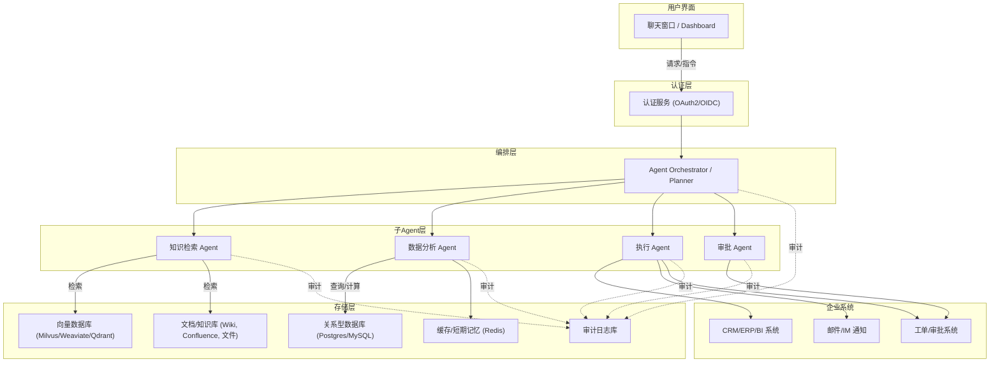
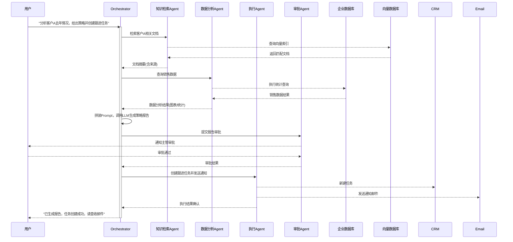

# 企业知识工作流 Agent —— 企业级产品方案

| 项目 | 内容 |
| :-- | :-- |
| 文档版本 | v1.0 |
| 文档状态 | 待评审（草案） |
| 适用范围 | 产品/研发/安全合规团队立项参考 |
| 编制说明 | 本方案整合两份前期调研报告（RAG+多Agent工作流方案、企业级Agentic AI落地方案），去重合并、补齐产品视角内容，形成可直接用于立项评审与研发排期的落地文档 |

---

## 目录

1. 执行摘要
2. 产品背景
3. 产品目标与范围
4. 目标用户与核心场景
5. 系统架构设计
6. 核心业务流程
7. 功能需求详解
8. 非功能需求
9. 技术架构与技术栈选型
10. MVP 功能优先级清单
11. 实施路线图（12 周详细排期）
12. 异常处理与兜底机制
13. 安全、权限与合规设计
14. 关键实现难点与应对策略
15. 验收标准与成功指标（KPI）
16. 风险评估与应对措施
17. 成本估算框架
18. 团队分工建议
19. 附录

---

## 一、执行摘要

企业内部知识分散在 Wiki、文档、邮件、CRM 等多个系统中，员工检索成本高、决策周期长；同时大量业务流程（报表生成、审批、客户跟进）依赖人工执行，效率低且易出错。传统 RPA 只能处理规则明确的静态任务，无法应对需要语言理解与跨系统决策的复杂场景。

本产品旨在构建一个**「企业知识检索 + 多 Agent 工作流自动化」**系统：用户以自然语言提出需求后，系统自动完成知识检索、数据分析、任务执行、必要时触发人工审批，形成"提问 → 分析 → 执行 → 反馈"的完整闭环，而非停留在单纯问答层面。

**核心设计原则：**

- **检索增强生成（RAG）**：所有回答基于企业真实数据生成，并可追溯来源，避免模型幻觉。
- **多 Agent 分工协作**：将复杂任务拆解为知识检索、数据分析、执行、审批等子任务，分别由专职 Agent 完成，便于独立迭代与监控。
- **人机协同兜底**：涉及资金、合同、客户数据等高风险操作强制引入人工审批节点，模型只做建议与预填，不做最终裁决。
- **企业级安全与可审计**：身份认证、细粒度权限、全链路审计日志作为一等公民能力，而非后期补充项。

MVP 建议按 **3 个月（12 周）** 分三阶段交付：单 Agent RAG 问答原型 → 多 Agent 协同工作流 → 企业级安全与生产部署，每阶段均有明确交付物与验收标准（详见第 11 章）。

---

## 二、产品背景

### 2.1 行业痛点

| 痛点 | 具体表现 |
| :-- | :-- |
| 知识孤岛 | 文档、Wiki、邮件、CRM 数据分散，缺乏统一检索入口，员工靠人肉搜索或询问同事 |
| 检索效率低 | 关键词搜索命中率低，难以处理语义相近但措辞不同的查询 |
| 流程割裂 | "查到信息"和"完成操作"是两个割裂的步骤，员工需手动在多个系统间切换执行后续动作 |
| 传统自动化局限 | RPA/规则引擎只能处理输入格式固定、流程路径确定的任务，无法理解自然语言或应对流程分支 |
| 审批与合规成本高 | 敏感操作（转账、合同、数据变更）依赖人工层层流转，缺少统一的记录与追溯机制 |

### 2.2 目标用户与画像

| 角色 | 典型场景 | 核心诉求 |
| :-- | :-- | :-- |
| 销售 / 市场分析师 | 查询历史客户信息、制定跟进策略 | 快速获取客户全景信息，并能一键生成跟进任务 |
| 客服 / 技术支持 | 实时查询产品知识库、处理工单 | 准确、有出处的答案，减少升级人工的比例 |
| 财务 / HR | 报表生成、审批流程、制度查询 | 减少重复性人工操作，同时保证审批留痕合规 |
| 部门主管 / 审批人 | 审批敏感操作（预算、合同、数据变更） | 清晰的风险提示与决策依据，操作可追溯 |
| IT / 安全管理员 | 权限治理、系统运维 | 细粒度权限控制、完整审计日志、可控的模型行为 |

### 2.3 商业价值

- **效率提升**：知识检索与自动化执行结合，可大幅减少重复性劳动（例如竞争情报类工作从数人日缩短到数小时级别，投研场景下人均可覆盖的标的数量成倍提升）。
- **成本节省**：审批、发票处理等流程自动化后，人工介入比例可显著降低，减轻月结、季结等高峰期的人力压力。
- **决策支持**：将内部数据与外部信息实时整合，为分析报告提供更全面的依据，提升决策质量。
- **合规与审计**：自动化流程天然带来更完整的操作日志，便于满足内部审计与监管要求，降低合规成本。

### 2.4 竞品与市场对比

| 产品/方案 | 定位 | 优势 | 局限 | 与本方案的差异 |
| :-- | :-- | :-- | :-- | :-- |
| ServiceNow AI Agents | IT/客服/HR 场景 AI Agent 平台 | 与 ITSM 生态深度集成 | 通常需要企业整体迁移到 ServiceNow 生态 | 本方案不绑定单一生态，可对接企业现有异构系统 |
| IBM Watson Orchestrate | 多 Agent 编排控制台 | 编排能力成熟 | 授权费用高，深度集成需额外开发 | 本方案基于开源框架自建，可控性与成本更优 |
| Microsoft Copilot（业务版） | 聊天式知识问答 + 单步执行 | 与 M365 生态无缝衔接 | 跨系统自动化能力仍在扩展中 | 本方案从设计之初即面向"检索 + 多步执行"闭环 |
| RPA + Chatbot（UiPath 等） | 规则驱动流程自动化 + 对话入口 | 成熟稳定，适合固定流程 | 策略固定，缺乏动态推理与多轮记忆 | 本方案基于 LLM 具备语义理解与动态规划能力 |
| 学术/社区方案 | 探索多文档检索、记忆管理等课题 | 提供前沿思路参考 | 距生产级可用尚有差距 | 本方案聚焦工程化落地与企业级安全合规 |

**差异化定位**：本方案不做单一场景的问答机器人，而是聚焦"企业知识库 + 工作流自动化"的通用多 Agent 架构，可按业务线（销售/客服/财务/HR）扩展定制子 Agent，同时将权限、审批、审计作为架构层面的一等能力，而非事后补丁。

---

## 三、产品目标与范围

### 3.1 产品目标

1. 在 3 个月内交付一个可演示、可试点的企业知识工作流 Agent 系统。
2. 知识检索准确率达到可用水平（初期目标 ≥90% 的相关文档命中率，附来源可追溯）。
3. 支持至少 1～2 类端到端自动化工作流（如"查询 → 分析 → 创建任务/发邮件"）。
4. 建立可复用的权限、审批、审计基础设施，为后续横向扩展到更多业务线打基础。
5. 系统可用性目标 ≥99%（生产试点阶段）。

### 3.2 MVP 范围（In Scope）

- 企业文档/Wiki 的向量化索引与 RAG 问答。
- 单一 Orchestrator + 知识检索 / 分析 / 执行 / 审批四类子 Agent。
- 至少 1～2 个外部工具集成（如 CRM 创建任务、邮件发送）。
- 基础身份认证与角色权限（RBAC）。
- 全链路日志与基础监控告警。
- Web 端或 IM（Slack/Teams/企业微信等）聊天界面。

### 3.3 二期规划范围（Out of MVP，预告）

- 多业务线子 Agent 横向扩展（HR、法务、供应链等）。
- 更细粒度的知识图谱增强检索（Graph RAG）。
- 多语言支持、移动端适配。
- 私有化小模型预筛选、模型分级路由等成本优化能力的规模化落地。

### 3.4 非目标（Explicitly Out of Scope）

- 不追求在 MVP 阶段替代所有人工审批流程，高风险操作始终保留人工确认环节。
- 不在 MVP 阶段承诺 7×24 全托管 SLA，先以试点业务线验证可行性。
- 不在 MVP 阶段自建大模型训练/微调管线，优先使用现成 API 或开源模型。

---

## 四、目标用户与核心场景（User Stories）

### 场景一：销售经理 —— 客户分析与跟进任务自动生成

> 销售经理在企业聊天窗口输入："请分析客户 A 过去一年的销售情况，给出销售策略建议，并为跟进任务创建提醒。"

1. Orchestrator 解析意图，拆解为"检索客户资料 → 分析销售数据 → 生成策略报告 → 创建跟进任务"四个子任务，并规划执行顺序。
2. 知识检索 Agent 在 Wiki/CRM/合同库中检索客户 A 相关信息，返回带来源的摘要。
3. 分析 Agent 查询销售数据库，统计客户 A 的销售额、订单量、产品分布及同比变化。
4. Orchestrator 汇总检索与分析结果，调用 LLM 生成策略建议报告。
5. 因涉及客户关系重大决策，报告先经审批 Agent 提交主管审核。
6. 主管确认后，执行 Agent 在 CRM 中创建跟进任务，并发送通知邮件/IM 消息。
7. 系统向销售经理反馈："已生成销售策略建议，并在 CRM 中创建 3 个跟进任务，详情见邮件。"

### 场景二：客服人员 —— 产品知识问答与工单处理

> 客服在处理工单时提问："产品 X 的退换货政策是什么？如果客户已经使用超过 30 天怎么办？"

1. 知识检索 Agent 从产品政策文档、FAQ 库中检索相关条款，附上文档出处与更新时间。
2. 若检索结果覆盖不到具体场景（如超期使用），系统明确提示"现有政策未覆盖该情形，建议升级人工核实"，而非编造答案。
3. 客服确认后，执行 Agent 可选地在工单系统中自动填写处理建议、更新工单状态。

### 场景三：财务人员 —— 发票/报销审批辅助

> 财务人员提交批量发票，请求："请核对本批发票信息并生成审批建议。"

1. 分析 Agent 校验发票金额、抬头、报销政策是否匹配，标记异常项。
2. 对于金额超阈值或信息异常的发票，审批 Agent 自动路由给对应审批人，Agent 仅生成建议摘要，不做自动放行。
3. 审批通过后，执行 Agent 更新财务系统记录并通知相关人员，全流程留痕。

---

## 五、系统架构设计

### 5.1 架构总览

系统采用 **微服务 + 多 Agent** 架构。用户通过 Web/IM 界面发起请求，经身份认证后由 Orchestrator 解析意图并协调各子 Agent 完成任务，所有关键节点均接入审计日志。

### 5.2 核心组件说明

| 组件 | 职责 | 关键设计要点 |
| :-- | :-- | :-- |
| **用户界面** | 提供交互入口 | Web Chat 或集成 Slack/Teams/企业微信 Bot，降低使用门槛 |
| **认证服务** | 校验身份与角色 | OAuth2/OIDC 统一登录，签发含角色信息的 Token |
| **Agent Orchestrator** | 解析意图、任务分解、调度子 Agent、汇总结果 | 类似"项目经理"角色；负责并发控制与异常协调；可用 OpenAI Agents SDK / LangGraph 实现 |
| **知识检索 Agent** | 基于 RAG 从向量库检索并生成带来源的答案 | 两阶段检索（粗排+精排）提升准确率；结果必须附来源 |
| **数据分析 Agent** | 执行 SQL 查询、调用 BI 工具、跑数据统计 | 输出结构化结果（表格/图表）供 Orchestrator 拼装 Prompt |
| **执行 Agent** | 调用外部系统 API 完成实际操作 | 遵循最小权限原则；调用后校验结果（如邮件是否送达、任务 ID 是否生成） |
| **审批 Agent** | 对敏感操作发起人工审批 | 涉及资金、合同、客户重大决策等场景强制介入；记录审批人、结果、时间戳 |

### 5.3 存储层设计

| 存储 | 用途 | 选型建议 |
| :-- | :-- | :-- |
| 向量数据库 | 文档/知识片段的 Embedding 存储与检索 | Milvus / Weaviate / Qdrant / Chroma，按用户或部门做命名空间隔离 |
| 关系型数据库 | 结构化业务数据、用户资料、长期记忆 | PostgreSQL / MySQL |
| 缓存 | 会话级上下文、短期记忆、高频查询结果 | Redis |
| 审计日志库 | 请求、Agent 决策、工具调用、审批记录 | 独立存储（数据库或专门审计平台），满足只增不改的合规要求 |
| 对象存储 | 原始文档、附件、备份 | MinIO / S3 兼容存储 |

### 5.4 安全架构（零信任模型）

- 用户通过 OAuth2/OIDC 登录，所有服务间调用基于 JWT 鉴权，杜绝隐式信任。
- 每个 Agent 运行在隔离的容器/沙箱环境中，工具调用参数经过输入校验，防止 Prompt 注入或越权调用。
- 敏感数据访问按角色做细粒度授权（如销售角色只能看财务数据摘要，不能看明细）。
- 向量库按用户/部门维度做命名空间隔离，避免跨租户/跨部门数据泄露。

### 5.5 可观测性架构

- 使用 OpenTelemetry 对推理步骤、工具调用、记忆访问进行全链路埋点。
- 关键指标（延迟、成功率、Token 消耗、并发量）接入 Prometheus + Grafana 看板。
- 异常发生时可通过 Trace 回放查看 Agent 的"思考过程"，快速定位问题根因。

---

## 六、核心业务流程

### 6.1 端到端流程时序图（以场景一为例）

### 6.2 流程设计要点

- Orchestrator 全程维护任务状态机，各子 Agent 的输出都会写入审计日志，形成可追溯的决策链条。
- 知识检索与数据分析两步可并行执行以缩短响应时间；执行与审批则必须串行，审批未通过不进入执行阶段。
- 每一步输出都应包含"依据来源"，避免最终报告出现无法溯源的结论。

---

## 七、功能需求详解

### 7.1 知识检索与 RAG 问答

- **功能描述**：将企业文档/Wiki/邮件归档等非结构化知识向量化，支持自然语言检索并生成带来源的回答。
- **关键需求点**：
  - 支持文档增量更新与重新索引，避免全量重建。
  - 两阶段检索：向量粗排 + 交叉编码器精排，提升相关性。
  - 回答必须标注引用来源（文档名/链接/更新时间）。
  - 检索不到足够信息时明确提示"暂无匹配结果"，不得编造答案。
- **验收标准**：给定测试问题集，检索相关文档命中率 ≥90%；无来源支撑的回答比例趋近于 0。

### 7.2 数据分析能力

- **功能描述**：对结构化数据执行查询、统计、生成图表，为报告提供量化依据。
- **关键需求点**：支持 SQL 查询封装、基础统计（同比/环比/趋势）、异常值提示（如指标突变时给出预警）。
- **验收标准**：分析 Agent 能正确响应预设的业务查询模板，输出结果与人工核算一致。

### 7.3 任务执行与工具调用

- **功能描述**：调用外部企业系统（CRM、邮件、工单系统等）完成具体操作。
- **关键需求点**：
  - 工具接口统一抽象（Function Calling / 自定义 API 封装）。
  - 调用前输入校验，调用后结果校验（如任务 ID 是否生成、收件人是否正确）。
  - 对有副作用的操作（创建、删除、发送）避免重复调用，具备幂等性设计。
- **验收标准**：至少完成 2 个工具的稳定集成，调用成功率 ≥99%（不含目标系统自身故障）。

### 7.4 审批与人机协同

- **功能描述**：对高风险操作强制引入人工审批节点。
- **关键需求点**：明确的风险判定规则（金额阈值、操作类型、涉及数据敏感级别）；审批记录包含审批人、时间戳、审批意见。
- **验收标准**：高风险操作 100% 经过人工确认才能执行，审批记录完整可查。

### 7.5 会话与记忆管理

- **功能描述**：维护会话级上下文，支持多轮任务衔接。
- **关键需求点**：短期记忆用 Redis 缓存当前会话状态；长期记忆（用户偏好、历史任务）落库持久化。
- **验收标准**：用户在同一会话内多轮追问时，系统能正确延续上下文，无需重复描述背景。

### 7.6 身份认证与权限管理（RBAC）

- **功能描述**：统一身份认证，按角色限定数据与功能访问范围。
- **关键需求点**：OAuth2/OIDC 登录；角色-权限矩阵可配置；跨部门数据默认隔离。
- **验收标准**：越权访问请求 100% 被拦截并记录告警。

### 7.7 审计与日志

- **功能描述**：记录所有用户请求、Agent 决策、工具调用、审批结果。
- **关键需求点**：日志字段标准化（时间戳、用户、角色、Agent、操作、输入、输出、结果）；日志只增不改。
- **验收标准**：任一异常事件均可通过日志完整复现处理链路。

### 7.8 前端与交互界面

- **功能描述**：提供聊天式交互入口，展示 Agent 回答、检索来源、执行结果。
- **关键需求点**：支持流式输出、来源高亮展示、审批状态可视化。
- **验收标准**：用户可在界面上完整看到"检索依据 → 分析结果 → 执行状态"的全过程，而非黑盒答案。

---

## 八、非功能需求

| 类别 | 要求 |
| :-- | :-- |
| 性能 | 常规问答响应时间 ≤5 秒（P95）；复杂多 Agent 任务 ≤30 秒完成首次反馈（可异步通知最终结果） |
| 可用性 | 试点阶段系统可用率 ≥99% |
| 安全合规 | 敏感数据传输加密；模型调用尽量避免传输未脱敏的敏感信息；关键操作留痕可审计 |
| 可扩展性 | Orchestrator 与各 Agent 服务无状态化，支持水平扩容 |
| 可维护性 | 全链路 Trace 可视化，问题定位时间 ≤30 分钟 |
| 成本效率 | 通过缓存、模型分级、批处理等手段控制单次交互的平均 Token 成本 |

---

## 九、技术架构与技术栈选型

| 分类 | 推荐方案 | 备选方案 | 选型理由 |
| :-- | :-- | :-- | :-- |
| 后端服务框架 | Python + FastAPI | Flask / Node.js (Express/Nest.js) | 异步性能好，生态与 AI/ML 库兼容性最佳 |
| Agent 编排框架 | OpenAI Agents SDK | LangChain / LangGraph / DeepAgents / Strands | 原生支持多 Agent 协作、handoff、Guardrails 与 Trace |
| 大模型 | GPT-4o / Claude 系列 | 开源模型（如 LLaMA 系）、国产大模型 | 云端模型推理能力强；本地/开源模型可用于非敏感、低风险场景降低成本 |
| 向量数据库 | Milvus / Weaviate | Qdrant / Chroma / 云厂商向量检索服务 | 支持大规模向量检索、按命名空间隔离、性能可横向扩展 |
| 关系型数据库 | PostgreSQL | MySQL | 结构化数据与长期记忆存储，生态成熟 |
| 缓存 | Redis | — | 会话上下文、热点数据、分布式锁 |
| 消息队列 | Kafka | RabbitMQ / Celery | 实现 Agent 间异步调用解耦，保障可靠性 |
| 工具网关 | 自建统一工具接口层（REST/gRPC） | — | 统一鉴权、参数校验、调用审计，避免各 Agent 直连外部系统 |
| 容器化与编排 | Docker + Kubernetes | — | 弹性伸缩、高可用部署 |
| CI/CD | GitHub Actions + Helm/Terraform | Jenkins + GitOps | 自动化测试与发布，基础设施即代码 |
| 身份认证 | OAuth2/OIDC（Keycloak / Cognito） | — | 统一登录与角色下发，支撑 RBAC |
| 监控与审计 | OpenTelemetry + Prometheus + Grafana | ELK / Splunk | 全链路 Trace，问题可回放定位 |
| 前端 | React/Vue Web UI + IM Bot（Slack/Teams/企业微信） | — | 兼顾自建界面与员工熟悉的协作工具入口 |

> 选型原则：优先使用各厂商官方推荐的成熟方案，并预留多云/多模型供应商切换能力（如 OpenAI/Anthropic/本地模型可配置切换），避免单点依赖。

---

## 十、MVP 功能优先级清单

| 优先级 | 功能模块 | 描述 |
| :--: | :-- | :-- |
| P0 | 文档检索与 RAG 问答 | 企业文档向量化索引，支持自然语言检索增强问答，附来源 |
| P0 | Agent 编排引擎 | 实现 Orchestrator，可根据指令调用 LLM 与工具 |
| P0 | 数据查询与分析 | 支持 SQL 查询企业数据库，生成基础统计结果 |
| P0 | 任务执行工具 | 集成 1～2 种企业工具（CRM/邮件），实现基本自动化 |
| P1 | 多 Agent 拆分 | 引入知识检索/分析/执行/审批子 Agent，支持并行处理 |
| P1 | 会话与记忆管理 | 使用 Redis 管理短期上下文，支持多轮交互 |
| P1 | 审批流程 | 敏感操作引入人机审批环节 |
| P2 | 身份鉴权与权限控制 | OAuth2/OIDC 登录，细分角色权限 |
| P2 | 可观测性与日志 | 部署监控与日志系统，记录 Agent 执行痕迹 |
| P2 | UI/前端仪表盘 | Web 或聊天界面展示交互结果 |
| P3 | 性能优化与容错 | 请求限流、失败重试、缓存 |
| P3 | 多语言支持 | 中英文双语交互 |

各阶段交付需优先覆盖 P0-P1，保证 Demo 具备说服力；P2 及以上功能在企业实际部署阶段逐步补齐。

---

## 十一、实施路线图（12 周详细排期）

### 阶段一（第 1-4 周）：单 Agent RAG MVP

| 周次 | 任务 |
| :-- | :-- |
| 第1周 | 开发环境与版本控制搭建；确定模型/框架选型；基础项目结构与容器镜像 |
| 第2周 | 收集企业文档（Wiki/Confluence/邮件归档），完成预处理（分片、清洗）与向量化，构建向量库索引 |
| 第3周 | 开发 RAG 问答接口，验证检索+生成质量；搭建简易 Web/命令行界面 |
| 第4周 | 集成首个工具调用（如发送邮件或查询数据库）；完成第一轮联调与内部测试 |

**验收标准**：用户可通过聊天界面提问企业知识，系统基于 RAG 检索给出正确答案并附来源；至少一个工具调用链路打通；系统在测试环境中稳定运行，日志记录完整。

### 阶段二（第 5-8 周）：多 Agent 协同

| 周次 | 任务 |
| :-- | :-- |
| 第5周 | 设计并实现 Orchestrator/Planner，接受用户指令并拆解任务流程 |
| 第6周 | 开发数据分析 Agent（SQL 查询/统计工具），生成结构化结果 |
| 第7周 | 开发执行 Agent（工具集成扩展）与审批 Agent（人机审批机制） |
| 第8周 | 引入短期记忆支持多轮对话；引入消息队列实现异步编排；端到端联调测试 |

**验收标准**：完整跑通第六章描述的端到端用户故事；系统可并发处理多个请求并保持隔离；所有 Agent 动作均被记录，敏感操作触发审批。

### 阶段三（第 9-12 周）：企业级完善与生产部署

| 周次 | 任务 |
| :-- | :-- |
| 第9周 | 集成 OAuth2/OIDC 身份认证，实现基于角色的访问控制（RBAC） |
| 第10周 | 部署 OpenTelemetry/Prometheus/Grafana 监控与告警；完善审计日志规范 |
| 第11周 | Kubernetes 高可用部署（Helm/Operator）、自动伸缩、CI/CD 流水线打通；容灾与备份配置 |
| 第12周 | 安全测试（权限攻击测试）、压力测试、用户验收测试（UAT）、文档交付与上线 |

**验收标准**：在模拟企业环境中完整上线，服务可用率 ≥99%；安全测试通过；功能演示满足合规要求，产出可交付的技术文档与运维手册。

### 里程碑总览

| 里程碑 | 时间点 | 核心交付物 |
| :-- | :-- | :-- |
| M1：RAG 问答原型 | 第4周末 | 可用的知识问答 Demo + 首个工具调用 |
| M2：端到端工作流闭环 | 第8周末 | 完整多 Agent 协作流程（检索→分析→执行→审批） |
| M3：生产级上线 | 第12周末 | 安全合规、监控完善、可用于试点业务线的生产系统 |

---

## 十二、异常处理与兜底机制

| 异常场景 | 处理策略 |
| :-- | :-- |
| 模型输出不确定/错误 | 对重要结论进行二次检索核查（Rubric 校验）；不确定时输出"信息不确定，请人工核对"而非强行给出答案 |
| 工具调用失败 | 捕获异常并重试（指数退避）；连续失败则回退人工处理，通知用户并记录故障详情 |
| 步骤级失败回滚（Saga模式） | 多步骤操作设计为可补偿事务，某一步失败时逆转已完成的操作（如删除已创建但流程未完成的资源） |
| 权限/认证错误 | 越权请求立即阻断并触发审计告警，检查权限配置是否正确 |
| 数据不一致/缺失 | 分析结果异常（如指标突变为负）时提示"数据异常，建议人工检查"，不直接采用可疑数据 |
| 并发冲突 | 使用分布式锁/事务处理同资源并发操作；工具调用层实现幂等性设计 |
| 高风险操作 | 强制人机共治：Agent 仅生成建议或预填内容，人工审批后才实际执行（如转账需双人审核） |
| 预算与限流 | 对 LLM 调用设置 Token/循环次数上限，防止无限循环耗尽资源，超限则中止或降级处理 |
| 服务降级 | 核心模型/关键服务不可用时，切换备用模型（如 GPT-4→GPT-3.5）或退回传统方案（静态 FAQ/人工客服） |
| 日志与告警 | 所有异常完整记录（用户指令、决策理由、工具调用、最终输出），未捕获异常触发实时告警 |

---

## 十三、安全、权限与合规设计

### 13.1 身份认证

- 统一采用 OAuth2/OpenID Connect（如 Keycloak、AWS Cognito）管理用户身份与角色。
- Agent 每次运行前获取用户 Token，调用内部工具时在请求头中携带，确保最小权限原则。

### 13.2 RBAC 权限模型（示例）

| 角色 | 知识库访问范围 | 可调用工具 | 是否需二次审批 |
| :-- | :-- | :-- | :-- |
| 销售 | 客户/销售相关文档 | CRM 创建任务、发送邮件 | 涉及重大策略建议时需要 |
| 客服 | 产品/政策文档 | 工单更新 | 一般不需要 |
| 财务 | 财务政策与本人经手数据 | 财务系统查询 | 转账/大额报销必须 |
| 主管/审批人 | 部门内全部数据 | 审批操作 | — |
| 系统管理员 | 权限配置、审计日志 | 无业务工具调用权限 | 权限变更需双人复核 |

### 13.3 数据隔离与沙箱

- 向量库按用户/部门维度做命名空间隔离，防止跨租户数据泄露。
- Agent 运行在隔离容器/沙箱环境中，工具调用参数经过严格校验，防止 Prompt 注入。
- 敏感数据存储加密，模型调用尽量避免传输未脱敏信息（可先做摘要/脱敏再传输）。

### 13.4 审计日志规范

标准字段建议包含：时间戳、请求用户、角色、触发的 Agent、具体操作、输入摘要、输出摘要、调用结果、（如适用）审批人与审批意见。日志应满足"只增不改"原则，作为事后审计与故障复现的唯一可信来源。

---

## 十四、关键实现难点与应对策略

1. **权限隔离与安全**：企业数据敏感度高，需保证每个用户会话在独立沙箱中运行，知识库按命名空间隔离；工具调用采用最小权限授权，输入输出严格校验，防止 Prompt 注入与模型滥用。

2. **RAG 检索精准度**：依赖高质量文档预处理（分片、过滤）与合适的嵌入模型；对复杂多跳问题采用分步检索或子 Agent 复审机制；必要时引入领域知识图谱（Graph RAG）增强上下文理解，但需权衡额外的构建成本。

3. **工具调用安全**：对外部系统的敏感操作（转账、审批等）需严格参数校验与限速，关键步骤强制人工审批；保留完整调用 Trace，支持异常回滚与人工干预。

4. **多 Agent 协作逻辑**：需明确定义每个 Agent 的职责边界与最终决策权归属，避免相互冲突；建议类比企业组织结构先划清分工，再设计推理策略与工具授权。

5. **并发与可扩展性**：Orchestrator 与子 Agent 实现为无状态服务，基于 Kubernetes 自动伸缩；数据库写入采用事务保障一致性；对高频检索结果与 LLM 输出做缓存，降低延迟与成本。

6. **成本控制**：采用分级模型策略（非核心场景用低成本模型）、结果缓存与批处理、向量检索精简上下文长度以减少 Token 消耗；对 Agent 调用设置计量与限额，防止滥用。

7. **持续记忆与上下文管理**：短期记忆用 Redis 支撑多轮对话，长期记忆（用户偏好、历史任务）落库持久化，支持跨会话的任务衔接与个性化。

8. **监控与调优**：Agent 行为具有非确定性，需通过 Tracing 可视化每次请求在各 Agent 间的流转与工具调用情况，定期审查日志、持续优化 Prompt 与知识库质量。

---

## 十五、验收标准与成功指标（KPI）

| 指标类别 | 指标 | 目标值 |
| :-- | :-- | :-- |
| 检索质量 | 相关文档命中率 | ≥90% |
| 响应性能 | 常规问答响应时间（P95） | ≤5 秒 |
| 系统可用性 | 试点阶段服务可用率 | ≥99% |
| 自动化效果 | 端到端工作流自动完成率（不含审批等待时间） | 阶段性设定，随试点数据校准 |
| 安全合规 | 越权访问拦截率 | 100% |
| 审批合规 | 高风险操作人工审批覆盖率 | 100% |
| 审计完整性 | 异常事件可通过日志完整复现的比例 | 100% |
| 成本效率 | 单次交互平均 Token/API 成本 | 建立基线后逐步优化 |

---

## 十六、风险评估与应对措施

| 风险 | 影响 | 应对策略 |
| :-- | :-- | :-- |
| 模型输出幻觉，给出错误信息 | 影响决策质量，损害用户信任 | 强制来源引用、二次核查机制、不确定时明确降级提示 |
| 高风险操作被误执行 | 资金/数据/合规损失 | 审批 Agent 强制人工确认，关键操作双人复核 |
| 向量库/知识库数据陈旧 | 检索结果失真 | 建立文档增量更新机制，定期巡检索引质量 |
| 权限配置错误导致越权访问 | 数据泄露、合规风险 | RBAC 矩阵评审、越权请求实时告警、定期权限审计 |
| LLM API 成本超预算 | 项目经济性下降 | 模型分级、缓存、限流，建立成本监控看板 |
| 外部系统集成不稳定 | 工具调用失败率上升 | 重试退避、降级方案、故障告警与人工兜底 |
| 团队对多 Agent 架构经验不足 | 开发/调试周期延长 | 分阶段迭代（先单 Agent 再多 Agent）、引入 Tracing 工具降低调试难度 |

---

## 十七、成本估算框架（参考）

> 以下为成本构成框架与优化思路，供立项预算测算参考，具体金额需结合实际用量、模型选型与云厂商报价另行核算。

| 成本类别 | 主要构成 | 优化建议 |
| :-- | :-- | :-- |
| LLM 调用成本 | 问答生成、策略报告生成等 Token 消耗 | 分级模型路由（非核心场景用低成本模型）、结果缓存、精简上下文长度 |
| 向量数据库/存储成本 | 索引存储、检索查询开销 | 定期清理过期/低价值文档、合理设置分片粒度 |
| 计算与部署成本 | Kubernetes 集群、GPU（如自建向量检索加速） | 按需自动伸缩、非高峰时段降配 |
| 人力成本 | 研发、测试、运维、安全评审 | 分阶段投入，MVP 阶段聚焦核心团队，第三阶段再引入安全/合规专项人力 |

---

## 十八、团队分工建议（参考）

| 角色 | 主要职责 | 重点参与阶段 |
| :-- | :-- | :-- |
| 产品经理 | 需求梳理、场景设计、验收标准把关 | 全程 |
| 后端/Agent 工程师 | Orchestrator 与子 Agent 开发 | 阶段一、二 |
| 算法/RAG 工程师 | 文档处理、向量索引、检索效果调优 | 阶段一，持续优化 |
| 前端工程师 | Web/IM 交互界面开发 | 阶段一、二 |
| DevOps/SRE | 容器化部署、CI/CD、监控告警 | 阶段三为主，全程支撑 |
| 安全/合规负责人 | 权限模型设计、审计规范、安全测试 | 阶段三重点介入，全程评审 |

---

## 十九、附录

### 19.1 术语表

| 术语 | 说明 |
| :-- | :-- |
| RAG（Retrieval-Augmented Generation） | 检索增强生成，先检索相关资料再生成答案，降低模型幻觉 |
| Agent | 具备目标感、可自主调用工具完成任务的 AI 程序单元 |
| Orchestrator | 负责解析用户意图、拆解任务并协调多个子 Agent 的编排组件 |
| RBAC（Role-Based Access Control） | 基于角色的访问控制模型 |
| OIDC（OpenID Connect） | 基于 OAuth2 的身份认证协议 |
| Guardrails | 对模型输入输出进行安全校验的机制，防止越权或有害操作 |
| Saga 模式 | 将多步骤事务设计为可补偿操作，某一步失败时逆转已完成步骤 |
| Graph RAG | 结合知识图谱增强检索上下文理解能力的 RAG 变体 |

### 19.2 文档来源说明

本方案基于两份前期技术调研（企业知识工作流 Agent 技术方案、企业级 Agentic AI 落地方案）整合而成，合并了架构设计、技术选型、实施路线图、异常处理机制等内容，并补充了产品目标、用户场景、功能需求、非功能需求、验收指标、风险评估与成本框架等产品化视角内容，便于直接用于内部立项评审与研发排期。
